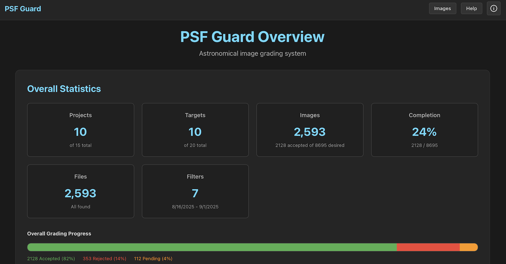
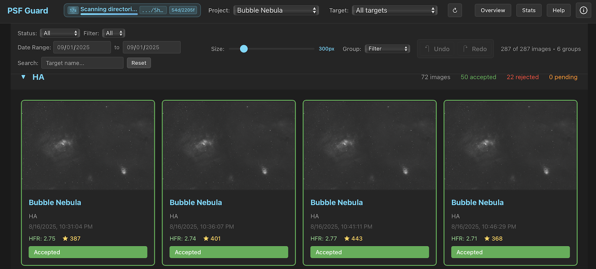
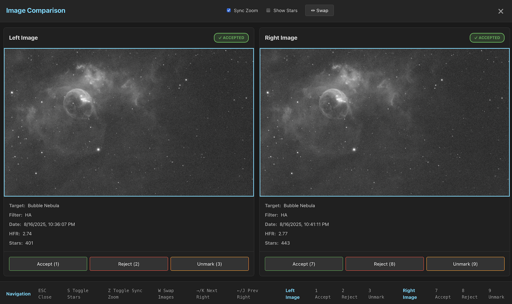

# PSF Guard

[](https://github.com/theatrus/psf-guard/actions/workflows/ci.yml)
[](https://opensource.org/licenses/Apache-2.0)

A Rust utility for astronomical image analysis and grading, with N.I.N.A. Target Scheduler integration.

## Screenshots

| Overview Dashboard | Image Grid | Side-by-Side Comparison |
|:--:|:--:|:--:|
|  |  |  |
| Complete project statistics and progress tracking | Grid view with filtering and batch operations | Synchronized zoom and detailed image comparison |

## Features

- **N.I.N.A. Integration**: Query and analyze Target Scheduler SQLite databases.
  Note that Target Scheduler is required, using standard NINA file paths doesn't
  work (yet), as we find images based on the database, and not based on the file
  structure.
- **Star Detection**: N.I.N.A. algorithm port + HocusFocus detector with PSF
  fitting for analysis.
- **Desktop App and Web Interface**: React-based UI for visual image grading
  with zoom/pan, and comparisons, with auto-stretched images. Updates to grading
  are written to the target scheduler DB to allow Target Scheduler to capture
  more images if required. Ships as both a server for NAS hosting, and a
  stand-alone desktop app.
- **CLI tools**: Regrading, batch operations, fits processing, batch image moving.
- **Statistical Analysis**: Advanced outlier detection using HFR, star count,
  and (primitive) cloud detection in the batch modes.
- **FITS Processing**: Convert to PNG, annotate stars, visualize PSF residuals
- **Multi-Directory Support**: Scan multiple image directories with priority ordering

## Known Limits

- Current, we only support **monochrome** images. Debayering a color image is
  not implemented and weird things may happen if you use color camera FITS
  files. Please reach out to psf-guard@theatr.us if you want to contribute some
  color FITS files for testing :)
- Some directory paths are presuming this N.I.N.A pattern:
  `%DATEMINUS12%/%TARGETNAME%/%DATEMINUS12%/LIGHT/standardfilename.fits`, with
  or without the leading date. Other paths may not be reliably detected, but I'm
  happy to support more paths and patterns in the future.
- `psf-guard` may eat your NINA Target Scheduler DB. Make a backup.
- The `filter-rejected` workflow may eat your FITS files. I use it, but there
  are lots of subtleties which may lead to bad results. Make a backup. Other
  commands do not touch FITS files, but still, make a backup.

## Quick Start with Web Grader

### Desktop App (Recommended for Windows/macOS)

**Download PSF Guard Desktop** - Get the native desktop application:

| Platform | Download | Notes |
|----------|----------|-------|
| **Windows x64** | [`.msi installer`](https://github.com/theatrus/psf-guard/releases/latest/download/psf-guard_0.3.0_x64_en-US.msi) | Native Windows installer |
| **Windows x64** | [`.exe installer`](https://github.com/theatrus/psf-guard/releases/latest/download/psf-guard_0.3.0_x64-setup.exe) | NSIS installer |
| **macOS x64** | [`.dmg`](https://github.com/theatrus/psf-guard/releases/latest/download/psf-guard_0.3.0_x64.dmg) | Drag-and-drop installer |
| **Linux x64** | [`.deb package`](https://github.com/theatrus/psf-guard/releases/latest/download/psf-guard_0.3.0_amd64.deb) | Ubuntu/Debian package |
| **Linux x64** | [`.AppImage`](https://github.com/theatrus/psf-guard/releases/latest/download/psf-guard_0.3.0_amd64.AppImage) | Portable application |

**Installation:**
1. Download the appropriate installer for your platform
2. Install following standard platform conventions
3. Launch PSF Guard from your applications menu
4. Configure your database and image directories in the settings panel
5. Start analyzing your images!

### Docker (Recommended for Linux Servers)

```bash
# Pull and run
docker pull ghcr.io/theatrus/psf-guard:latest

docker run -d -p 3000:3000 \
  -v /path/to/database.sqlite:/data/database.sqlite:ro \
  -v /path/to/images:/images:ro \
  -v /path/to/psf-guard.toml:/data/config.toml:ro \
  ghcr.io/theatrus/psf-guard:latest \
  server --config /data/config.toml
```

Open your browser to http://localhost:3000/

### Pre-built CLI/Server Binaries for Windows, macOS, Linux

Download the latest release for your platform:

| Platform | Download | Notes |
|----------|----------|-------|
| **Linux x64** | [`psf-guard-linux-x64`](https://github.com/theatrus/psf-guard/releases/latest/download/psf-guard-linux-x64) | Requires system libraries - use Docker instead |
| **macOS x64** | [`psf-guard-macos-x64`](https://github.com/theatrus/psf-guard/releases/latest/download/psf-guard-macos-x64) | May require system libraries |
| **Windows x64** | [`psf-guard-windows-x64.exe`](https://github.com/theatrus/psf-guard/releases/latest/download/psf-guard-windows-x64.exe) | Static binary |

**Note**: Native binaries for macOS and Linux require system libraries (SQLite,
image processing libraries) that are not included. Docker is recommended for
Linux deployments to ease the install pain. For macOS, you'll need Homebrew to
install OpenCV.


```bash
# Linux/macOS - make executable and run
chmod +x psf-guard-*
./psf-guard-linux-x64 server --config psf-guard.toml

# Windows
copy "%LOCALAPPDATA%\NINA\SchedulerPlugin\schedulerdb.sqlite" schedulerdb-backup.sqlite
psf-guard-linux-x64 server "%LOCALAPPDATA%\NINA\SchedulerPlugin\schedulerdb.sqlite"
 C:\where_images_are
```

Open your browser to http://localhost:3000/

Note for Windows: This makes a local copy of the schedulerdb as an insurance
policy when running psf-guard. You should always make a backup of the database
in case something eats it.

### Build from Source

You'll need to make sure to include several build tools depending on platform.
The best luck is probably from reading the .github/ CI files for package install
instructions. The OpenCV dependency is large and annoying. Its even more large
and annoying on Windows.

```bash
git clone https://github.com/theatrus/psf-guard.git
cd psf-guard
cargo build --release

# Run server (traditional CLI args)
./target/release/psf-guard server schedulerdb.sqlite /path/to/images/

# Or using config file
./target/release/psf-guard server --config psf-guard.toml

# Open http://localhost:3000
```

### Multi-Directory Usage

```bash
# Scan multiple directories in priority order (first-hit wins)
psf-guard server db.sqlite /primary/images/ /backup/images/ /archive/images/
```

## Configuration File

PSF Guard supports TOML configuration files for easier management:

```bash
# Create from example
cp psf-guard.toml.example psf-guard.toml
# Edit with your settings
nano psf-guard.toml

# Use config file
psf-guard server --config psf-guard.toml
```

### Configuration Options

```toml
[server]
port = 3000
host = "0.0.0.0"

[database]  
path = "schedulerdb.sqlite"

[images]
directories = ["/path/to/images1", "/path/to/images2"]

[cache]
directory = "./cache"  
file_ttl = "5m"        # Human readable: 30s, 5m, 1h, 2h30m, 1d
directory_ttl = "5m"

[pregeneration]  # Optional
enabled = true
screen = true   # Generate 1200px previews
large = false   # Generate 2000px previews
```

Command line arguments override config file settings.

## Database Location

**Windows N.I.N.A.:**
```
%LOCALAPPDATA%\NINA\SchedulerPlugin\schedulerdb.sqlite
```

## Web Interface

### Dashboard Overview
The main dashboard provides a comprehensive view of your imaging projects:
- **Statistics Cards**: Projects, targets, images, and completion percentage
- **Progress Visualization**: Color-coded grading progress bars
- **File Status**: Real-time file discovery and cache status
- **Filter Summary**: Date ranges and filter usage statistics

### Image Grid View
- **Smart Filtering**: Filter by project, target, status, and date range
- **Batch Operations**: Multi-select with Shift+Click, Ctrl+Click
- **Real-time Status**: Accept/reject/unmark with immediate visual feedback
- **Quick Navigation**: Keyboard shortcuts for efficient workflow
- **Metadata Display**: HFR, star counts, and acquisition details

### Comparison Mode
- **Side-by-Side**: Compare images with synchronized zoom and pan
- **Independent Controls**: Each image can be manipulated separately
- **Quick Actions**: Accept, reject, or unmark both images simultaneously
- **Navigation**: Easy switching between image pairs

### Key Features
- **Smart Loading**: Fast preview → full resolution on zoom
- **Cache Progress**: Real-time directory scanning with progress indicators
- **Undo/Redo**: Full history with Ctrl+Z/Ctrl+Y

### Keyboard Shortcuts

| Key | Action | Key | Action |
|-----|--------|-----|--------|
| K/→ | Next image | A | Accept |
| J/← | Previous | X | Reject |  
| C | Compare | U | Unmark |
| S | Stars overlay | +/- | Zoom |
| Ctrl+Z | Undo | Ctrl+Y | Redo |

## CLI Commands

### Core Commands

```bash
# Web server (CLI args)
psf-guard server <database> <image-dirs...> [--port 3000]

# Web server (config file)
psf-guard server --config psf-guard.toml [--port 8080]  # CLI overrides config

# Move rejected images  
psf-guard filter-rejected <database> <image-dir> [--dry-run] [--project NAME]

# Star detection analysis
psf-guard analyze-fits image.fits [--compare-all] [--detector nina|hocusfocus]

# Create annotated images
psf-guard annotate-stars image.fits [--max-stars 50] [--color red|yellow]
```

### Database Queries

```bash
# List projects and targets
psf-guard list-projects -d database.sqlite
psf-guard list-targets "Project Name" -d database.sqlite

# Export grading data
psf-guard dump-grading -d database.sqlite [--project NAME]
```

### FITS Processing

```bash
# Convert with MTF stretch
psf-guard stretch-to-png image.fits output.png

# PSF analysis grid
psf-guard visualize-psf-multi image.fits [--num-stars 25]

# Metadata display
psf-guard read-fits image.fits
```

## Statistical Grading

Advanced outlier detection beyond database status:

- **HFR Analysis**: Focus quality per target/filter
- **Star Count**: Abnormal detection counts  
- **Cloud Detection**: Sequence analysis for weather
- **Distribution Analysis**: MAD for skewed data

Enable with `--enable-statistical` flag.

## REST API

```bash
# List images with filters
curl "localhost:3000/api/images?project_id=2&status=pending"

# Update grading
curl -X PUT localhost:3000/api/images/123/grade \
  -H "Content-Type: application/json" \
  -d '{"status": "accepted"}'

# Get processed images
curl "localhost:3000/api/images/123/preview?size=large" -o preview.png
curl "localhost:3000/api/images/123/annotated" -o stars.png
```

## Cache System

- **Auto-refresh**: Both file and directory caches refresh every 5 minutes
- **Manual refresh**: UI button for file cache, Shift+click for both
- **Real-time progress**: Live updates during directory scanning
- **Multi-directory**: Scans all directories with first-hit preference

## Development

```bash
# Setup
cargo fmt && cargo clippy && cargo test

# Run with logging
RUST_LOG=debug cargo run -- server db.sqlite images/

# Frontend development
cd static && npm run dev

# OpenCV (optional, enhanced star detection)
brew install opencv  # macOS
```

See [CLAUDE.md](CLAUDE.md) for architecture details.

## License

Apache License 2.0 - See [LICENSE](LICENSE)
