# PSF Guard

[](https://github.com/theatrus/psf-guard/actions/workflows/ci.yml)
[](https://opensource.org/licenses/Apache-2.0)

**Image grading and quality screening for [N.I.N.A.](https://nighttime-imaging.eu/)
astrophotography with the Target Scheduler plugin.**

After an imaging session you're left with hundreds of subs — and some of them
are ruined by clouds, a tree creeping into the frame, dome occlusion, or stray
light that conventional star-count/HFR grading happily accepts. PSF Guard
points at your Target Scheduler database and image folders and gives you:

- **A fast visual grader** — web UI or desktop app with auto-stretched
  previews, zoom/pan, side-by-side comparison, batch operations, and undo.
- **Sky context and on-demand plate solving** — identify expected objects from
  known coordinates, solve image pixels with Seiza, and overlay catalog labels,
  outlines, a coordinate grid, and the target offset directly on the frame.
- **Satellite track identification** — project named satellite crossings over
  an exposure, align nearby trails in the FITS pixels, and reject only when a
  potentially bright orbital candidate has matching pixel evidence.
- **Automatic quality screening** — spatial metrics, cross-frame photometry,
  and pixel-derived plate solutions catch occlusion, clouds, thin veils,
  errant light, off-target frames, and lost tracking, with evidence explaining
  every verdict.
- **On-demand stack previews** — integrate the selected or visible project
  frames per target and channel with Seiza registration, while carrying the
  same grading exclusions and per-frame admission evidence into the result;
  rebuild channels independently, retain and flag stale prior results, inspect
  the full-resolution result with the normal zoom/pan tools, apply or revert
  parameterized Seiza display stretches and conservative deconvolution, or
  download either the cached integration or its processed linear FITS variant.
  Deconvolution is explicitly opt-in and defaults off. When the required
  channel stacks exist, combine them into cached RGB, LRGB, or selectable
  SHO/HOO/Foraxx color previews with
  independent Seiza background extraction before registration, editable
  additive or multiplicative correction controls, optional per-input
  deconvolution, ordered input/output stretch stacks, phase-complete progress,
  reusable prepared-channel caches, and full-resolution processed RGB FITS
  output. Stretch-only edits reuse prior background, registration, and
  deconvolution work.
- **Scheduler write-back** — every grade lands in the Target Scheduler
  database, so the scheduler knows to re-capture what you rejected.
- **Project and target planning** — inspect Target Scheduler project state,
  priority, limits, target coordinates, rotation, ROI, shared exposure
  templates, and exposure plans from the Overview. With database management
  enabled, edit those fields, change a plan's exposure or desired count, and
  add filter plans by reusing an exact profile template or deriving a new one.
  Acquired and accepted counts stay read-only.
- **Start from plain folders** — no scheduler database? `create-db` bootstraps
  a fully-faithful Target Scheduler database and imports folders of FITS
  lights. Each target becomes one project by default; nearby, similarly dated
  panel targets share a project when their names identify a likely mosaic.
  Import derives shared exposure templates from each frame's filter, gain,
  offset, binning, numeric readout mode, and most-used exposure duration.
  A separate database action can fill missing quality data or rescan every
  image for stars, background, clouds, obstructions, and pointing.
- **Take out for stacking** — export the non-rejected lights into a
  WBPP-style folder tree (copy or instant hardlinks), or download them as a
  zip straight from the web UI. Rejects never leave the library.
- **Safe reject archival** — move rejected frames (and their sidecars) out of
  the directory tree your stacking software scans, reversibly.
- **Two-machine workflows** — sync projects, captured images, and grades
  between the telescope's database and your grading machine.
- **Star detection and PSF analysis** — a port of N.I.N.A.'s detector plus the
  HocusFocus-inspired detector, with Gaussian/Moffat PSF fitting and annotated output.

It runs as a desktop app (Windows/macOS/Linux), a self-hosted web server
(Docker, NAS), or a standalone CLI.

> **Back up your Target Scheduler database before first use.** PSF Guard
> writes grades into it, and its `sync` commands can merge entire databases —
> projects, captured images, and grades — between machines. It's careful
> (dry-run flags everywhere), but it's also young software.

## Features in practice

The sky images below come from real FITS acquisitions, not generated demo
fields. They are deliberately shown as quick-look data: PSF Guard is for
finding problems, making grading decisions, and checking an integration before
committing hours to a full calibration and processing workflow.

### Review and grade a night quickly

| Overview Dashboard | Image Grid | Side-by-Side Comparison |
|:--:|:--:|:--:|
| 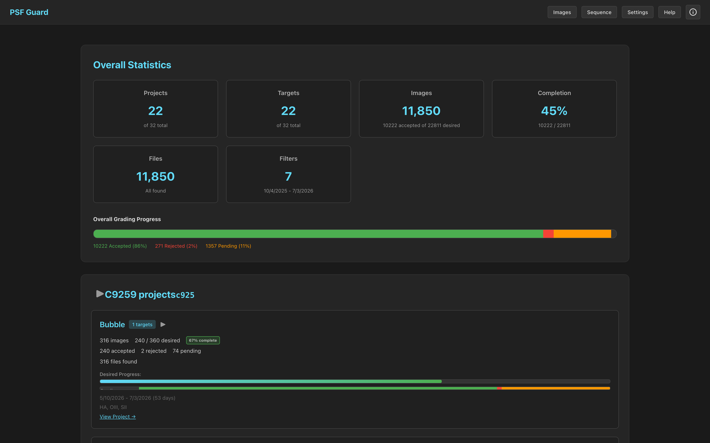 | 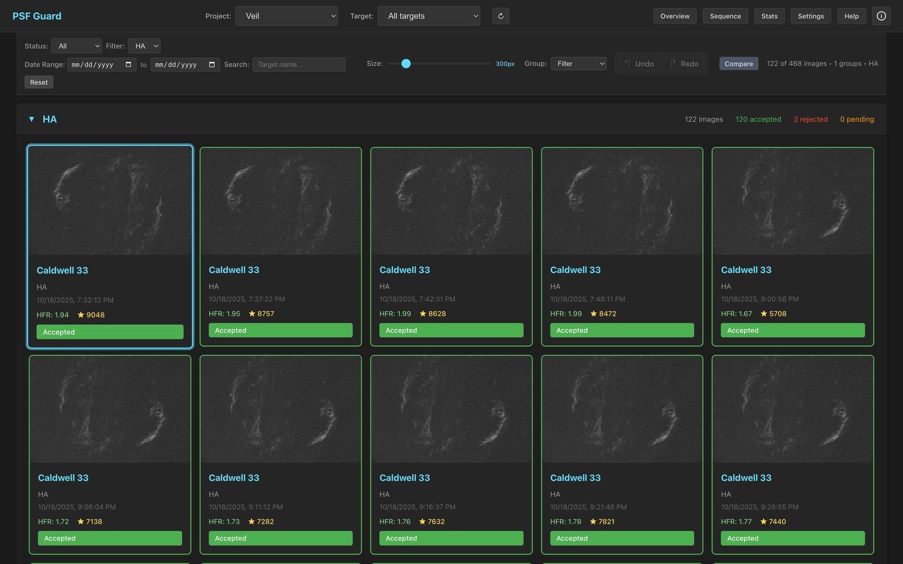 | 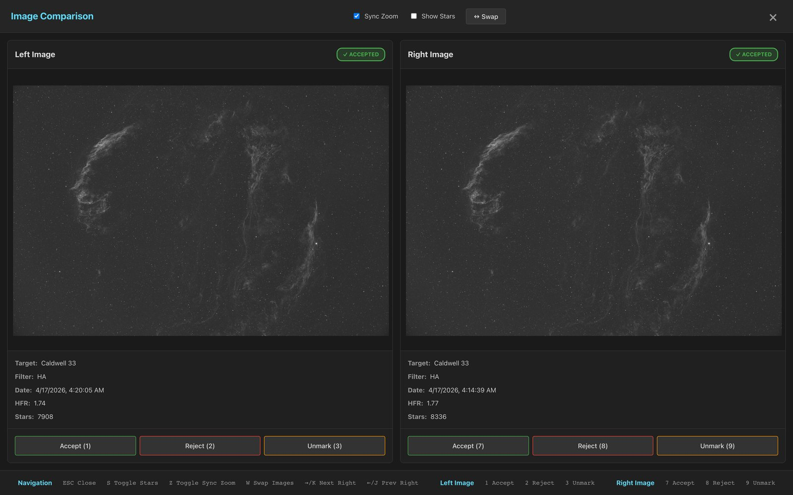 |
| Project statistics and progress tracking | Grid view with filtering and batch operations | Synchronized zoom and detailed comparison |

Each Overview project has a **Plan & coordinates** view. It shows the project
settings and every target's Target Scheduler coordinates and exposure plans.
RA uses Target Scheduler's decimal-hour convention; Dec uses degrees. New plans
reuse an exact matching profile template or create one with Target Scheduler
defaults. The plan table keeps Target Scheduler's `-1` exposure value, which
means “use the template default.” Start the server with
`--allow-database-management` to edit; without
that flag the same view remains available read-only. A sky-map link can use the
stored coordinates in a later release.

### See the evidence behind a quality decision

| Sequence Analysis & Astrometry Quality | Star Detection | PSF Fitting |
|:--:|:--:|:--:|
| 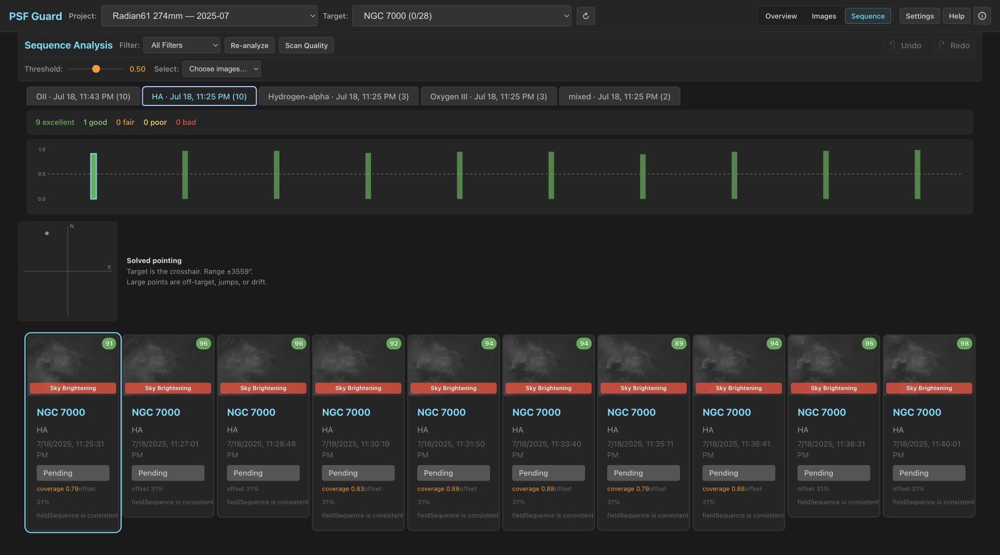 | 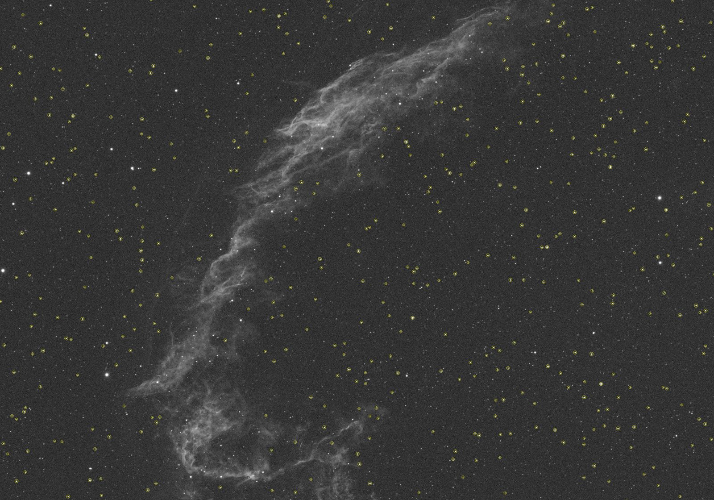 | 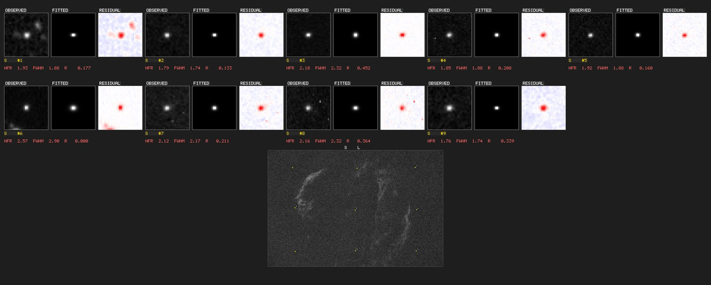 |
| Per-frame scores, cloud/occlusion screening, solved-center scatter, and off-target/tracking flags | HocusFocus-inspired detection with annotated output (`annotate-stars`) | Observed / fitted / residual grids with Moffat & Gaussian models (`visualize-psf-multi`) |

The sequence analyzer brings global image statistics, spatial and photometric
screening, pixel-derived plate solves, and cached satellite evidence into a
per-frame score. Recommendations remain reviewable before PSF Guard writes a
grade back to Target Scheduler.

### Preview a stack without leaving the grader

| Stack Preview | Full-size Inspection | Stack Admission Decisions |
|:--:|:--:|:--:|
| 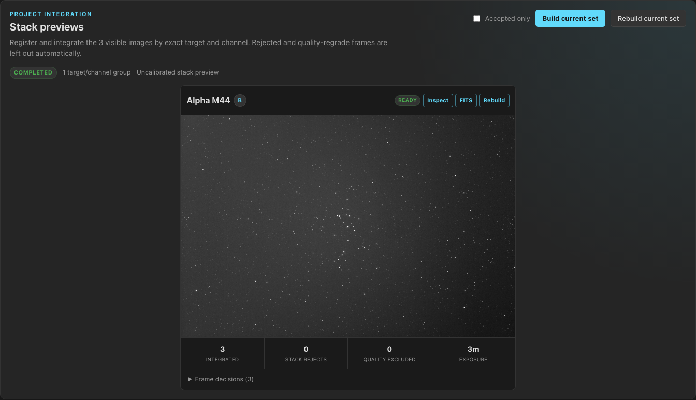 | 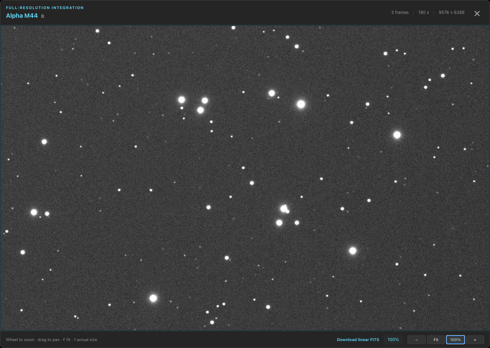 | 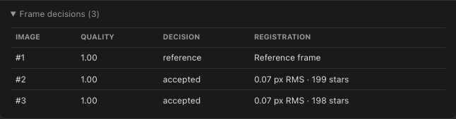 |
| Uncalibrated, on-demand integration grouped by exact target and channel | Familiar zoom, pan, fit, and one-pixel-per-pixel controls | Quality exclusions, reference choice, matches, registration RMS, and rejection reasons |

This real M44 example was built from three B-channel acquisitions. Each input's
quality exclusion, registration match count, residual, and admission decision
is retained with the cached linear FITS result.

### Combine real narrowband channel stacks

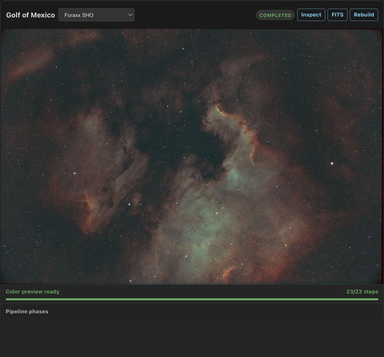

This real Gulf of Mexico (NGC 7000) quick-look preview uses six accepted Ultracat
acquisitions: two each in H-alpha, OIII, and SII. The same three linear channel
stacks can be recombined as standard SHO, Foraxx SHO, or any other compatible
narrowband palette without rebuilding the integrations.

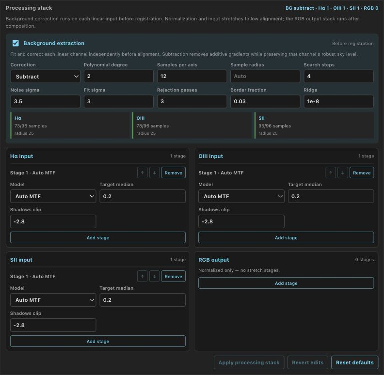

Color previews fit and subtract each input channel's background before
cross-filter registration. The UI exposes the resolved fit evidence, editable
background model, per-input and output stretch stacks, complete phase progress,
full-size inspection, and a downloadable processed RGB FITS file. This real
narrowband run accepted 73 of 96 H-alpha samples, 78 of 96 OIII samples, and 95
of 96 SII samples while rejecting noisy or source-contaminated fit locations.
See the **[stack preview guide](docs/STACKING_PREVIEWS.md)** for the full
workflow and cache behavior.

## Installation

### Desktop app (Windows / macOS / Linux)

Grab the installer for your platform from the
**[latest release](https://github.com/theatrus/psf-guard/releases/latest)**:

| Platform | Asset |
|----------|-------|
| Windows x64 | `PSF.Guard_<version>_x64_en-US.msi` |
| macOS (Apple Silicon) | `PSF.Guard_<version>_aarch64.dmg` |
| Linux x64 | `PSF.Guard_<version>_amd64.deb` or `.AppImage` |

Install, launch, and point the settings panel at your scheduler database and
image directories. Releases after v0.3.0 also include a Windows NSIS
installer (`-setup.exe`) that additionally installs a console
`psf-guard-cli.exe` and adds it to your user `PATH`, so the full CLI works
from any terminal.

### Docker (Linux servers / NAS)

```bash
docker run -d -p 3000:3000 \
  -v /path/to/schedulerdb.sqlite:/data/database.sqlite \
  -v /path/to/images:/images:ro \
  ghcr.io/theatrus/psf-guard:latest
```

Then open http://localhost:3000/. The database mount must be **writable** —
grading writes back to it (that's the point!). Mount a TOML config at
`/data/config.toml` and append `server --config /data/config.toml
/data/database.sqlite /images` if you want to tune port, cache, or preview
pre-generation (see [Configuration](#configuration)).

### Standalone CLI binaries

Version-independent download links, always pointing at the latest release:

| Platform | Download | Notes |
|----------|----------|-------|
| Linux x64 | [`psf-guard-linux-x64`](https://github.com/theatrus/psf-guard/releases/latest/download/psf-guard-linux-x64) | Self-contained binary |
| macOS | [`psf-guard-macos-x64`](https://github.com/theatrus/psf-guard/releases/latest/download/psf-guard-macos-x64) | Self-contained binary |
| Windows x64 | [`psf-guard-windows-x64.exe`](https://github.com/theatrus/psf-guard/releases/latest/download/psf-guard-windows-x64.exe) | Static binary, no dependencies |

```bash
# Linux / macOS
chmod +x psf-guard-*
./psf-guard-linux-x64 server schedulerdb.sqlite /path/to/images/
```

```bat
:: Windows — back up the DB first, then serve it
copy "%LOCALAPPDATA%\NINA\SchedulerPlugin\schedulerdb.sqlite" schedulerdb-backup.sqlite
psf-guard-windows-x64.exe server "%LOCALAPPDATA%\NINA\SchedulerPlugin\schedulerdb.sqlite" C:\path\to\images
```

Then open http://localhost:3000/.

### Fedora RPM

Releases after v0.3.0 attach prebuilt RPMs for Fedora 43 and 44 to the
[releases page](https://github.com/theatrus/psf-guard/releases/latest):

```bash
sudo dnf install ./psf-guard-*.fc44.x86_64.rpm
```

The package installs the CLI/server plus a `psf-guard.service` systemd unit
for running the PSF Guard server as a daemon.

Prefer to build your own? Native RPMs build with standard tooling
(`rpmbuild`, `mock`, COPR), fully offline once sources are prepared:

```bash
sudo dnf install -y rpm-build rpmdevtools cargo rust nodejs npm git
rpmdev-setuptree
./scripts/make-rpm-sources.sh                  # builds frontend + vendors crates
rpmbuild -ba packaging/rpm/psf-guard.spec      # RPMs land in ~/rpmbuild/RPMS/
```

See [`packaging/rpm/README.md`](packaging/rpm/README.md) for mock builds and
release steps.

### Build from source

```bash
git clone https://github.com/theatrus/psf-guard.git
cd psf-guard
cargo build --release
./target/release/psf-guard server schedulerdb.sqlite /path/to/images/
```

You'll need Rust and Node.js/npm (the React frontend is embedded at build
time). Image processing is pure Rust (the published
[`seiza-imgproc`](https://github.com/theatrus/seiza) crate), so no native
computer-vision libraries are required.

## The grader UI

It's the same UI in the desktop app (built in — no server or browser needed)
and served by `psf-guard server` for browser access on NAS and remote
setups. Open it and you get an overview dashboard (projects, targets, completion,
grading progress), an image grid, and a comparison mode:

- **Grid**: filter by project/target/status/date, multi-select with
  Shift/Ctrl+Click, accept/reject/unmark with instant feedback, HFR and
  star-count metadata on every card.
- **Comparison**: side-by-side with synchronized (or independent) zoom and
  pan — grade both frames at once.
- **Smart loading**: fast previews first, full resolution on zoom; previews
  generate on demand in the background, so a fresh install is browsable
  immediately.
- **Stack previews**: in a single project, build an uncalibrated registered
  preview from an explicit multi-selection or the current visible filters.
  PSF Guard excludes rejected and regrade-recommended frames before Seiza
  performs registration and admission, and retains a downloadable linear FITS
  beside the display PNG. Completed R/G/B, L/R/G/B, or Ha/OIII/SII stacks can
  then be registered across filters and combined into RGB, LRGB, or a selected
  narrowband palette without altering the source integrations. See
  **[docs/STACKING_PREVIEWS.md](docs/STACKING_PREVIEWS.md)**.
- **Sky context and plate solving**: coordinate-only catalog matches appear
  immediately. Choose **Solve field** (or press `O`) to run Seiza against the
  image pixels; PSF Guard tries the FITS/mount hint first, falls back to the
  blind index when installed, persists the WCS per database, and enables the
  shared object overlay.
- **Undo/redo** for every grading action.

| Key | Action | Key | Action |
|-----|--------|-----|--------|
| K / → | Next image | A | Accept |
| J / ← | Previous | X | Reject |
| C | Compare | U | Unmark |
| S | Stars overlay | O | Solve / sky overlay |
| T | Predict / satellite tracks | P | PSF view |
| + / − | Zoom | Ctrl+Z | Undo |
| Ctrl+Y | Redo | | |

Grades are written straight to the Target Scheduler database, so the
scheduler's acquired-image counts stay accurate and rejected frames get
re-shot.

## Sky context, plate solving, and overlays

Open an image and the **Sky context** panel immediately reads its FITS headers
and Target Scheduler coordinates. With `objects.bin` installed, PSF Guard can
list catalog objects expected near those coordinates without decoding pixels
or running a solver. Treat that initial list as pointing context, not proof
that each object is visible in the image.

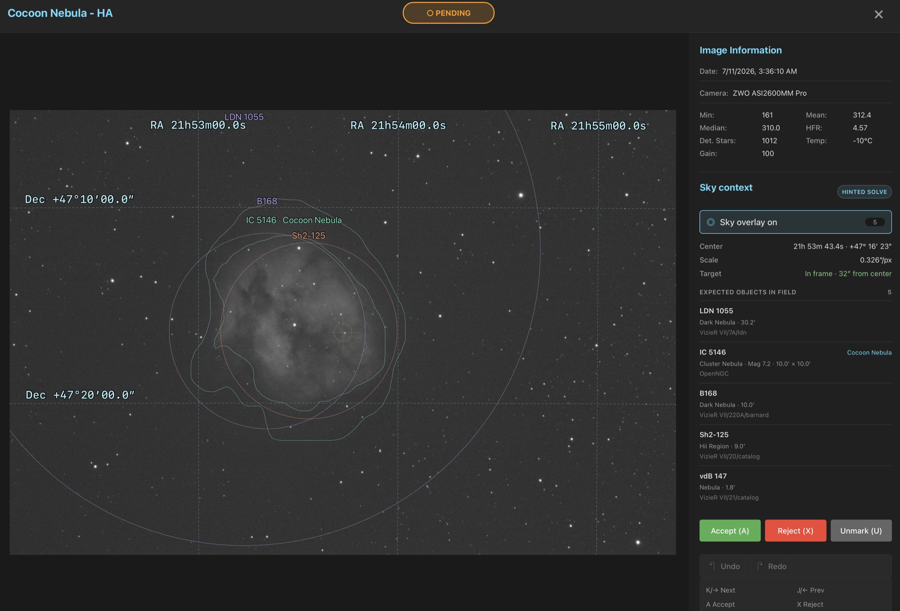

When the FITS file already contains a supported TAN WCS, the exact overlay is
available immediately. Otherwise choose **Solve field** or press `O`. PSF Guard
detects stars in the image, tries a fast hinted solve from the FITS/mount
coordinates and pixel scale, then falls back to the blind index when one is
installed. A successful solve turns the overlay on and reports the solved
center, scale, solve mode, and target offset. Once a solution exists, `O`
toggles the overlay instead of solving again.

### Install the Seiza catalogs

PSF Guard embeds Seiza 0.11.2's solver but does not bundle its multi-gigabyte
catalog data. Install the `seiza` CLI from the
[Seiza releases](https://github.com/theatrus/seiza/releases) or with
`cargo install seiza-cli --version 0.11.2`, then download a bundle once:

```bash
# Recommended: choose a bundle interactively and install it in Seiza's
# platform-standard catalog directory.
seiza setup

# Or download the complete prebuilt bundle to a directory you control.
seiza download-data prebuilt --output /path/to/seiza-data
```

Catalog downloads are versioned and SHA-256 verified. PSF Guard uses Seiza's
standard discovery, so data installed by `seiza setup` is found automatically.
You can instead set `SEIZA_CATALOG_DIR` to the downloaded directory, or merge
this top-level fragment into PSF Guard's JSON registry:

```json
"astrometry": {
  "data_dir": "/path/to/seiza-data"
}
```

The registry is `%APPDATA%\psf-guard\config.json` on Windows,
`~/Library/Application Support/psf-guard/config.json` on macOS, and
`~/.config/psf-guard/config.json` on Linux. Keep the existing `databases`
entries and restart PSF Guard after changing the catalog location.

For Docker, mount the same directory read-only and point Seiza at the mount:

```bash
docker run -d -p 3000:3000 \
  -e SEIZA_CATALOG_DIR=/catalogs \
  -v /path/to/seiza-data:/catalogs:ro \
  -v /path/to/schedulerdb.sqlite:/data/database.sqlite \
  -v /path/to/images:/images:ro \
  ghcr.io/theatrus/psf-guard:latest
```

The prebuilt bundle includes everything. If you install individual files,
their roles are distinct:

| File | Enables |
|------|---------|
| `objects.bin` | Coordinate-only object association plus solved labels and catalog outlines |
| `stars-lite-tycho2.bin`, `stars-gaia.bin`, or `stars-deep-gaia17.bin` | Hinted plate solving; Seiza selects the deepest installed catalog |
| `blind-gaia16.idx` | Blind fallback when the pointing hint is absent or stale |

Check what the running process discovered before troubleshooting an image:

```bash
curl http://localhost:3000/api/astrometry/capabilities
curl -X POST http://localhost:3000/api/astrometry/catalogs/validate
```

The validation call intentionally reads every configured catalog and can take
time. Hinted/blind solutions are cached per database under
`<cache>/<db-slug>/astrometry/`; PSF Guard invalidates them when the source
FITS file, relevant catalog, or Seiza version changes.

### Satellite track identifiers and bright-trail risk

Open an image's **Satellite tracks** panel and choose **Identify satellite
tracks**, or press `T`. PSF Guard ensures the frame has a pixel WCS, loads the
appropriate satellite elements through the resolver in `seiza-satellites`,
and projects every crossing during the shutter-open interval. Recent exposures
use CelesTrak's active catalog. Historical exposures use a nearby durable cache
entry, the Seiza rolling mirror, or the public IAU SatChecker fallback. PSF
Guard does not reproduce that provider policy. It then searches a narrow
corridor around each prediction for a matching linear trail in the FITS
pixels. The overlay keeps risk-colored orbital paths dashed and draws detected
pixel paths in solid green. Labels retain the candidate name and NORAD
identity; selecting a named result opens its external satellite information
page.

The FITS header must contain either explicit UTC exposure bounds, a UTC
midpoint (`DATE-AVG`) plus duration, or a UTC start plus duration, and an
observing site (`SITELAT`/`SITELONG`, `OBSGEO-B`/`OBSGEO-L`, or their
documented aliases). Both on-demand prediction and the user-triggered server
quality scan may refresh CelesTrak data or resolve historical data from the
Seiza mirror/IAU fallback. Merely viewing Sequence Analysis and running
`screen-fits --regrade-db` never download orbital data. The latter reuses a
suitable cached snapshot when one exists and otherwise abstains. Per-image
predictions persist under `<cache>/<db-slug>/satellites/`. Current and
historical snapshots share the same 5 GiB default cache bound, and each result
records the provider and exact orbital-payload fingerprint. Historical results
also record the requested catalog epoch separately from download time.

Bright-trail risk is a conservative geometry/illumination heuristic based on
sunlight, range, elevation, and path length. It is not an apparent magnitude.
Prediction alone warns and caps the score at 0.75; only a high-risk candidate
with a pixel-aligned trail can cap the score at 0.35 and propose an `[Auto]`
rejection through the same per-image confirmation workflow as other quality
findings. The orbital identity remains a candidate association. See
**[docs/SATELLITES.md](docs/SATELLITES.md)** for provenance, caching, and
failure semantics.

| Solved track overlay | Sequence grading recommendation |
|:--:|:--:|
| 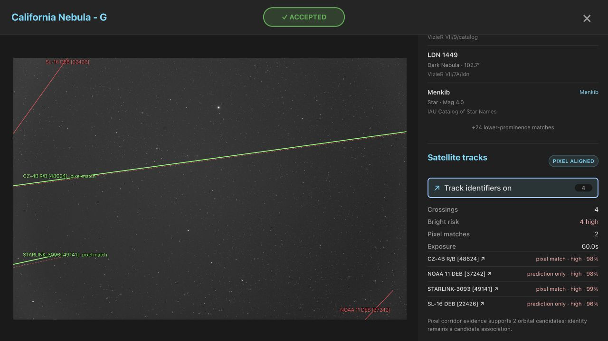 | 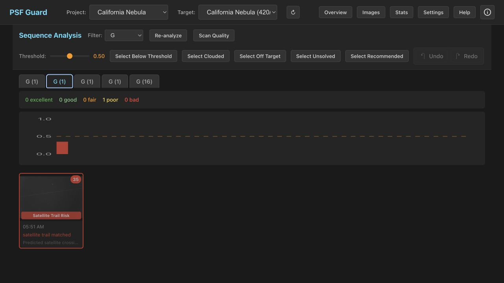 |

These real October 2025 frames validate both sides of the evidence boundary:
visible paths align tens of sensor pixels away from their orbital projections,
while other in-frame predictions correctly remain prediction-only. Treat the
name as a candidate association; rejection is based on the pixel-aligned
bright trail, not catalog presence alone.

## Quality screening

Screen light frames for occlusion, clouds, veils, stray light, off-target
pointing, and tracking loss — failure modes that ruin integrations but pass
star-count/HFR grading. No database is needed for spatial/photometric
screening. Supplying `--regrade-db` also loads the intended TS target, runs
fresh Seiza pixel solves, and—when orbital elements are already cached—adds
satellite crossing risk before the shared sequence grader.

```bash
# Screen a night, get per-frame verdicts (OK / WARN / REJECT)
psf-guard screen-fits "/path/to/2026-06-30/LIGHT"

# Render annotated diagnostics showing WHY each frame was flagged
psf-guard screen-fits "/path/to/LIGHT" --annotate /tmp/diagnostics

# Write [Auto] rejections into the scheduler DB, then archive the files
psf-guard screen-fits "/path/to/LIGHT" --regrade-db my-db --dry-run
psf-guard screen-fits "/path/to/LIGHT" --regrade-db my-db
psf-guard move-rejects --db my-db
```

| Occlusion arriving | Thin cloud veil (same field, clean vs veiled) |
|:--:|:--:|
| 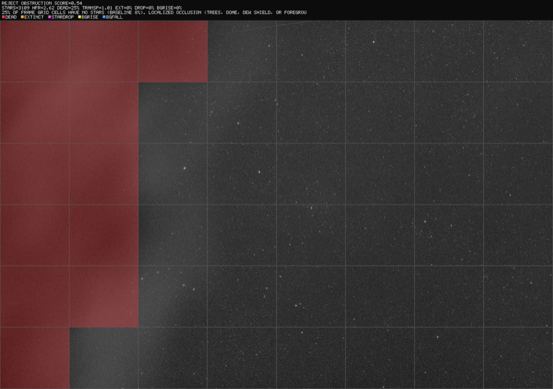 | 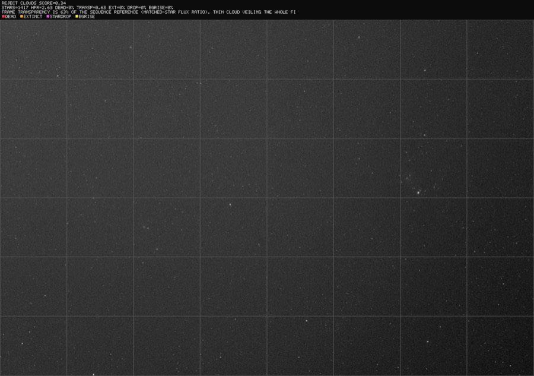 |

The web UI's Sequence view has a **Scan Quality** button that runs spatial,
photometric, and astrometric analysis server-side. It shows solved-center
scatter, field-relative offsets, quality scores, and Off Target / Pointing
Jump / Pointing Drift / Unsolved evidence. **Select Recommended** opens a
per-image review before any rejection is written. Stable multi-frame framing
offsets remain advisory instead of being mistaken for lost tracking.

Database settings also offer **Analyze Missing Quality** and **Rescan All
Quality**. These low-priority jobs cover the whole database, persist progress
while the settings page is closed, and refresh star counts, HFR, spatial and
photometric metrics, and pointing evidence. FITS import stays header-only by
default and never waits for this work. Star count and HFR use the N.I.N.A.
Fast detector so rescanned values remain comparable with Target Scheduler;
its full-resolution measurements also supply calibrated flux for photometry.

| Astrometry quality results | Guarded rejection review |
|:--:|:--:|
|  | 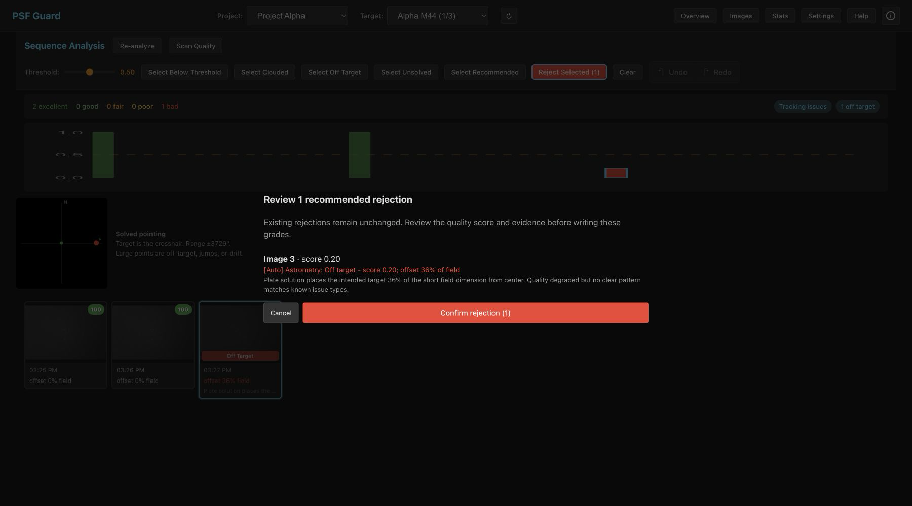 |

Astrometry grading details, target-source precedence, failure semantics,
score caps, cache safety, and CLI behavior:
**[docs/ASTROMETRY_QUALITY.md](docs/ASTROMETRY_QUALITY.md)**.

Full documentation — the detection stack, annotated diagnostic examples,
tuning, and safety properties: **[docs/SCREENING.md](docs/SCREENING.md)**.

## Managing rejected files

Once frames are rejected (by hand or by screening), archive them out of the
directory tree your stacking software scans — reversibly:

```bash
# Move rejects to <image_dir>/<Project>/REJECT/... with their sidecars.
# Idempotent; every move is recorded for restore.
psf-guard move-rejects --db my-db [--dry-run]

# Changed your mind? Un-reject frames in the UI, then:
psf-guard restore-rejects --db my-db          # restores only un-rejected files
psf-guard restore-rejects --db my-db --all    # restores everything
```

`restore-rejects` never overwrites an existing file, and archived frames stay
visible in the web UI. The legacy `filter-rejected` command still exists for
its statistical-regrading flags but is deprecated in favor of `move-rejects`.

## Syncing between machines

Grade on one machine while the telescope keeps capturing on another. `sync`
moves selected state between two scheduler databases — registry slugs or
`.sqlite` paths — matching rows by their stable GUID (Target Scheduler schema
v22+):

```bash
# Mirror projects, targets and captured images FROM the telescope INTO your DB.
# Your local grading is preserved; new images arrive with the telescope's grade.
psf-guard sync pull --from telescope.sqlite --to my-db --dry-run

# Push new or edited planning settings back TO the telescope. This updates
# projects, targets, templates, plans, and rule weights. Telescope capture
# counts, images, and grades stay unchanged.
psf-guard sync planning --from my-db --to telescope.sqlite --dry-run

# Push your grading decisions back TO the telescope (one-way, source wins).
psf-guard sync grades --from my-db --to telescope.sqlite --dry-run
```

Use them as a loop: pull complete new projects and captures, edit plans or
grade locally, then push planning settings and grades back. All three support
`--project` filters and `--dry-run` (`grades` also supports `--target` and
`--status`), open the source read-only, and run in one transaction. The
Settings panel offers the same full-pull and planning-push actions with a
dry-run preview before Apply.

## CLI reference

One binary, many tools. `psf-guard --help` lists everything; the highlights:

```bash
# Serve the grader UI (registers the DB in the shared registry on first run)
psf-guard server <database> <image-dirs...> [--port 3000]
psf-guard server --config psf-guard.toml            # TOML for server knobs
psf-guard server --registry /tmp/scratch.json <db> <dirs...>  # throwaway session
psf-guard server --host 127.0.0.1 <db> <dirs...>    # localhost only (default binds 0.0.0.0)

# Quality screening; --regrade-db also enables astrometry quality analysis
psf-guard screen-fits ./lights --annotate ./diagnostics
psf-guard screen-fits ./lights --regrade-db my-db --dry-run
psf-guard screen-fits ./lights --format json         # or table, csv

# Create a new Target Scheduler database from folders of FITS lights
psf-guard create-db new.sqlite ./lights1 ./lights2 [--name "My Rig"] [--dry-run]
# Top up later: attaches to EXISTING targets (name/coordinate match); only
# unmatched frames create new projects. Preview with --dry-run first.
psf-guard import <slug-or-path> ./more-lights [--dry-run] [--no-attach]
psf-guard remove-imported <slug-or-path> [--dry-run]  # undo an import's projects

# Export ("take out") non-rejected lights for stacking — WBPP-style layout
# <dest>/<target>/LIGHT/<filter>/; rejects are never exported
psf-guard export <slug-or-path> --dest ./stacking [--include-pending]
psf-guard export my-db --dest ./stacking --target "M 31" --link  # hardlinks

# Reject archival
psf-guard move-rejects --db <slug> [--dry-run] [--project NAME] [--target NAME]
psf-guard restore-rejects --db <slug> [--all] [--image-id N] [--dry-run]

# Two-database sync (see "Syncing between machines" above)
psf-guard sync pull --from telescope.sqlite --to my-db
psf-guard sync planning --from my-db --to telescope.sqlite
psf-guard sync grades --from my-db --to telescope.sqlite

# Star detection & PSF analysis
psf-guard analyze-fits image.fits [--detector nina|hocusfocus] [--compare-all]
psf-guard annotate-stars image.fits [--max-stars 50]
psf-guard visualize-psf image.fits [--star-index N]  # single-star fit residuals
psf-guard visualize-psf-multi image.fits [--num-stars 25]
psf-guard benchmark-psf image.fits                   # PSF fitting performance

# FITS utilities
psf-guard stretch-to-png image.fits -o output.png   # MTF auto-stretch
psf-guard read-fits image.fits                      # header/metadata dump

# Database queries & manual grading
psf-guard list-projects -d database.sqlite
psf-guard list-targets "Project Name" -d database.sqlite
psf-guard dump-grading -d database.sqlite [--project NAME]
psf-guard show-images <IDS> -d database.sqlite
psf-guard update-grade <ID> rejected -d database.sqlite
psf-guard regrade database.sqlite [--dry-run]        # statistical re-grading
```

Batch commands also support statistical outlier detection
(`--enable-statistical`): per-target/filter HFR and star-count distribution
analysis plus sequence-based cloud detection. Details in
[docs/STATISTICAL_GRADING.md](docs/STATISTICAL_GRADING.md).

## Configuration

### Databases: the registry

The server manages any number of scheduler databases. The list lives in a
JSON registry at the platform config location — not in the TOML:

| Platform | Registry path |
|----------|---------------|
| Windows | `%APPDATA%\psf-guard\config.json` |
| macOS | `~/Library/Application Support/psf-guard/config.json` |
| Linux | `~/.config/psf-guard/config.json` |

`psf-guard server <db> <dirs...>` **registers** that database on first run and
reuses it afterwards; you can also manage the list from the desktop app's
Settings panel or the `/api/databases` HTTP endpoints. For a one-off session
that shouldn't touch your real config, pass `--registry /tmp/scratch.json`.

The default N.I.N.A. scheduler database on Windows lives at
`%LOCALAPPDATA%\NINA\SchedulerPlugin\schedulerdb.sqlite`.

### Seiza catalogs and plate solving

See [Sky context, plate solving, and overlays](#sky-context-plate-solving-and-overlays)
for installation, Docker setup, resource roles, and UI usage. PSF Guard uses
Seiza's standard catalog discovery; a complete catalog bundle can also be
selected explicitly with the top-level `astrometry.data_dir` in the JSON
registry:

```json
{
  "schema_version": 2,
  "databases": [],
  "astrometry": { "data_dir": "/var/lib/psf-guard/catalog" }
}
```

`objects.bin` enables coordinate-only object association. A star tile catalog
enables hinted solving; the blind pattern index adds fallback solving when the
pointing hint is absent or stale. Successful pixel-derived solutions live at
`<cache>/<db-slug>/astrometry/<image-id>.json` and are invalidated when the
source FITS file or relevant catalog changes.

### Server knobs: the TOML

```bash
cp psf-guard.toml.example psf-guard.toml
psf-guard server --config psf-guard.toml
```

```toml
[server]
port = 3000
host = "0.0.0.0"
# Optional: fraction of CPU cores for parallel work (both default sensibly).
# Interactive jobs (occlusion scans, on-demand previews) get scan_worker_ratio;
# background pre-generation gets background_worker_ratio and pauses entirely
# while an interactive job runs.
#scan_worker_ratio = 0.5
#background_worker_ratio = 0.25

[cache]
directory = "./cache"
file_ttl = "5m"        # 30s, 5m, 1h, 2h30m, 1d ...
directory_ttl = "5m"

[pregeneration]        # optional background preview warming
enabled = true
screen = true          # 1200px previews
large = false          # 2000px previews
```

Command-line arguments override the config file. (A legacy
`[database]`/`[images]` section is still parsed but ignored in server mode —
databases come from the registry.)

## REST API

Per-database endpoints are nested under `/api/db/{db_id}/`; `GET
/api/databases` lists the configured databases and their ids.

```bash
# List images with filters
curl "localhost:3000/api/db/my-db/images?project_id=2&status=pending"

# Update a grade
curl -X PUT localhost:3000/api/db/my-db/images/123/grade \
  -H "Content-Type: application/json" \
  -d '{"status": "accepted"}'

# Fetch processed images
curl "localhost:3000/api/db/my-db/images/123/preview?size=large" -o preview.png
curl "localhost:3000/api/db/my-db/images/123/annotated" -o stars.png

# Read header/catalog context, then plate-solve pixels on demand
curl "localhost:3000/api/db/my-db/images/123/astrometry"
curl -X POST "localhost:3000/api/db/my-db/images/123/astrometry"

# Read a cached satellite prediction, or explicitly refresh/predict on demand
curl "localhost:3000/api/db/my-db/images/123/satellites"
curl -X POST "localhost:3000/api/db/my-db/images/123/satellites"

# Preview a full telescope → local sync. Use dry_run=false to apply it.
curl -X POST "localhost:3000/api/databases/my-db/sync" \
  -H "Content-Type: application/json" \
  -d '{"peer_db_id":"telescope","kind":"pull","dry_run":true}'

# Preview a local → telescope planning-settings sync.
curl -X POST "localhost:3000/api/databases/my-db/sync" \
  -H "Content-Type: application/json" \
  -d '{"peer_db_id":"telescope","kind":"push_planning","dry_run":true}'
```

## Known limitations

- **Monochrome only.** Color/OSC FITS files are not debayered and will do
  weird things. Want color support? Sample FITS files are welcome at
  psf-guard@theatr.us.
- **Target Scheduler required.** Images are located via the scheduler
  database, not by walking N.I.N.A.'s standard file layout (yet).
- **Path assumptions.** Directory layouts matching
  `%DATEMINUS12%/%TARGETNAME%/%DATEMINUS12%/LIGHT/...` (with or without the
  leading date) are detected reliably; other patterns may not be. Happy to
  support more — open an issue.
- **Make backups.** Of the scheduler database always, and of your FITS files
  before using file-moving commands. `move-rejects` is designed to be
  reversible and non-destructive, but it's your data.

## Development

```bash
cargo fmt && cargo clippy && cargo test    # the basics
RUST_LOG=debug cargo run -- server db.sqlite images/
cd static && npm run dev                   # frontend dev server
cd static && npm run test:e2e              # Playwright end-to-end suite
```

Architecture notes live in [CLAUDE.md](CLAUDE.md).

## License

Apache License 2.0 — see [LICENSE](LICENSE).
