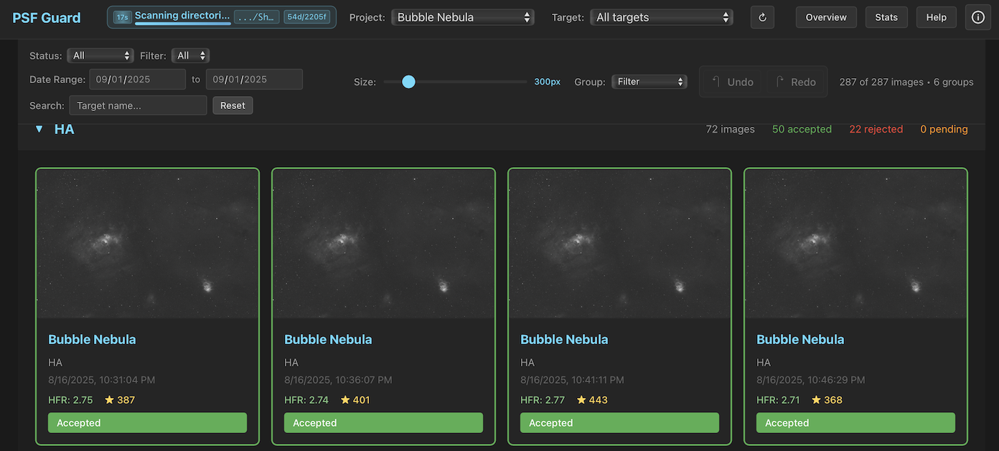
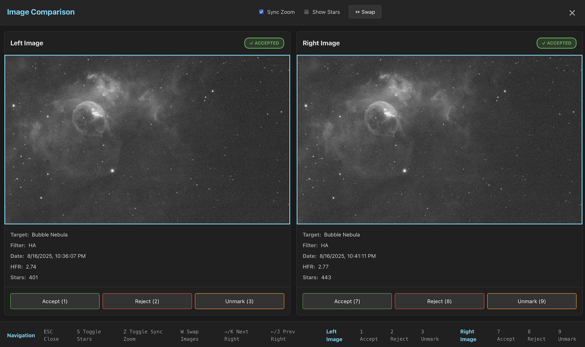
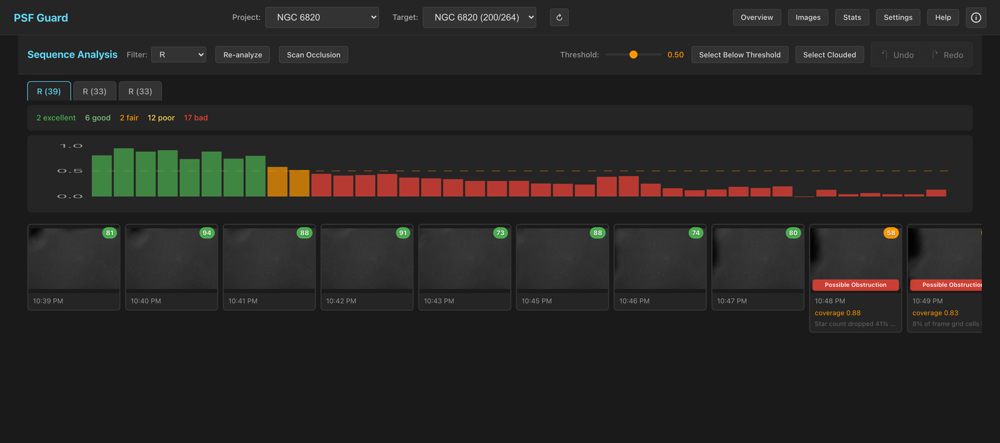

# PSF Guard

[](https://github.com/theatrus/psf-guard/actions/workflows/ci.yml)
[](https://opensource.org/licenses/Apache-2.0)

**Image grading and quality screening for [N.I.N.A.](https://nighttime-imaging.eu/)
astrophotography with the Target Scheduler plugin.**

After an imaging session you're left with hundreds of subs — and some of them
are ruined by clouds, a tree creeping into the frame, dome occlusion, or stray
light that conventional star-count/HFR grading happily accepts. PSF Guard
points at your Target Scheduler database and image folders and gives you:

- **A fast visual grader** — web UI or desktop app with auto-stretched
  previews, zoom/pan, side-by-side comparison, batch operations, and undo.
- **Automatic quality screening** — grid-based spatial metrics and cross-frame
  differential photometry that catch occlusion, small clouds, thin veils, and
  errant light, with annotated diagnostic images explaining every verdict.
- **Scheduler write-back** — every grade lands in the Target Scheduler
  database, so the scheduler knows to re-capture what you rejected.
- **Safe reject archival** — move rejected frames (and their sidecars) out of
  the directory tree your stacking software scans, reversibly.
- **Two-machine workflows** — sync projects, captured images, and grades
  between the telescope's database and your grading machine.
- **Star detection and PSF analysis** — a port of N.I.N.A.'s detector plus the
  HocusFocus detector, with Gaussian/Moffat PSF fitting and annotated output.

It runs as a desktop app (Windows/macOS/Linux), a self-hosted web server
(Docker, NAS), or a standalone CLI.

> **Back up your Target Scheduler database before first use.** PSF Guard
> writes grades into it, and its `sync` commands can merge entire databases —
> projects, captured images, and grades — between machines. It's careful
> (dry-run flags everywhere), but it's also young software.

## Screenshots

| Overview Dashboard | Image Grid | Side-by-Side Comparison |
|:--:|:--:|:--:|
|  |  |  |
| Project statistics and progress tracking | Grid view with filtering and batch operations | Synchronized zoom and detailed comparison |

| Sequence Analysis & Quality Screening | Star Detection | PSF Fitting |
|:--:|:--:|:--:|
|  |  |  |
| Per-frame quality scores, cloud/occlusion classification, one-click occlusion scanning | HocusFocus detector with annotated output (`annotate-stars`) | Observed / fitted / residual grids with Moffat & Gaussian models (`visualize-psf-multi`) |

## Installation

### Desktop app (Windows / macOS / Linux)

Grab the installer for your platform from the
**[latest release](https://github.com/theatrus/psf-guard/releases/latest)**:

| Platform | Asset |
|----------|-------|
| Windows x64 | `PSF.Guard_<version>_x64_en-US.msi` |
| macOS (Apple Silicon) | `PSF.Guard_<version>_aarch64.dmg` |
| Linux x64 | `PSF.Guard_<version>_amd64.deb` or `.AppImage` |

Install, launch, and point the settings panel at your scheduler database and
image directories. Releases after v0.3.0 also include a Windows NSIS
installer (`-setup.exe`) that additionally installs a console
`psf-guard-cli.exe` and adds it to your user `PATH`, so the full CLI works
from any terminal.

### Docker (Linux servers / NAS)

```bash
docker run -d -p 3000:3000 \
  -v /path/to/schedulerdb.sqlite:/data/database.sqlite \
  -v /path/to/images:/images:ro \
  ghcr.io/theatrus/psf-guard:latest
```

Then open http://localhost:3000/. The database mount must be **writable** —
grading writes back to it (that's the point!). Mount a TOML config at
`/data/config.toml` and append `server --config /data/config.toml
/data/database.sqlite /images` if you want to tune port, cache, or preview
pre-generation (see [Configuration](#configuration)).

### Standalone CLI binaries

Version-independent download links, always pointing at the latest release:

| Platform | Download | Notes |
|----------|----------|-------|
| Linux x64 | [`psf-guard-linux-x64`](https://github.com/theatrus/psf-guard/releases/latest/download/psf-guard-linux-x64) | Needs system OpenCV — Docker is easier |
| macOS | [`psf-guard-macos-x64`](https://github.com/theatrus/psf-guard/releases/latest/download/psf-guard-macos-x64) | Needs Homebrew OpenCV |
| Windows x64 | [`psf-guard-windows-x64.exe`](https://github.com/theatrus/psf-guard/releases/latest/download/psf-guard-windows-x64.exe) | Static binary, no dependencies |

```bash
# Linux / macOS
chmod +x psf-guard-*
./psf-guard-linux-x64 server schedulerdb.sqlite /path/to/images/
```

```bat
:: Windows — back up the DB first, then serve it
copy "%LOCALAPPDATA%\NINA\SchedulerPlugin\schedulerdb.sqlite" schedulerdb-backup.sqlite
psf-guard-windows-x64.exe server "%LOCALAPPDATA%\NINA\SchedulerPlugin\schedulerdb.sqlite" C:\path\to\images
```

Then open http://localhost:3000/.

### Fedora RPM

Releases after v0.3.0 attach prebuilt RPMs for Fedora 43 and 44 to the
[releases page](https://github.com/theatrus/psf-guard/releases/latest):

```bash
sudo dnf install ./psf-guard-*.fc44.x86_64.rpm
```

The package installs the CLI/server plus a `psf-guard.service` systemd unit
for running the web grader as a daemon.

Prefer to build your own? Native RPMs build with standard tooling
(`rpmbuild`, `mock`, COPR), fully offline once sources are prepared:

```bash
sudo dnf install -y rpm-build rpmdevtools cargo rust clang-devel \
    opencv-devel nodejs npm git
rpmdev-setuptree
./scripts/make-rpm-sources.sh                  # builds frontend + vendors crates
rpmbuild -ba packaging/rpm/psf-guard.spec      # RPMs land in ~/rpmbuild/RPMS/
```

See [`packaging/rpm/README.md`](packaging/rpm/README.md) for mock builds, the
`--without opencv` variant, and release steps.

### Build from source

```bash
git clone https://github.com/theatrus/psf-guard.git
cd psf-guard
cargo build --release
./target/release/psf-guard server schedulerdb.sqlite /path/to/images/
```

You'll need Rust, Node.js/npm (the React frontend is embedded at build time),
and OpenCV with clang. OpenCV is the painful one — the CI workflows under
[`.github/workflows/`](.github/workflows/) are the authoritative package lists
per platform (vcpkg on Windows, Homebrew on macOS, `libopencv-dev` on
Debian/Ubuntu).

## The web grader

Open the UI and you get an overview dashboard (projects, targets, completion,
grading progress), an image grid, and a comparison mode:

- **Grid**: filter by project/target/status/date, multi-select with
  Shift/Ctrl+Click, accept/reject/unmark with instant feedback, HFR and
  star-count metadata on every card.
- **Comparison**: side-by-side with synchronized (or independent) zoom and
  pan — grade both frames at once.
- **Smart loading**: fast previews first, full resolution on zoom; previews
  generate on demand in the background, so a fresh install is browsable
  immediately.
- **Undo/redo** for every grading action.

| Key | Action | Key | Action |
|-----|--------|-----|--------|
| K / → | Next image | A | Accept |
| J / ← | Previous | X | Reject |
| C | Compare | U | Unmark |
| S | Stars overlay | + / − | Zoom |
| Ctrl+Z | Undo | Ctrl+Y | Redo |

Grades are written straight to the Target Scheduler database, so the
scheduler's acquired-image counts stay accurate and rejected frames get
re-shot.

## Quality screening

Screen light frames for occlusion, clouds, veils, and stray light — the
failure modes that ruin integrations but pass star-count/HFR grading. No
database needed; write-back into the scheduler DB is optional.

```bash
# Screen a night, get per-frame verdicts (OK / WARN / REJECT)
psf-guard screen-fits "/path/to/2026-06-30/LIGHT"

# Render annotated diagnostics showing WHY each frame was flagged
psf-guard screen-fits "/path/to/LIGHT" --annotate /tmp/diagnostics

# Write [Auto] rejections into the scheduler DB, then archive the files
psf-guard screen-fits "/path/to/LIGHT" --regrade-db my-db --dry-run
psf-guard screen-fits "/path/to/LIGHT" --regrade-db my-db
psf-guard move-rejects --db my-db
```

| Occlusion arriving | Thin cloud veil (same field, clean vs veiled) |
|:--:|:--:|
|  |  |

The web UI's Sequence view has a **Scan Occlusion** button that runs the same
analysis server-side in the background and badges affected frames with their
classification.

Full documentation — the detection stack, annotated diagnostic examples,
tuning, and safety properties: **[docs/SCREENING.md](docs/SCREENING.md)**.

## Managing rejected files

Once frames are rejected (by hand or by screening), archive them out of the
directory tree your stacking software scans — reversibly:

```bash
# Move rejects to <image_dir>/<Project>/REJECT/... with their sidecars.
# Idempotent; every move is recorded for restore.
psf-guard move-rejects --db my-db [--dry-run]

# Changed your mind? Un-reject frames in the UI, then:
psf-guard restore-rejects --db my-db          # restores only un-rejected files
psf-guard restore-rejects --db my-db --all    # restores everything
```

`restore-rejects` never overwrites an existing file, and archived frames stay
visible in the web UI. The legacy `filter-rejected` command still exists for
its statistical-regrading flags but is deprecated in favor of `move-rejects`.

## Syncing between machines

Grade on one machine while the telescope keeps capturing on another. `sync`
moves state between two scheduler databases — registry slugs or `.sqlite`
paths — matching images by their stable GUID (Target Scheduler schema v22+):

```bash
# Mirror projects, targets and captured images FROM the telescope INTO your DB.
# Your local grading is preserved; new images arrive with the telescope's grade.
psf-guard sync pull --from telescope.sqlite --to my-db --dry-run

# Push your grading decisions back TO the telescope (one-way, source wins).
psf-guard sync grades --from my-db --to telescope.sqlite --dry-run
```

Use them as a loop — pull to refresh, grade locally, push grades back. Both
directions support `--project` filters and `--dry-run` (`grades` also
`--target` and `--status`), open the source read-only, and run in a single
transaction.

## CLI reference

One binary, many tools. `psf-guard --help` lists everything; the highlights:

```bash
# Serve the web grader (registers the DB in the shared registry on first run)
psf-guard server <database> <image-dirs...> [--port 3000]
psf-guard server --config psf-guard.toml            # TOML for server knobs
psf-guard server --registry /tmp/scratch.json <db> <dirs...>  # throwaway session
psf-guard server --host 127.0.0.1 <db> <dirs...>    # localhost only (default binds 0.0.0.0)

# Quality screening (see docs/SCREENING.md)
psf-guard screen-fits ./lights --annotate ./diagnostics
psf-guard screen-fits ./lights --regrade-db my-db --dry-run
psf-guard screen-fits ./lights --format json         # or table, csv

# Reject archival
psf-guard move-rejects --db <slug> [--dry-run] [--project NAME] [--target NAME]
psf-guard restore-rejects --db <slug> [--all] [--image-id N] [--dry-run]

# Two-database sync (see "Syncing between machines" above)
psf-guard sync pull --from telescope.sqlite --to my-db
psf-guard sync grades --from my-db --to telescope.sqlite

# Star detection & PSF analysis
psf-guard analyze-fits image.fits [--detector nina|hocusfocus] [--compare-all]
psf-guard annotate-stars image.fits [--max-stars 50]
psf-guard visualize-psf image.fits [--star-index N]  # single-star fit residuals
psf-guard visualize-psf-multi image.fits [--num-stars 25]
psf-guard benchmark-psf image.fits                   # PSF fitting performance

# FITS utilities
psf-guard stretch-to-png image.fits -o output.png   # MTF auto-stretch
psf-guard read-fits image.fits                      # header/metadata dump

# Database queries & manual grading
psf-guard list-projects -d database.sqlite
psf-guard list-targets "Project Name" -d database.sqlite
psf-guard dump-grading -d database.sqlite [--project NAME]
psf-guard show-images <IDS> -d database.sqlite
psf-guard update-grade <ID> rejected -d database.sqlite
psf-guard regrade database.sqlite [--dry-run]        # statistical re-grading
```

Batch commands also support statistical outlier detection
(`--enable-statistical`): per-target/filter HFR and star-count distribution
analysis plus sequence-based cloud detection. Details in
[docs/STATISTICAL_GRADING.md](docs/STATISTICAL_GRADING.md).

## Configuration

### Databases: the registry

The server manages any number of scheduler databases. The list lives in a
JSON registry at the platform config location — not in the TOML:

| Platform | Registry path |
|----------|---------------|
| Windows | `%APPDATA%\psf-guard\config.json` |
| macOS | `~/Library/Application Support/psf-guard/config.json` |
| Linux | `~/.config/psf-guard/config.json` |

`psf-guard server <db> <dirs...>` **registers** that database on first run and
reuses it afterwards; you can also manage the list from the desktop app's
Settings panel or the `/api/databases` HTTP endpoints. For a one-off session
that shouldn't touch your real config, pass `--registry /tmp/scratch.json`.

The default N.I.N.A. scheduler database on Windows lives at
`%LOCALAPPDATA%\NINA\SchedulerPlugin\schedulerdb.sqlite`.

### Server knobs: the TOML

```bash
cp psf-guard.toml.example psf-guard.toml
psf-guard server --config psf-guard.toml
```

```toml
[server]
port = 3000
host = "0.0.0.0"
# Optional: fraction of CPU cores for parallel work (both default sensibly).
# Interactive jobs (occlusion scans, on-demand previews) get scan_worker_ratio;
# background pre-generation gets background_worker_ratio and pauses entirely
# while an interactive job runs.
#scan_worker_ratio = 0.5
#background_worker_ratio = 0.25

[cache]
directory = "./cache"
file_ttl = "5m"        # 30s, 5m, 1h, 2h30m, 1d ...
directory_ttl = "5m"

[pregeneration]        # optional background preview warming
enabled = true
screen = true          # 1200px previews
large = false          # 2000px previews
```

Command-line arguments override the config file. (A legacy
`[database]`/`[images]` section is still parsed but ignored in server mode —
databases come from the registry.)

## REST API

Per-database endpoints are nested under `/api/db/{db_id}/`; `GET
/api/databases` lists the configured databases and their ids.

```bash
# List images with filters
curl "localhost:3000/api/db/my-db/images?project_id=2&status=pending"

# Update a grade
curl -X PUT localhost:3000/api/db/my-db/images/123/grade \
  -H "Content-Type: application/json" \
  -d '{"status": "accepted"}'

# Fetch processed images
curl "localhost:3000/api/db/my-db/images/123/preview?size=large" -o preview.png
curl "localhost:3000/api/db/my-db/images/123/annotated" -o stars.png
```

## Known limitations

- **Monochrome only.** Color/OSC FITS files are not debayered and will do
  weird things. Want color support? Sample FITS files are welcome at
  psf-guard@theatr.us.
- **Target Scheduler required.** Images are located via the scheduler
  database, not by walking N.I.N.A.'s standard file layout (yet).
- **Path assumptions.** Directory layouts matching
  `%DATEMINUS12%/%TARGETNAME%/%DATEMINUS12%/LIGHT/...` (with or without the
  leading date) are detected reliably; other patterns may not be. Happy to
  support more — open an issue.
- **Make backups.** Of the scheduler database always, and of your FITS files
  before using file-moving commands. `move-rejects` is designed to be
  reversible and non-destructive, but it's your data.

## Development

```bash
cargo fmt && cargo clippy && cargo test    # the basics
RUST_LOG=debug cargo run -- server db.sqlite images/
cd static && npm run dev                   # frontend dev server
cd static && npm run test:e2e              # Playwright end-to-end suite
```

Architecture notes live in [CLAUDE.md](CLAUDE.md).

## License

Apache License 2.0 — see [LICENSE](LICENSE).
