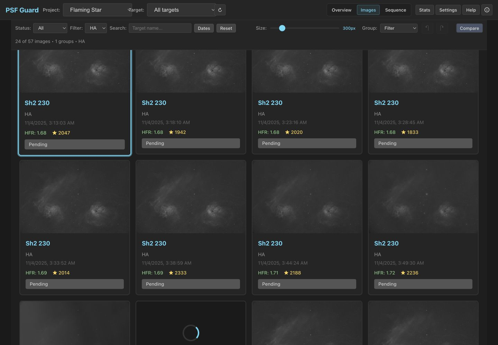
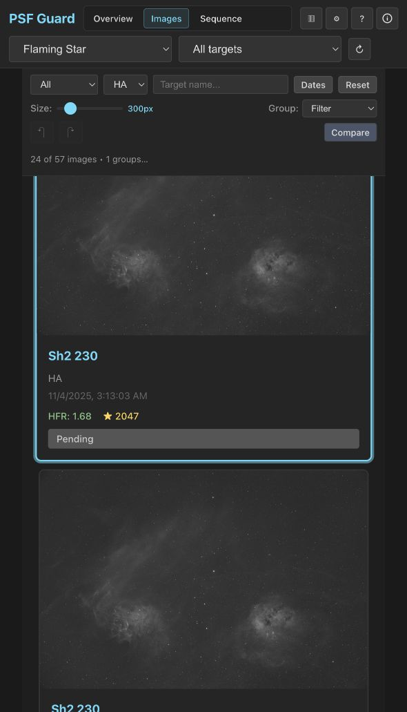
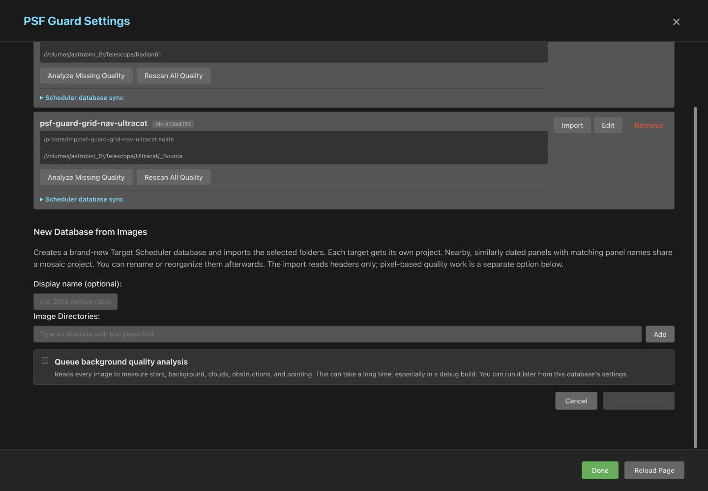
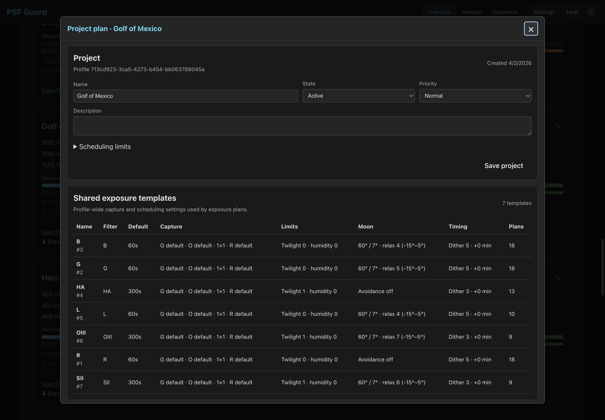
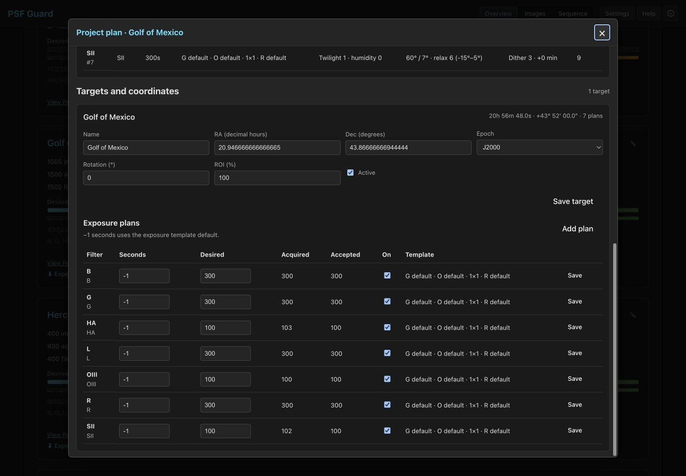
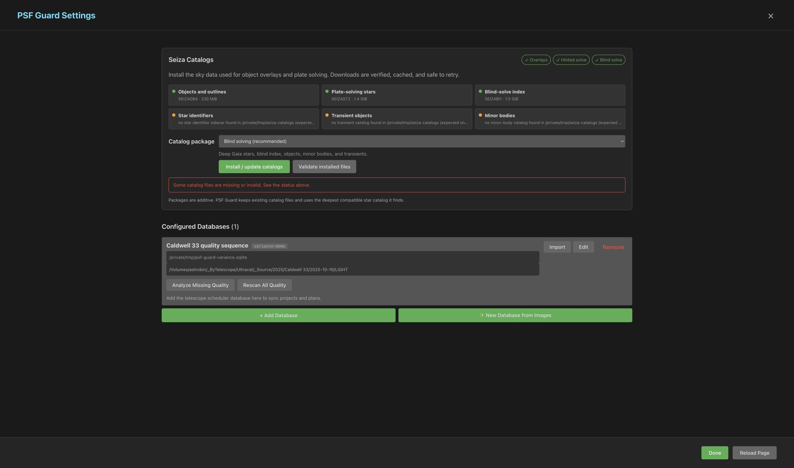
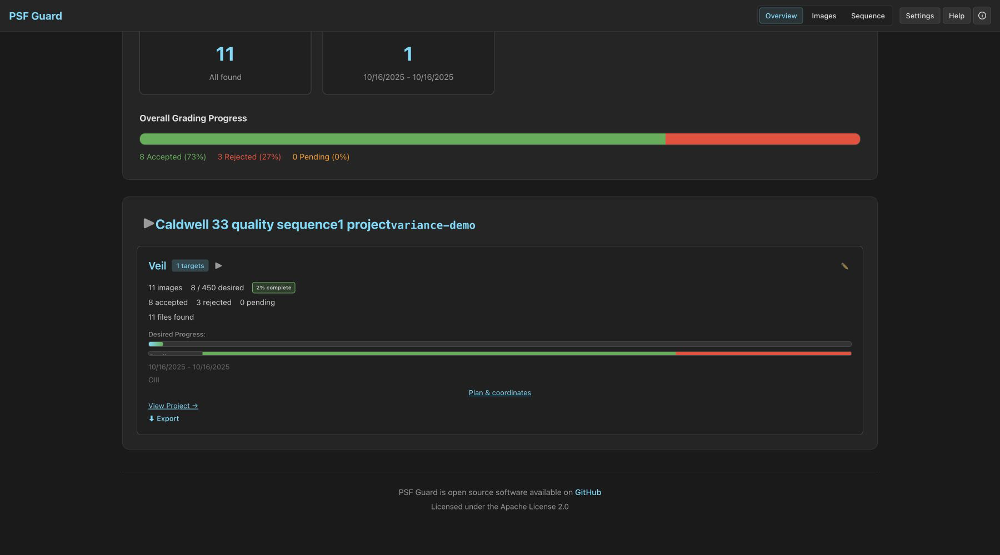

# 🛡️ PSF Guard

[](https://github.com/theatrus/psf-guard/releases/latest)
[](https://github.com/theatrus/psf-guard/actions/workflows/ci.yml)
[](https://github.com/theatrus/psf-guard/releases/latest)
[](https://opensource.org/licenses/Apache-2.0)

**An astrophotography image catalog, grader, and quality workbench.**

Create a catalog from folders of FITS files, or open an existing
[N.I.N.A.](https://nighttime-imaging.eu/) Target Scheduler database. PSF Guard
groups frames by target, session, and filter; lets you inspect and grade them;
finds quality problems; builds stack previews; and exports clean data for
processing. Your image files stay where they are.

> **Like Lightroom Classic, but for astrophotography data:** PSF Guard catalogs
> files in place instead of moving them into a managed library. It reads FITS
> metadata and stores its image map, plans, and grades in a catalog based on the
> Target Scheduler database structure. Target Scheduler integration is
> optional.

**[⬇️ Download](https://github.com/theatrus/psf-guard/releases/latest)**
· **[📖 Documentation](https://psf-guard.atpn.co/docs/)**
· **[🐛 Report an issue](https://github.com/theatrus/psf-guard/issues)**

## 🧭 Choose a workflow

| | Start here when… | What to do |
|:--:|---|---|
| 📥 | **You have FITS folders** | Build a catalog from the folders. Header import runs first; quality analysis can run later. |
| 🗃️ | **You have a Target Scheduler database** | Open the existing catalog in the desktop app and start reviewing. |
| 🌐 | **You need a CLI or NAS setup** | Serve the UI, screen folders, export files, or automate jobs. |
| 🔄 | **You keep two database files** | Pull from the telescope copy, then push plans and grades back. Skip sync when PSF Guard opens the telescope database directly. |

> **Opening a Target Scheduler database?** Back it up before the first write.
> Grading updates it; import and sync preview wider changes before applying
> them.

## ✨ What PSF Guard does

- **Organize every frame** in a catalog built from FITS folders or inherited
  from Target Scheduler. Browse by target, session, filter, date, and grade
  while the source files stay in place.
- **Review frames quickly** in the desktop app or browser with stretched
  previews, zoom and pan, comparison, batch grading, keyboard controls, and
  undo. Image details show the resolved or recorded file path; the desktop app
  can reveal a resolved file in Finder, Explorer, or the Linux file manager.
- **Screen image quality** with spatial metrics, cross-frame photometry, and
  fresh pixel-derived plate solutions. The evidence can expose clouds,
  occlusion, stray light, off-target frames, and lost tracking.
- **Inspect the sky** with catalog context, on-demand Seiza plate solving,
  object overlays, target offsets, and satellite-track checks that keep orbital
  predictions separate from trails found in the pixels.
- **Build stack previews** per target and channel, inspect admission decisions,
  combine RGB, LRGB, or narrowband palettes, adjust the processing stack, and
  download the cached linear or processed FITS result.
- **Review plans and imports** with project settings, target coordinates,
  shared exposure templates, and exposure plans derived from FITS headers.
- **Take data out safely** by exporting non-rejected lights for stacking or by
  moving rejected files and sidecars into a recorded, reversible archive.
- **Sync separate copies** by pulling telescope projects and captures, then
  pushing edited plans and reviewed grades back in the named direction.
- **Run analysis tools** for N.I.N.A. Fast and HocusFocus star detection,
  Gaussian or Moffat PSF fitting, annotations, and batch reports.

PSF Guard runs as a desktop app on Windows, macOS, and Linux, as a self-hosted
web server for Docker or a NAS, and as a standalone CLI.

## 🚀 Start your catalog

1. Install the desktop app from the
   [latest release](https://github.com/theatrus/psf-guard/releases/latest).
2. In Settings, choose **New Database from Images** to build a catalog from FITS
   folders, or **Add Database** to open an existing Target Scheduler catalog.
3. Add the folders that hold the FITS files.
4. Choose a project on Overview, then open Images or Sequence.

PSF Guard reads images in place; it does not copy the FITS library. Image
folders can stay read-only. The database must be writable to save grades or
planning changes. See [Import and Planning](docs/IMPORTING.md) for a new
catalog, or the [Getting Started guide](https://psf-guard.atpn.co/docs/) for
both paths.

## 📷 See it in practice

The images below come from real FITS acquisitions. They show quick-look data:
PSF Guard finds problems, records grading decisions, and checks an integration
before a full calibration and processing run.

### Review and grade a night quickly

| Overview Dashboard | Image Grid | Side-by-Side Comparison |
|:--:|:--:|:--:|
|  |  |  |
| Project statistics and progress tracking | Grid view with filtering and batch operations | Synchronized zoom and detailed comparison |

The compact grid header keeps project, target, filters, grouping, image size,
undo/redo, and comparison controls in stable rows. Preview generation, stack
status, and database refreshes preserve the first visible image instead of
moving the review position. Arrow keys move the image cursor; `Space` toggles
its selection in both Grid and Sequence views. Shift+Click selects a range and
Ctrl/Cmd+Click toggles one frame.

<details>
<summary>Responsive grid layout</summary>



</details>

Each Overview project has a **Plan & coordinates** view. It shows the project
settings and every target's catalog coordinates and exposure plans. The
inherited Target Scheduler mapping stores RA as decimal hours and Dec as
degrees. New plans reuse an exact matching profile template or create one with
Target Scheduler-compatible defaults. The plan table keeps the schema's `-1`
exposure value, which means “use the template default.” The desktop app can
edit these fields. The web server needs `--allow-database-management`; without
it, the view stays read-only.

### Build an image catalog from FITS folders

Use this path when no catalog exists or when frames are missing from one you
already use.



Open **Settings → New Database from Images** to build a catalog from plain FITS
folders. PSF Guard uses the Target Scheduler database structure, but does not
require Target Scheduler. The first pass reads headers only. It creates one
project per target by default, joins only strong same-rig mosaic panel matches,
derives target coordinates, and builds shared exposure templates and plans from
filter, gain, offset, binning, readout mode, and exposure time. Pixel work stays
off by default, so a large import does not wait for star detection or plate
solving.

| Narrowband template view | Target coordinates and exposure plans |
|:--:|:--:|
|  |  |

Settings shows import progress even after the page is closed or reloaded. Once
the catalog is ready, **Analyze Missing Quality** fills uncached star,
photometric, spatial, and pointing evidence in a low-priority job;
**Rescan All Quality** forces a fresh pass. Importing more folders starts with
a dry preview, skips basenames already present, and attaches new frames to an
existing target by name or nearby coordinates before it creates new structure.

The Overview's **Plan & coordinates** dialog lets you correct imported names,
coordinates, limits, and desired counts. See the
**[import and planning guide](docs/IMPORTING.md)** for database paths, grouping
rules, backfill behavior, and CLI commands.

**Sync is for two database files.** Settings can pull new projects from a
telescope copy or push edited planning fields back without changing its
captures or grades. Skip this step when PSF Guard opens the telescope database
directly.

### See the evidence behind a quality decision

| Sequence Analysis & Astrometry Quality | Star Detection | PSF Fitting |
|:--:|:--:|:--:|
|  |  |  |
| Per-frame scores, cloud/occlusion screening, solved-center scatter, and off-target/tracking flags | HocusFocus-inspired detection with annotated output (`annotate-stars`) | Observed / fitted / residual grids with Moffat & Gaussian models (`visualize-psf-multi`) |

The sequence analyzer brings global image statistics, spatial and photometric
screening, pixel-derived plate solves, and cached satellite evidence into a
per-frame score. Recommendations remain reviewable before PSF Guard writes a
grade to the active catalog.

### Preview a stack without leaving the grader

| Stack Preview | Full-size Inspection | Stack Admission Decisions |
|:--:|:--:|:--:|
|  |  |  |
| Uncalibrated, on-demand integration grouped by exact target and channel | Familiar zoom, pan, fit, and one-pixel-per-pixel controls | Quality exclusions, reference choice, matches, registration RMS, and rejection reasons |

This real M44 example was built from three B-channel acquisitions. Each input's
quality exclusion, registration match count, residual, and admission decision
is retained with the cached linear FITS result.

### Combine real narrowband channel stacks


This real Gulf of Mexico (NGC 7000) quick-look preview uses six accepted Ultracat
acquisitions: two each in H-alpha, OIII, and SII. The same three linear channel
stacks can be recombined as standard SHO, Foraxx SHO, or any other compatible
narrowband palette without rebuilding the integrations.


Color previews fit and subtract each input channel's background before
cross-filter registration. The UI exposes the resolved fit evidence, editable
background model, per-input and output stretch stacks, complete phase progress,
full-size inspection, and a downloadable processed RGB FITS file. This real
narrowband run accepted 73 of 96 H-alpha samples, 78 of 96 OIII samples, and 95
of 96 SII samples while rejecting noisy or source-contaminated fit locations.
See the **[stack preview guide](docs/STACKING_PREVIEWS.md)** for the full
workflow and cache behavior.

## 📦 Installation

### Desktop app (Windows / macOS / Linux)

Grab the installer for your platform from the
**[latest release](https://github.com/theatrus/psf-guard/releases/latest)**:

| Platform | Asset |
|----------|-------|
| Windows x64 | `PSF.Guard_<version>_x64_en-US.msi` |
| macOS (Apple Silicon) | `PSF.Guard_<version>_aarch64.dmg` |
| Linux x64 | `PSF.Guard_<version>_amd64.deb` or `.AppImage` |

Install and launch the app, then build a catalog from FITS folders or open an
existing Target Scheduler database. Releases after v0.3.0 also include a
Windows NSIS installer (`-setup.exe`) that installs a console
`psf-guard-cli.exe` and adds it to your user `PATH`, so the full CLI works
from any terminal.

The remaining install options serve the UI on another machine or provide
command-line tools. Desktop review does not require them.

### Docker (Linux servers / NAS)

```bash
docker run -d -p 3000:3000 \
  -v /path/to/catalog.sqlite:/data/database.sqlite \
  -v /path/to/images:/images:ro \
  ghcr.io/theatrus/psf-guard:latest
```

Then open http://localhost:3000/. The database mount must be **writable**
because grading updates it. Mount a TOML config at
`/data/config.toml` and append `server --config /data/config.toml
/data/database.sqlite /images` to tune the port, cache, or preview
pre-generation (see [Configuration](#configuration)).

### Standalone CLI binaries

These version-independent links point at the latest release:

| Platform | Download | Notes |
|----------|----------|-------|
| Linux x64 | [`psf-guard-linux-x64`](https://github.com/theatrus/psf-guard/releases/latest/download/psf-guard-linux-x64) | Self-contained binary |
| macOS | [`psf-guard-macos-x64`](https://github.com/theatrus/psf-guard/releases/latest/download/psf-guard-macos-x64) | Self-contained binary |
| Windows x64 | [`psf-guard-windows-x64.exe`](https://github.com/theatrus/psf-guard/releases/latest/download/psf-guard-windows-x64.exe) | Static binary, no dependencies |

```bash
# Linux / macOS
chmod +x psf-guard-*
./psf-guard-linux-x64 server catalog.sqlite /path/to/images/
```

```bat
:: Windows — back up the DB first, then serve it
copy "%LOCALAPPDATA%\NINA\SchedulerPlugin\schedulerdb.sqlite" schedulerdb-backup.sqlite
psf-guard-windows-x64.exe server "%LOCALAPPDATA%\NINA\SchedulerPlugin\schedulerdb.sqlite" C:\path\to\images
```

Then open http://localhost:3000/.

### Fedora RPM

Releases after v0.3.0 attach prebuilt RPMs for Fedora 43 and 44 to the
[releases page](https://github.com/theatrus/psf-guard/releases/latest):

```bash
sudo dnf install ./psf-guard-*.fc44.x86_64.rpm
```

The package installs the CLI/server plus a `psf-guard.service` systemd unit
for running the PSF Guard server as a daemon.

Native RPMs build with standard tooling (`rpmbuild`, `mock`, COPR) and need no
network access after the sources have been prepared:

```bash
sudo dnf install -y rpm-build rpmdevtools cargo rust nodejs npm git
rpmdev-setuptree
./scripts/make-rpm-sources.sh                  # builds frontend + vendors crates
rpmbuild -ba packaging/rpm/psf-guard.spec      # RPMs land in ~/rpmbuild/RPMS/
```

See [`packaging/rpm/README.md`](packaging/rpm/README.md) for mock builds and
release steps.

### Build from source

```bash
git clone https://github.com/theatrus/psf-guard.git
cd psf-guard
cargo build --release
./target/release/psf-guard server catalog.sqlite /path/to/images/
```

The build needs Rust and Node.js/npm; it embeds the React frontend. Image
processing uses the pure-Rust
[`seiza-imgproc`](https://github.com/theatrus/seiza) crate, so no native
computer-vision libraries are required.

## 🖼️ The grader UI

The desktop app embeds the grader, so it needs no separate server or browser.
`psf-guard server` serves the same UI for a NAS or remote setup. The overview
shows projects, targets, completion, and grading progress; the other views add
the image grid and comparison tools:

- **Grid**: filter by project/target/status/date, multi-select with
  Shift/Ctrl/Cmd+Click or `Space`, move through cards with the arrow keys,
  accept/reject/unmark with instant feedback, and see HFR and star-count
  metadata on every card. Time-based Session grouping keeps large projects
  in the same image-first layout.
- **Stable position**: preview generation, status changes, and database refresh
  updates keep the visible image anchored instead of moving the page.
- **Comparison**: side-by-side with synchronized (or independent) zoom and
  pan — grade both frames at once.
- **Smart loading**: fast previews first, full resolution on zoom; previews
  generate on demand in the background, so a fresh install is browsable
  immediately.
- **File location**: image details show the resolved path when the source file
  is present and fall back to the path recorded in the catalog. Copy any shown
  path, or use **Show in folder** in the desktop app.
- **Stack previews**: in a single project, build an uncalibrated registered
  preview from an explicit multi-selection or the current visible filters.
  PSF Guard excludes rejected and regrade-recommended frames before Seiza
  performs registration and admission, and retains a downloadable linear FITS
  beside the display PNG. Completed R/G/B, L/R/G/B, or Ha/OIII/SII stacks can
  then be registered across filters and combined into RGB, LRGB, or a selected
  narrowband palette without altering the source integrations. See
  **[docs/STACKING_PREVIEWS.md](docs/STACKING_PREVIEWS.md)**.
- **Sky context and plate solving**: coordinate-only catalog matches appear
  immediately. Choose **Solve field** (or press `O`) to run Seiza against the
  image pixels; PSF Guard tries the FITS/mount hint first, falls back to the
  blind index when installed, persists the WCS per database, and enables the
  shared object overlay.
- **Undo/redo** for every grading action.

| Key | Action | Key | Action |
|-----|--------|-----|--------|
| K / → | Next image | A | Accept |
| J / ← | Previous image | X | Reject |
| ↑ / ↓ | Nearest grid row | Space | Toggle selection |
| Enter | Open image | C | Compare |
| Esc | Clear selection / close | U | Unmark |
| S | Stars overlay | O | Solve / sky overlay |
| T | Predict / satellite tracks | P | PSF view |
| + / − | Zoom | Ctrl+Z | Undo |
| Ctrl+Y | Redo | | |

Grades are written to the active catalog. If that catalog is an existing
Target Scheduler database—or you sync grades to one—the scheduler can keep its
acquired-image counts accurate and replace rejected frames.

## 🌌 Sky context, plate solving, and overlays

Open an image and the **Sky context** panel immediately reads its FITS headers
and catalog target coordinates. With `objects.bin` installed, PSF Guard can
list catalog objects expected near those coordinates without decoding pixels
or running a solver. Treat that initial list as pointing context, not proof
that each object is visible in the image.


When the FITS file already contains a supported TAN WCS, the exact overlay is
available immediately. Otherwise choose **Solve field** or press `O`. PSF Guard
detects stars in the image, tries a fast hinted solve from the FITS/mount
coordinates and pixel scale, then falls back to the blind index when one is
installed. A successful solve turns the overlay on and reports the solved
center, scale, solve mode, and target offset. Once a solution exists, `O`
toggles the overlay instead of solving again.

### Install the Seiza catalogs

PSF Guard embeds Seiza 0.12.0's solver but does not bundle its multi-gigabyte
catalog data. The desktop app can install and update these files from
**Settings → Seiza Catalogs**. The same controls appear in a browser when the
server starts with `--allow-database-management`. Settings shows which
features are ready, keeps download progress across page reloads, and can
validate every installed file. Catalog packages are additive; **Blind
solving** is the recommended default.



For a manual or headless install, get the `seiza` CLI from the
[Seiza releases](https://github.com/theatrus/seiza/releases) or with
`cargo install seiza-cli --version 0.12.0`, then download a bundle once:

```bash
# Recommended: choose a bundle interactively and install it in Seiza's
# platform-standard catalog directory.
seiza setup

# Or download the complete prebuilt bundle to a directory you control.
seiza download-data prebuilt --output /path/to/seiza-data
```

Catalog downloads are versioned and SHA-256 verified. PSF Guard uses Seiza's
standard discovery, so data installed by `seiza setup` is found automatically.
You can instead set `SEIZA_CATALOG_DIR` to the downloaded directory, or merge
this top-level fragment into PSF Guard's JSON registry:

```json
"astrometry": {
  "data_dir": "/path/to/seiza-data"
}
```

The registry is `%APPDATA%\psf-guard\config.json` on Windows,
`~/Library/Application Support/psf-guard/config.json` on macOS, and
`~/.config/psf-guard/config.json` on Linux. Keep the existing `databases`
entries and restart PSF Guard after changing the catalog location.

For Docker, mount the same directory read-only and point Seiza at the mount:

```bash
docker run -d -p 3000:3000 \
  -e SEIZA_CATALOG_DIR=/catalogs \
  -v /path/to/seiza-data:/catalogs:ro \
  -v /path/to/catalog.sqlite:/data/database.sqlite \
  -v /path/to/images:/images:ro \
  ghcr.io/theatrus/psf-guard:latest
```

The prebuilt bundle includes everything. If you install individual files,
their roles are distinct:

| File | Enables |
|------|---------|
| `objects.bin` | Coordinate-only object association plus solved labels and catalog outlines |
| `stars-lite-tycho2.bin`, `stars-gaia.bin`, or `stars-deep-gaia17.bin` | Hinted plate solving; Seiza selects the deepest installed catalog |
| `blind-gaia16.idx` | Blind fallback when the pointing hint is absent or stale |

Check what the running process discovered before troubleshooting an image:

```bash
curl http://localhost:3000/api/astrometry/capabilities
curl -X POST http://localhost:3000/api/astrometry/catalogs/validate
```

The validation call intentionally reads every configured catalog and can take
time. Hinted/blind solutions are cached per database under
`<cache>/<db-slug>/astrometry/`; PSF Guard invalidates them when the source
FITS file, relevant catalog, or Seiza version changes.

### Satellite track identifiers and bright-trail risk

Open an image's **Satellite tracks** panel and choose **Identify satellite
tracks**, or press `T`. PSF Guard ensures the frame has a pixel WCS, loads the
appropriate satellite elements through the resolver in `seiza-satellites`,
and projects every crossing during the shutter-open interval. Recent exposures
use CelesTrak's active catalog. Historical exposures use a nearby durable cache
entry, the Seiza rolling mirror, or the public IAU SatChecker fallback. PSF
Guard does not reproduce that provider policy. It then searches a narrow
corridor around each prediction for a matching linear trail in the FITS
pixels. The overlay keeps risk-colored orbital paths dashed and draws detected
pixel paths in solid green. Labels retain the candidate name and NORAD
identity; selecting a named result opens its external satellite information
page.

The FITS header must contain either explicit UTC exposure bounds, a UTC
midpoint (`DATE-AVG`) plus duration, or a UTC start plus duration, and an
observing site (`SITELAT`/`SITELONG`, `OBSGEO-B`/`OBSGEO-L`, or their
documented aliases). Both on-demand prediction and the user-triggered server
quality scan may refresh CelesTrak data or resolve historical data from the
Seiza mirror/IAU fallback. Merely viewing Sequence Analysis and running
`screen-fits --regrade-db` never download orbital data. The latter reuses a
suitable cached snapshot when one exists and otherwise abstains. Per-image
predictions persist under `<cache>/<db-slug>/satellites/`. Current and
historical snapshots share the same 5 GiB default cache bound, and each result
records the provider and exact orbital-payload fingerprint. Historical results
also record the requested catalog epoch separately from download time.

Bright-trail risk is a conservative geometry/illumination heuristic based on
sunlight, range, elevation, and path length. It is not an apparent magnitude.
Prediction alone warns and caps the score at 0.75; only a high-risk candidate
with a pixel-aligned trail can cap the score at 0.35 and propose an `[Auto]`
rejection through the same per-image confirmation workflow as other quality
findings. The orbital identity remains a candidate association. See
**[docs/SATELLITES.md](docs/SATELLITES.md)** for provenance, caching, and
failure semantics.

| Solved track overlay | Sequence grading recommendation |
|:--:|:--:|
|  |  |

These real October 2025 frames validate both sides of the evidence boundary:
visible paths align tens of sensor pixels away from their orbital projections,
while other in-frame predictions correctly remain prediction-only. Treat the
name as a candidate association; rejection is based on the pixel-aligned
bright trail, not catalog presence alone.

## 🔍 Quality screening

PSF Guard screens for occlusion, clouds, veils, stray light, off-target
pointing, and tracking loss. These faults can pass star-count and HFR grading.

**In the app:** open a target's Sequence view and choose **Scan Quality**. Use
the selectors to focus Clouded, Off Target, Unsolved, or all Recommended
frames.

The scan runs spatial, photometric, and astrometric analysis on the server. It
shows solved-center scatter, field-relative offsets, quality scores, and Off
Target, Pointing Jump, Pointing Drift, or Unsolved evidence. **Select
Recommended** opens a per-image review before any rejection is written. Stable
multi-frame framing offsets stay advisory.

| Occlusion arriving | Thin cloud veil (same field, clean vs veiled) |
|:--:|:--:|
|  |  |

Database settings also offer **Analyze Missing Quality** and **Rescan All
Quality**. These low-priority jobs cover the whole database, keep their
progress while the Settings page is closed, and refresh star counts, HFR,
spatial and photometric metrics, and pointing evidence. FITS import stays
header-only by default. Star count and HFR use the N.I.N.A. Fast detector, so
rescanned values remain comparable with Target Scheduler. The full-resolution
measurements also provide calibrated flux for photometry.

| Astrometry quality results | Guarded rejection review |
|:--:|:--:|
|  |  |

**From the CLI:** screen folders in a batch without a database. Add
`--regrade-db` to load the intended target, run fresh Seiza solves, and preview
supported grade changes.

```bash
# Screen a night, get per-frame verdicts (OK / WARN / REJECT)
psf-guard screen-fits "/path/to/2026-06-30/LIGHT"

# Render annotated diagnostics showing WHY each frame was flagged
psf-guard screen-fits "/path/to/LIGHT" --annotate /tmp/diagnostics

# Write supported [Auto] rejections into the catalog, then archive the files
psf-guard screen-fits "/path/to/LIGHT" --regrade-db my-db --dry-run
psf-guard screen-fits "/path/to/LIGHT" --regrade-db my-db
psf-guard move-rejects --db my-db
```

When orbital elements are already cached, `--regrade-db` also adds satellite
crossing risk before the shared sequence grader.

Astrometry grading details, target-source precedence, failure semantics,
score caps, cache safety, and CLI behavior:
**[docs/ASTROMETRY_QUALITY.md](docs/ASTROMETRY_QUALITY.md)**.

Full documentation — the detection stack, annotated diagnostic examples,
tuning, and safety properties: **[docs/SCREENING.md](docs/SCREENING.md)**.

## 📤 Export accepted frames for stacking

After grading, expand a project on **Overview** and choose **⬇ Export**. The
desktop app writes a WBPP-style target/filter tree to a folder you choose. A
browser downloads the same tree as a ZIP. Rejected frames never enter the
export.



You can export a whole project or one target. The action appears when PSF Guard
has found at least one accepted source file. The CLI offers the same filters
and a dry run:

```bash
psf-guard export my-db --dest ./stacking --dry-run
psf-guard export my-db --dest ./stacking
```

## 🗂️ Managing rejected files

This is a CLI workflow. Preview the move with `--dry-run`; PSF Guard records
the source path so the files can be restored later.

Once frames are rejected by hand or by screening, move them out of the
directory tree used by the stacking tool:

```bash
# Move rejects to <image_dir>/<Project>/REJECT/... with their sidecars.
# Idempotent; every move is recorded for restore.
psf-guard move-rejects --db my-db [--dry-run]

# Changed your mind? Un-reject frames in the UI, then:
psf-guard restore-rejects --db my-db          # restores only un-rejected files
psf-guard restore-rejects --db my-db --all    # restores everything
```

`restore-rejects` never overwrites an existing file, and archived frames stay
visible in the web UI. The legacy `filter-rejected` command remains available
for its statistical regrading flags but has been replaced by `move-rejects`.

## 🔄 Syncing between machines

This workflow needs two database files. Keep the directions shown below: pull
from the telescope, then push planning settings and reviewed grades back.
Preview the first run with `--dry-run` and back up both files.

Use sync when one machine grades while another keeps capturing. The commands
copy selected state between two scheduler databases, given as registry slugs
or `.sqlite` paths. Rows match by their stable GUID and require Target
Scheduler schema v22 or later.

```bash
# Mirror projects, targets and captured images FROM the telescope INTO your DB.
# Your local grading is preserved; new images arrive with the telescope's grade.
psf-guard sync pull --from telescope.sqlite --to my-db --dry-run

# Push new or edited planning settings back TO the telescope. This updates
# projects, targets, templates, plans, and rule weights. Telescope capture
# counts, images, and grades stay unchanged.
psf-guard sync planning --from my-db --to telescope.sqlite --dry-run

# Push your grading decisions back TO the telescope (one-way, source wins).
psf-guard sync grades --from my-db --to telescope.sqlite --dry-run
```

Pull complete new projects and captures, edit plans or grade locally, then
push planning settings and grades back. All three commands support
`--project` filters and `--dry-run` (`grades` also supports `--target` and
`--status`), open the source read-only, and run in one transaction. The
Settings panel offers the same full-pull and planning-push actions with a
dry-run preview before Apply.

## ⌨️ CLI reference

Desktop users who open one existing database do not need this section. Run
`psf-guard --help` for the full command list and use `<command> --help` for
command options.

Common commands:

```bash
# Serve the grader UI (registers the DB in the shared registry on first run)
psf-guard server <database> <image-dirs...> [--port 3000]
psf-guard server --config psf-guard.toml            # TOML for server knobs
psf-guard server --registry /tmp/scratch.json <db> <dirs...>  # throwaway session
psf-guard server --host 127.0.0.1 <db> <dirs...>    # localhost only (default binds 0.0.0.0)

# Quality screening; --regrade-db also enables astrometry quality analysis
psf-guard screen-fits ./lights --annotate ./diagnostics
psf-guard screen-fits ./lights --regrade-db my-db --dry-run
psf-guard screen-fits ./lights --format json         # or table, csv

# Create and register a compatible image catalog from folders of FITS lights
psf-guard create-db new.sqlite ./lights1 ./lights2 [--name "My Rig"] [--dry-run]
# Top up later: attaches to EXISTING targets (name/coordinate match); only
# unmatched frames create new projects. Preview with --dry-run first.
psf-guard import <slug-or-path> ./more-lights [--dry-run] [--no-attach]
psf-guard remove-imported <slug-or-path> [--dry-run]  # undo an import's projects

# Export ("take out") non-rejected lights for stacking — WBPP-style layout
# <dest>/<target>/LIGHT/<filter>/; rejects are never exported
psf-guard export <slug-or-path> --dest ./stacking [--include-pending]
psf-guard export my-db --dest ./stacking --target "M 31" --link  # hardlinks

# Reject archival
psf-guard move-rejects --db <slug> [--dry-run] [--project NAME] [--target NAME]
psf-guard restore-rejects --db <slug> [--all] [--image-id N] [--dry-run]

# Two-database sync (see "Syncing between machines" above)
psf-guard sync pull --from telescope.sqlite --to my-db
psf-guard sync planning --from my-db --to telescope.sqlite
psf-guard sync grades --from my-db --to telescope.sqlite

# Star detection & PSF analysis
psf-guard analyze-fits image.fits [--detector nina|hocusfocus] [--compare-all]
psf-guard annotate-stars image.fits [--max-stars 50]
psf-guard visualize-psf image.fits [--star-index N]  # single-star fit residuals
psf-guard visualize-psf-multi image.fits [--num-stars 25]
psf-guard benchmark-psf image.fits                   # PSF fitting performance

# FITS utilities
psf-guard stretch-to-png image.fits -o output.png   # MTF auto-stretch
psf-guard read-fits image.fits                      # header/metadata dump

# Database queries & manual grading
psf-guard list-projects -d database.sqlite
psf-guard list-targets "Project Name" -d database.sqlite
psf-guard dump-grading -d database.sqlite [--project NAME]
psf-guard show-images <IDS> -d database.sqlite
psf-guard update-grade <ID> rejected -d database.sqlite
psf-guard regrade database.sqlite [--dry-run]        # statistical re-grading
```

Batch commands also support statistical outlier detection
(`--enable-statistical`): per-target/filter HFR and star-count distribution
analysis plus sequence-based cloud detection. Details in
[docs/STATISTICAL_GRADING.md](docs/STATISTICAL_GRADING.md).

## ⚙️ Configuration

Most desktop users can manage databases in Settings and do not need to edit
the registry or server TOML. The settings below are for server and API setups.

### Databases: the registry

The server manages any number of image catalogs. Each catalog uses the
inherited Target Scheduler database mapping, and the list lives in a
JSON registry at the platform config location — not in the TOML:

| Platform | Registry path |
|----------|---------------|
| Windows | `%APPDATA%\psf-guard\config.json` |
| macOS | `~/Library/Application Support/psf-guard/config.json` |
| Linux | `~/.config/psf-guard/config.json` |

`psf-guard server <db> <dirs...>` **registers** that database on first run and
reuses it afterwards; you can also manage the list from the desktop app's
Settings panel or the `/api/databases` HTTP endpoints. For a one-off session
that shouldn't touch your real config, pass `--registry /tmp/scratch.json`.

The default N.I.N.A. scheduler database on Windows lives at
`%LOCALAPPDATA%\NINA\SchedulerPlugin\schedulerdb.sqlite`.

### Seiza catalogs and plate solving

See [Sky context, plate solving, and overlays](#sky-context-plate-solving-and-overlays)
for installation, Docker setup, resource roles, and UI usage. PSF Guard uses
Seiza's standard catalog discovery; a complete catalog bundle can also be
selected explicitly with the top-level `astrometry.data_dir` in the JSON
registry:

```json
{
  "schema_version": 2,
  "databases": [],
  "astrometry": { "data_dir": "/var/lib/psf-guard/catalog" }
}
```

`objects.bin` enables coordinate-only object association. A star tile catalog
enables hinted solving; the blind pattern index adds fallback solving when the
pointing hint is absent or stale. Successful pixel-derived solutions live at
`<cache>/<db-slug>/astrometry/<image-id>.json` and are invalidated when the
source FITS file or relevant catalog changes.

### Server knobs: the TOML

```bash
cp psf-guard.toml.example psf-guard.toml
psf-guard server --config psf-guard.toml
```

```toml
[server]
port = 3000
host = "0.0.0.0"
# Optional: fraction of CPU cores for parallel work (both default sensibly).
# Interactive jobs (occlusion scans, on-demand previews) get scan_worker_ratio;
# background pre-generation gets background_worker_ratio and pauses entirely
# while an interactive job runs.
#scan_worker_ratio = 0.5
#background_worker_ratio = 0.25

# Optional plain-text notice shown below the application header.
[server.banner]
title = "Demo site"
message = "This public demo uses sample data. Changes may be reset."
link_text = "Learn about PSF Guard"
link_url = "https://psf-guard.com/"

[cache]
directory = "./cache"
file_ttl = "5m"        # 30s, 5m, 1h, 2h30m, 1d ...
directory_ttl = "5m"

[pregeneration]        # optional background preview warming
enabled = true
screen = true          # 1200px previews
large = false          # 2000px previews
```

Omit `[server.banner]` to hide the notice. The title and message are plain
text. Set both link fields or omit both; links must use `http://` or
`https://`.

Command-line arguments override the config file. (A legacy
`[database]`/`[images]` section is still parsed but ignored in server mode —
databases come from the registry.)

## 🔌 REST API

Per-database endpoints are nested under `/api/db/{db_id}/`; `GET
/api/databases` lists the configured databases and their ids.

```bash
# List images with filters
curl "localhost:3000/api/db/my-db/images?project_id=2&status=pending"

# Update a grade
curl -X PUT localhost:3000/api/db/my-db/images/123/grade \
  -H "Content-Type: application/json" \
  -d '{"status": "accepted"}'

# Fetch processed images
curl "localhost:3000/api/db/my-db/images/123/preview?size=large" -o preview.png
curl "localhost:3000/api/db/my-db/images/123/annotated" -o stars.png

# Read header/catalog context, then plate-solve pixels on demand
curl "localhost:3000/api/db/my-db/images/123/astrometry"
curl -X POST "localhost:3000/api/db/my-db/images/123/astrometry"

# Read a cached satellite prediction, or explicitly refresh/predict on demand
curl "localhost:3000/api/db/my-db/images/123/satellites"
curl -X POST "localhost:3000/api/db/my-db/images/123/satellites"

# Preview a full telescope → local sync. Use dry_run=false to apply it.
curl -X POST "localhost:3000/api/databases/my-db/sync" \
  -H "Content-Type: application/json" \
  -d '{"peer_db_id":"telescope","kind":"pull","dry_run":true}'

# Preview a local → telescope planning-settings sync.
curl -X POST "localhost:3000/api/databases/my-db/sync" \
  -H "Content-Type: application/json" \
  -d '{"peer_db_id":"telescope","kind":"push_planning","dry_run":true}'
```

## ⚠️ Known limitations

- **OSC display is luminance-first.** Raw one-shot-color FITS files with a
  recognized `BAYERPAT` header are debayered, then reduced to luminance for
  grading and quality measurements. The single-frame grader does not yet
  provide a full-color rendition of an OSC exposure.
- **Path assumptions.** Directory layouts matching
  `%DATEMINUS12%/%TARGETNAME%/%DATEMINUS12%/LIGHT/...` (with or without the
  leading date) are detected reliably. Other patterns may need support; open
  an issue with an example.
- **Make backups.** Back up any catalog before broad edits, and back up FITS
  files before using file-moving commands. `move-rejects` records reversible
  moves, but a backup remains the last line of recovery.

## 🛠️ Development

```bash
cargo fmt && cargo clippy && cargo test
RUST_LOG=debug cargo run -- server db.sqlite images/
cd static && npm run dev                   # frontend dev server
cd static && npm run test:e2e              # Playwright end-to-end suite
```

Architecture notes live in [CLAUDE.md](CLAUDE.md).

## 📄 License

Apache License 2.0 — see [LICENSE](LICENSE).
