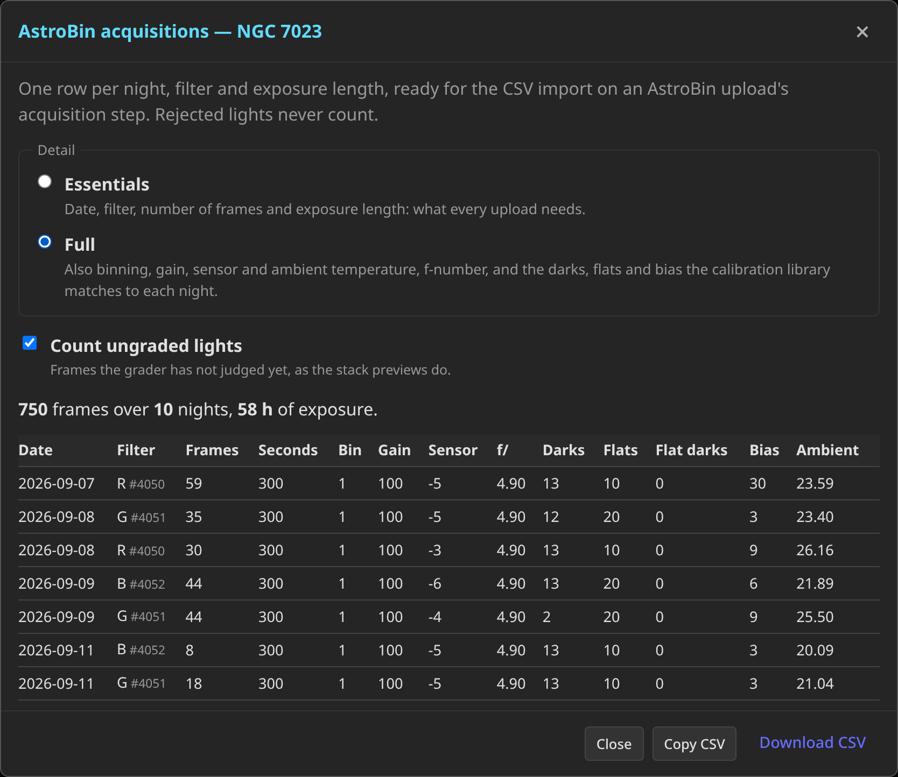
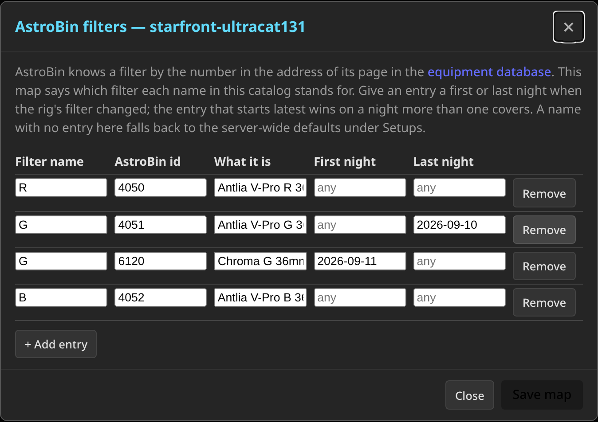

# AstroBin acquisition export

When you upload an image to AstroBin, its acquisition step accepts a CSV
of imaging sessions: one row per date, filter and exposure length, with the
number of frames and, if you have them, camera settings and calibration
counts. PSF Guard writes that CSV from a catalog, so a target shot over
many nights becomes a list of sessions in one click.



## Where to find it

On the **Overview**, every project card and every target row with accepted
or ungraded lights has an **AstroBin** action next to **Export**. It opens
a dialog that previews the rows, offers a **Download CSV** link and a
**Copy CSV** button, and asks for any filter id it still lacks.

The CLI writes the same file:

```bash
psf-guard astrobin-csv my-db --target-id 12
psf-guard astrobin-csv my-db --project-id 3 --detail full --include-pending -o m31.csv
psf-guard astrobin-csv my-db --target-id 12 --filter-id L=4049 --filter-id Ha=4051
```

`my-db` is a registry slug or the path of a Target Scheduler database.
Full detail reads one light per night and filter, so it takes the image
folders from the registry entry or `--image-dirs`.

## What a row is

A row is one night, one filter and one exposure length. Nights split where
the whole catalog is quiet, the same rule the Sky view uses, so a session
that runs past midnight stays one row and a site far east of Greenwich
still gets the right date.

Accepted lights always count. Ungraded lights count too unless you untick
**Count ungraded lights**, matching what the stack previews show. Rejected
lights never count.

## Two levels of detail

**Essentials** (the default) writes the four columns every upload needs:

| Column | Value |
|---|---|
| `date` | The night, as `YYYY-MM-DD` |
| `filter` | The AstroBin filter id (see below), or blank |
| `number` | Frames in the row |
| `duration` | Seconds per frame, to four decimals |

It reads nothing but the catalog, so it is instant.

**Full** adds every column the catalog and the frames can fill. Rows also
split by binning and gain, since AstroBin records those per row.

| Column | Value |
|---|---|
| `binning` | The x binning factor |
| `gain` | Camera gain |
| `sensorCooling` | The mean sensor temperature over the row, to the degree |
| `fNumber` | The `FOCRATIO` header, or focal length over aperture when both are in the header |
| `darks`, `flats`, `flatDarks`, `bias` | How many frames of each kind the calibration library would build a master from for that night and filter, matched exactly as a stack build would |
| `temperature` | The mean focuser probe temperature (`FocuserTemp`) over the row, the nearest thing a N.I.N.A. rig records to the air temperature |

The f-number and calibration counts come from one light per night and
filter (the median one, read header-only from disk). When that file is
missing, the export tries its neighbours and reports how many lights had
no file. Columns PSF Guard cannot know (`iso`, `bortle`, `meanSqm`,
`meanFwhm`) are left out; AstroBin treats an absent column as blank.

## Filter ids

AstroBin does not read filter names. Its `filter` column wants the number
of a filter in AstroBin's equipment database, which is the number in the
address of that filter's page (for example `.../equipment/explorer/filter/4049/...`).

A catalog's filter names are generic: "G" says nothing about which G, and
two rigs' "G" are two filters. So each catalog keeps its own **filter
map**, under **Settings → Databases → AstroBin filters**. An entry names a
filter as the catalog spells it, the AstroBin id it stands for, what it is
("Antlia V-Pro G 36mm"), and, when the rig's filter changed, the first and
last night the entry applies to. Names match ignoring case. On a night
more than one entry covers, the one that starts latest wins. A filter that
changed between nights keeps its rows apart, one per id. The map lives in
the catalog itself (a `psf_guard_astrobin_filter` table Target Scheduler
ignores), so it travels with the rig's database and needs the
database-management grant to edit.



The export dialog lists the filters the map does not cover and saves what
you enter as open-ended entries in this catalog's map; give them nights in
Settings when a filter changed over time.

**Settings → Setups → AstroBin** holds server-wide defaults by name, used
for a name no catalog entry covers. A filter with no id anywhere gets a
blank cell, which AstroBin ignores, so the rest of the row still imports.

## Importing on AstroBin

On the upload page's acquisition step choose the CSV import, paste or
upload the file, and check the rows. AstroBin validates nothing: a value it
cannot read is dropped, not flagged, so the dialog's preview is the place
to spot a wrong id or an unexpected night.
