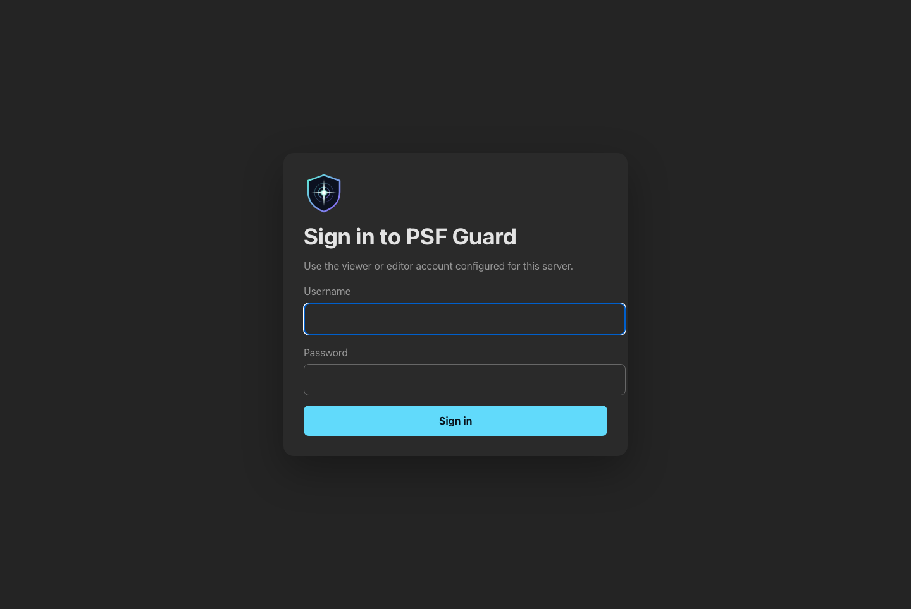
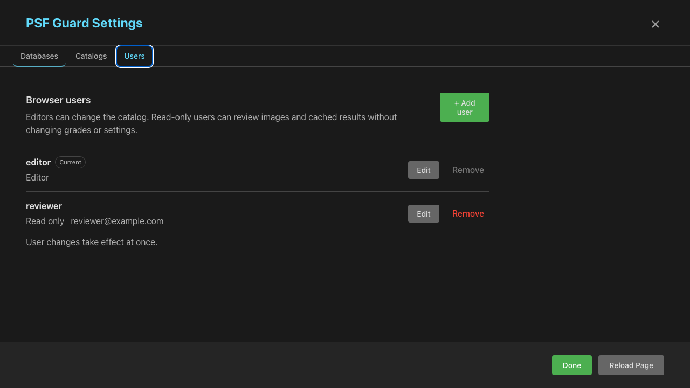

# Server authentication

PSF Guard can require a login when it runs as a web server. Authentication is
off by default. The Tauri desktop app does not use it: its server listens on
localhost and remains trusted by the desktop UI.



## What a server with no accounts serves

The bind address decides what an account-less server hands out. Reaching a
loopback server already means reaching the machine, so it stays open:

| Bind address | No accounts configured |
|---|---|
| `127.0.0.1`, `::1`, `localhost` | Full access, as before. The desktop app and local development use this. |
| Anything else, including the `0.0.0.0` default | Every API request answers 401, including reads. |

A network server therefore needs at least one account before it serves
anything. `psf-guard server --allow-database-management` goes further and
refuses to start on a network address until an account exists, because those
routes name paths the server then reads and writes. Only an editor can use
them once it does.

Remote sync and image upload are the exception. They carry their own
`Authorization: Bearer` keys, so those routes keep working on a server with no
browser accounts — that is how a headless intake box runs.

### Keeping a network server open

`--allow-anonymous-access` gives every caller on a network address what a
localhost server gives them, with no accounts and no login:

```bash
psf-guard server --host 0.0.0.0 --allow-anonymous-access
```

It exists for a server on a network you trust as much as the machine itself,
and for upgrading an older deployment without an outage. It hands full editor
access — grading, imports, and, with `--allow-database-management`, the
registry — to anyone who can reach the port. Add accounts and drop the flag.

## Manage users from the CLI

Add a viewer or editor. If `--password-file` is absent, the CLI prompts twice
without showing the password:

```bash
psf-guard users add viewer --role read-only --email viewer@example.com
psf-guard users add editor --role read-write --email editor@example.com \
  --password-file /run/secrets/editor
psf-guard users list
```

The CLI stores salted Argon2 password hashes in `auth.json`, beside the
database registry. It never stores the password. Email is optional account
metadata. With a custom database registry, pass the same path to both commands:

```bash
psf-guard users add editor --role read-write \
  --registry /srv/psf-guard/catalogs.json
psf-guard server --registry /srv/psf-guard/catalogs.json
```

This example writes the users to `/srv/psf-guard/catalogs.auth.json`. The
standard `config.json` registry uses `auth.json`. On Unix, PSF Guard writes the
auth registry with mode `0600`.

Use `--replace` with `users add` to change a user's password or role. Remove a
user with:

```bash
psf-guard users remove viewer
```

The CLI refuses to remove the final user unless you pass `--allow-empty`.
Removing that user turns browser authentication off after restart. Restart the
server after any CLI user change; active sessions stay valid until then.

## Manage users in Settings

An editor signed in to a web server gets a separate **Users** tab in Settings.
Editors can add users, record an optional email, change roles or passwords,
and remove users. Changes take effect at once. Changing access or a password,
or removing an account, signs out its existing sessions. Changing only an
email does not.



The UI refuses to remove the account used by the current session or leave the
server without an editor. Tauri does not show the tab because its localhost
server does not use browser authentication.

## Server settings

The optional TOML block sets session policy. It does not define a second user
list:

```toml
[server.auth]
session_hours = 168
secure_cookie = true
allow_read_only_compute = false
```

Run `psf-guard server --config psf-guard.toml`. If `auth.json` contains users,
the browser will show a PSF Guard login page. A successful login creates an
HttpOnly, SameSite=Strict session cookie. Sessions live in server memory,
expire after `session_hours`, and end when the server restarts.

Secure cookies are the default. Set
`secure_cookie = false` only for a direct HTTP development server; a browser
will not send a Secure cookie to a plain HTTP URL.

## Roles

The viewer can read catalogs, images, quality results, exports, and cached
analysis. By default, the viewer cannot start costly stack builds, plate
solves, satellite predictions, or view-processing jobs. Cached results remain
available.

Set `allow_read_only_compute = true` to let the viewer start those derived-data
jobs. This can suit a trusted private server. Leave it off for a public demo,
where repeated jobs could consume CPU, network data, and cache space.

The editor can also:

- grade images and use undo or redo;
- update projects, targets, coordinates, and exposure plans;
- start quality scans and imports;
- save, delete, and import named processing setups (viewers can list, apply,
  and export them);
- manage databases, peers, catalogs, and calibration records when the matching
  server management gate is also enabled;
- write local exports and apply database sync previews.

Server checks enforce the role even if a client calls the API directly. The UI
also labels viewer sessions as **Read only**, hides Settings, and disables
grading controls.

## API sessions

Scripts that use the ordinary UI API can log in with a cookie jar:

```bash
curl -c psf-guard.cookies \
  -H "Content-Type: application/json" \
  -d '{"username":"editor","password":"..."}' \
  https://guard.example/api/auth/login

curl -b psf-guard.cookies https://guard.example/api/databases
```

Remote image upload and scheduler sync do not use this session. Their
`Authorization: Bearer ...` keys remain scoped to the configured database and
continue to work when browser authentication is enabled.

## Deployment notes

- Put the public server behind HTTPS. Login passwords otherwise cross the
  network in clear text.
- Restrict `auth.json` permissions to the PSF Guard service account. PSF Guard
  sets mode `0600` on Unix.
- A deployment can seed a user from an existing secret with
  `psf-guard users add editor --role read-write --password-file PATH`. PSF Guard
  stores only the resulting hash in `auth.json`.
- Keep `--allow-database-management` off unless browser-side database
  management is needed. An editor login does not override that gate, and the
  gate does not override the login: on a network address the server needs
  both.
- Treat `--allow-anonymous-access` as a temporary measure. A public server
  running it has no access control at all.
- Signing out revokes the current in-memory session. Restarting the server
  revokes every browser session.
