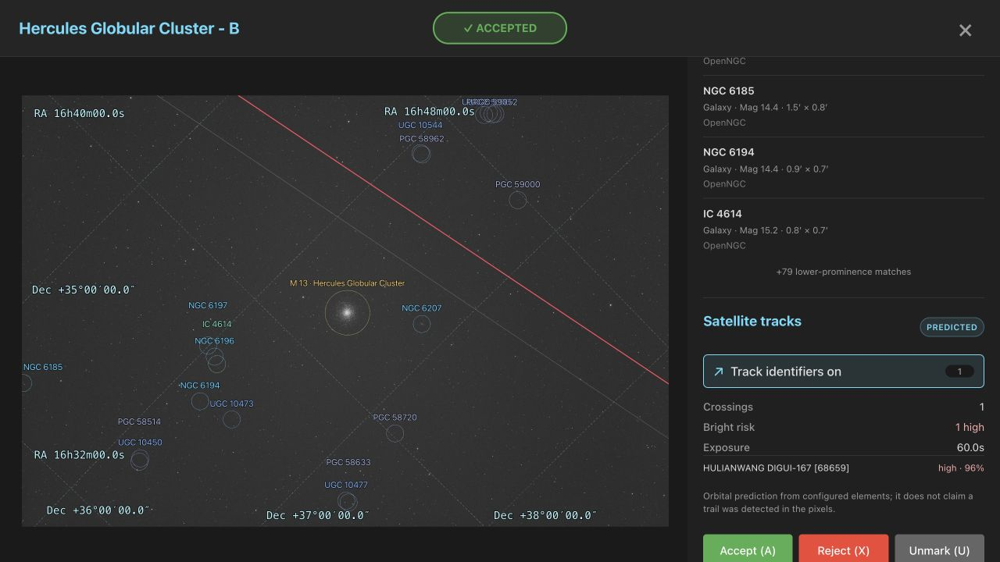
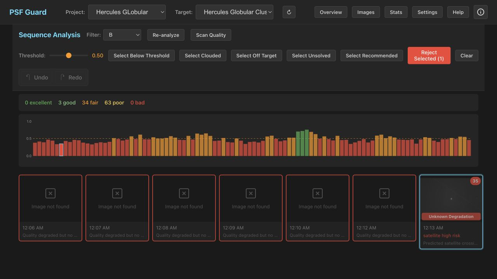

# Satellite track prediction

PSF Guard can identify satellites predicted to cross a solved image during
its actual exposure. Open an image, find **Satellite tracks**, and choose
**Identify satellite tracks** (or press `T`). The resulting overlay draws the
clipped path inside the sensor and labels it with the satellite name and NORAD
identity supplied by the orbital catalog.

## Evidence boundary

Satellite results are orbital predictions, not pixel detections. They answer
“which cataloged objects should cross this solved footprint between shutter
open and shutter close?” They do not claim that a streak is present, visible,
or caused by the labeled object. PSF Guard keeps this evidence separate from:

- the pixel-derived WCS used to project the path;
- catalog-only coordinate association;
- star/PSF, occlusion, cloud, and photometric measurements from pixels.

Every response and persisted result carries
`association: predicted_not_pixel_detected`, the exact WCS, FITS source
fingerprint, exposure/site provenance, orbital-element source/state, and the
Seiza dependency versions used to compute it.

## Required FITS metadata

Prediction requires all three inputs:

1. A solved pixel WCS. The on-demand action will run the existing hinted/blind
   solver if no valid solution is cached.
2. UTC shutter timing, in precedence order: explicit `DATE-BEG`/`DATE-OBS`
   through `DATE-END`; `DATE-AVG` plus `EXPTIME`/`EXPOSURE`; or a start time
   plus `EXPTIME`/`EXPOSURE`. Using `DATE-AVG` centers the interval on the
   writer's measured midpoint, avoiding assumptions about whether a filename
   timestamp represents shutter open or readout completion.
3. Observer latitude and longitude: `SITELAT`/`SITELONG`, `LAT-OBS`/
   `LONG-OBS`, or `OBSGEO-B`/`OBSGEO-L`. Altitude comes from `SITEELEV`,
   `SITEELEVATION`, `ALT-OBS`, or `OBSGEO-H`; missing altitude safely defaults
   to sea level.

Longitude is normalized east-positive to −180…180 degrees. A missing time,
site, WCS, or usable orbital snapshot causes the satellite analysis to
abstain; it does not turn missing evidence into a clean-frame claim.

## Orbital-element cache

The explicit on-demand action loads CelesTrak's active-satellite catalog via
`seiza-satellites`. A fresh local snapshot is reused; when refresh is needed,
that action may download a new snapshot and may fall back to stale cached data
according to the library's cache policy. Shared orbital data lives under
`<cache>/satellites/`.

For reproducible or offline work, set `astrometry.satellite_elements` in the
JSON registry to a local OMM JSON or TLE file. Relative paths resolve below
`astrometry.data_dir`:

```json
"astrometry": {
  "data_dir": "/var/lib/psf-guard/seiza",
  "satellite_elements": "active.json"
}
```

Per-image results are written atomically to
`<cache>/<db-slug>/satellites/<image-id>.json`. They are accepted only when
the FITS fingerprint, exact WCS, Seiza version, and seiza-satellites version
still match.

## Bright-trail risk and grading

Track colors express a conservative heuristic:

- **cyan / low**: a crossing is predicted, but illumination/geometry does not
  suggest a bright trail;
- **yellow / possible**: sunlit and close enough to warrant visual review;
- **red / high**: a longer, close, sunlit path with stronger trail risk.

The 0–1 risk combines sunlight fraction, range, elevation, and clipped path
length. It is deliberately not called magnitude: the active catalog does not
provide a reliable exposure-band brightness model, and attitude/flares can
change observed brightness.

Possible risk adds `SatelliteTrailRisk` and caps the frame score at 0.75.
High risk caps the score at 0.35 and proposes a reason such as:

```text
[Auto] Predicted bright satellite crossing - 1 high-risk track(s), risk 0.82; verify overlay
```

The Sequence view still requires the normal per-image review and explicit
confirmation before writing a rejection. Existing rejected grades are not
overwritten.

## Real Hercules exposure

The screenshots below come from the unmodified 60-second B-filter exposure
`2026-05-21_00-13-14_B_-10.10_60.00s_0054.fits`, not a mocked UI fixture.
Its headers provide `SITELAT`, `SITELONG`, `SITEELEV`, and
`DATE-AVG=2026-05-21T07:13:45.3551363`. PSF Guard therefore
used the header-provided observing site and the centered interval
`07:13:15.355136–07:14:15.355136 UTC`.

Seiza 0.9 solved the frame with 85 matched stars at 1.73 arcsec RMS. Against a
configured historical TLE snapshot near the exposure epoch,
`seiza-satellites 0.1` projected one fully illuminated in-frame crossing:
**HULIANWANG DIGUI-167 [68659]**. The clipped path is about 7,672 pixels long,
the minimum range is about 1,174 km, and the heuristic risk is 0.96. That
produces a high-risk recommendation and a 0.35 quality cap, while the UI keeps
the claim explicitly labeled as an orbital prediction rather than a detected
pixel trail.

The visible diagonal trail does **not** coincide with the red prediction. A
line fit puts it roughly 800–1,200 full-resolution pixels away from the
predicted path. An address-derived site check moved the predicted endpoints by
only 25–38 pixels: the FITS position was already within about 0.2 km of that
independent location. This is therefore not a confirmed identification of the
visible trail. It may reflect orbital-element uncertainty for a recently
launched object, a different object, or another timing/site input error. The
frame remains a useful demonstration of the product's intended boundary:
orbital predictions contribute conservative grading evidence, while the UI
does not claim a pixel detection or identity match. The named result links to
an external satellite information page for follow-up.

| Solved image and on-demand identifier | Sequence score and recommendation |
|:--:|:--:|
|  |  |

## Background and CLI behavior

Quality scans and `screen-fits --regrade-db` are cache-only consumers: they
never download orbital data. If a configured or previously downloaded
snapshot exists, they compute and persist exposure predictions alongside the
fresh plate solution. Otherwise satellite grading simply abstains.

When CLI and server share the default `./cache`, no extra option is needed. If
the server uses another cache root, give `screen-fits` the same path:

```bash
psf-guard screen-fits /path/to/lights \
  --regrade-db my-db --cache-dir /var/cache/psf-guard --dry-run
```

Review the dry run, then repeat without `--dry-run` to apply supported
recommendations.
