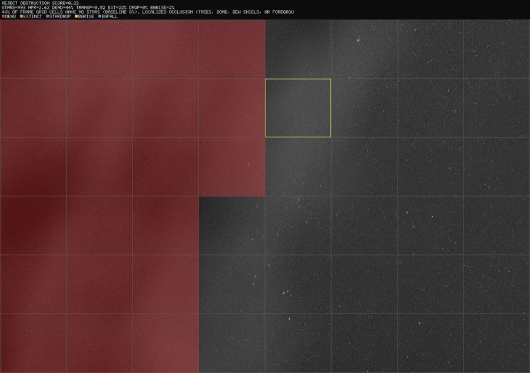
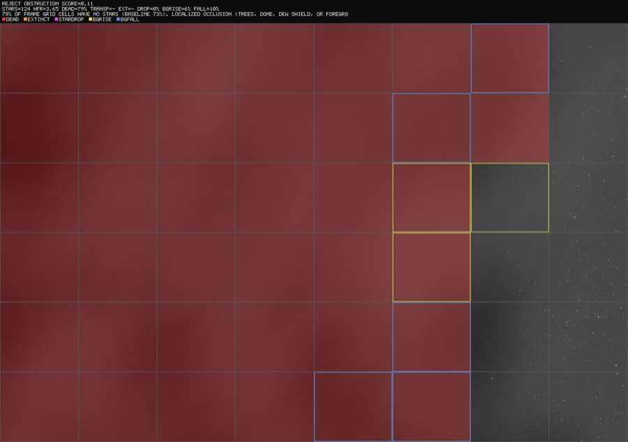
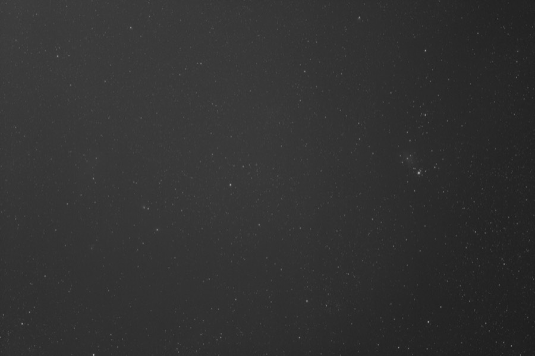
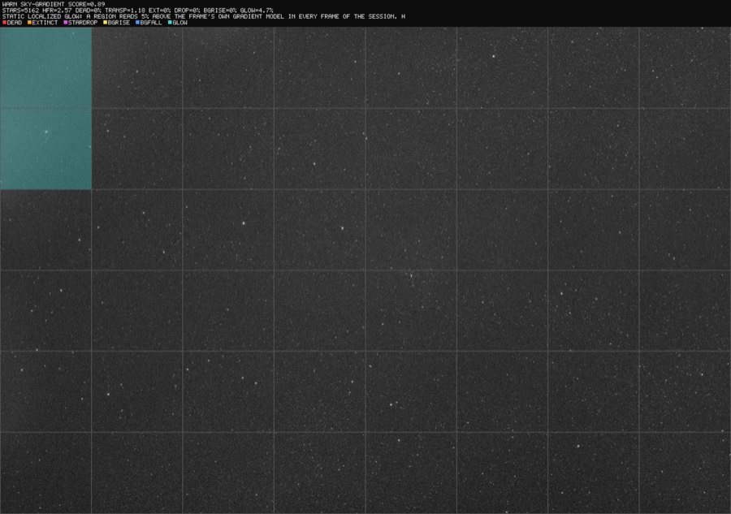

# Quality Screening: Occlusion, Clouds & Stray Light

PSF Guard can automatically screen light frames for problems that ruin
integrations but slip past conventional grading: trees or a dome edge
occluding part of the field, small clouds passing through, thin veils that
dim the whole frame, errant light, and static glow at the field edge. Every
verdict can be rendered as an annotated diagnostic image showing exactly
which part of the frame drove the decision.

All detections are classical statistics — no machine learning, no training
data, no network access. Thresholds were calibrated against real sessions
(measured clean-frame envelopes across multiple nights and filters) and each
detector carries regression tests pinning its behavior.

## Why global metrics are not enough

Star count and HFR — what conventional graders use — barely move when a
frame is partially ruined. Measured on a real session where a tree line
progressively occluded the field:

- Frames with a visibly occluded corner kept **star counts within normal
  variation** (the rest of the field is fine).
- **HFR stayed flat (~2.6) until the frame was more than 60% occluded** —
  the surviving stars are still in focus.
- A thin cloud veil dimmed every star by 37% while star count, HFR, and
  background all looked normal — the frame was Accepted by the capture
  software's own grader.
- N.I.N.A.'s rolling star-count baseline *adapts to* slow occlusions: on the
  measured session it Accepted 31 of 33 occluded frames, including one that
  was 90% blocked.

The screening stack answers with signals that are local (per grid cell),
photometric (flux ratios, not counts), and temporal (each cell compared to
its own history) — with baselines that refuse to normalize slow-growing
problems away.

## The detection stack

| Signal | Catches | How |
|---|---|---|
| **Dead cells** | Occlusion (trees, dome, dew shield) | Fraction of 8×6 grid cells whose star density collapsed vs the frame's own median cell |
| **Transparency** | Thin uniform veils | Median flux ratio of stars matched against a per-sequence reference catalog; 0.7 = whole frame ~0.4 mag dimmer |
| **Localized extinction** | Small clouds | Per-cell flux ratios ÷ global transparency; a passing cloud is a coherent dip in one patch of stars |
| **Star-share drops** | Small opaque clouds | Each cell's *share* of the frame's stars vs that cell's own temporal median (Poisson-aware) |
| **Background rise** | Errant light (headlights, flashlights) | Per-cell background vs the cell's own history, after subtracting the frame's gradient (robust plane fit) |
| **Background fall** | Dark occluders, cloud shadow | Same, downward: something blocking skyglow reads *darker*, not milky |
| **Static glow** | Corner haze, lit occluder edges | Cells brighter than the frame's own gradient model — catches problems present from a session's *first* frame, which temporal baselines can never see |

The signals feed a sequence analyzer that scores every frame 0–1 relative to
its session (same target, filter, and exposure; sessions split on 60-minute
gaps) and classifies the likely cause. Verdicts: **OK**, **WARN**
(recoverable or review-worthy — e.g. gradients that flat-ish processing can
remove, glow that stacks into artifacts), **REJECT** (clouds and occlusion).

## Quick start

```bash
# Screen a night of lights (no database needed)
psf-guard screen-fits "/path/to/2026-06-30/LIGHT"

# Render an annotated diagnostic PNG for every WARN/REJECT frame
psf-guard screen-fits "/path/to/LIGHT" --annotate /tmp/diagnostics

# Write [Auto] rejections into the Target Scheduler database
# (dry-run first; frames matched by filename AND capture timestamp)
psf-guard screen-fits "/path/to/LIGHT" --regrade-db my-db-slug --dry-run
psf-guard screen-fits "/path/to/LIGHT" --regrade-db my-db-slug

# Then archive the rejected files out of your stacking tree
psf-guard move-rejects --db my-db-slug
```

From the **web UI**: open a target's Sequence view and press **Scan
Occlusion**. The scan runs server-side in the background (progress shown
live), results persist across restarts, and the sequence analysis picks up
the occlusion/photometric signals automatically — coverage badges and
classifications appear on the affected frames, and "Select Clouded" bulk-
selects flagged runs for rejection.

## Reading the diagnostics

`--annotate` renders each flagged frame with the analysis grid overlaid.
Cells are marked by the signal that fired; the caption strip carries the
verdict, score, per-frame metrics, and the classifier's explanation.

| Marking | Meaning |
|---|---|
| red fill | dead cell — star density collapsed (occlusion) |
| orange fill | localized extinction — stars dimmed (small cloud), labeled with the cell's flux ratio |
| magenta fill | transient drop in the cell's share of stars |
| yellow border | transient background rise (errant light) |
| blue border | transient background fall (dark occluder / cloud shadow) |
| cyan fill | static glow above the frame's own gradient model |

### Occlusion arriving (tree line)

25% of the field's cells have lost their stars; the red region traces the
visible out-of-focus occluder exactly. Note the caption: transparency is
1.01 — the *surviving* field is photometrically perfect, which is why global
metrics miss frames like this.


### Heavy occlusion with a stray-lit edge

Half the field is dead and a yellow border marks a cell whose background
rose above its own temporal baseline — the occluder's stray-lit edge
bleeding into a live cell.



### The advancing frontier — darkening and brightening at once

Late in the same session: blue borders mark cells reading *darker* than
their own history (the dark occluder blocking skyglow as it advances),
yellow marks its lit fringe. The frontier sits between the dead region and
the surviving starfield.



### Thin cloud veil — pure photometry

Same field, 13 minutes apart. Clean frame: 2,973 stars, transparency 1.05.
Veiled frame: 1,417 stars, transparency 0.63 (~0.5 magnitude of uniform
extinction). No cell is tinted because nothing is *locally* wrong — only the
matched-star flux ratios see it. This frame was Accepted by conventional
grading.

| Clean (frame 0025) | Veiled (frame 0034, REJECT) |
|:--:|:--:|
|  |  |

### Static corner glow

A haze present from the session's *first* frame — every temporal detector is
structurally blind to it (the affected cells' own baselines include the
glow), and it stacks into gradient artifacts. The static glow signal
compares each cell against the frame's own gradient model instead: the cyan
cells sit exactly on the haze at 4.7% above the plane. Found because a human
reviewer spotted it in a frame the pipeline had passed; now it's a detector.



## Tuning

Defaults were calibrated against measured clean-frame envelopes (42+ frames,
4 nights, multiple filters). The main knobs:

| Knob | Default | Notes |
|---|---|---|
| `--min-score` | 0.35 | Composite score below which a frame is rejected |
| `--dead-cell-rise` | 0.08 | Occlusion onset sensitivity; clean-frame jitter is ≤0.04, so 0.08 is a 2× margin |
| `--session-gap` | 60 min | Splits sequences into sessions |
| glow threshold | 2.5% of sky **and** >30 ADU | The ADU floor keeps real narrowband nebulosity (measured 19–22 ADU) from false-flagging; true haze measured 48–103 ADU. Rig-specific — tune `glow_min_adu` for your camera/exposures |
| transparency threshold | 0.80 | Global veil rejection level |

Safety properties worth knowing:

- **Regrade matching is double-keyed**: filename *and* capture timestamp
  (±10 min) must agree, so screening the wrong directory can never regrade
  the wrong row. Already-Rejected rows are never touched.
- **Bounded baselines**: a run of anomalous frames longer than
  `baseline_freeze_max_frames` (default 15) is accepted as a new steady
  state, so a permanent condition change (moonrise, light dome) cannot
  condemn the rest of a night. Occluded frames stay penalized through the
  absolute spatial term regardless.
- **Sparse-field abstention**: star-grid metrics abstain on legitimately
  star-poor frames (narrowband, short subs on slow optics) instead of
  reporting phantom dead cells.
- **Single-frame blips don't reject**: rise-based occlusion needs an
  adjacent frame to corroborate; photometric small-cloud calls rest on
  multi-star flux evidence and may be single-frame (clouds move).

## Limitations

- Photometry requires the default HocusFocus detector (the N.I.N.A. detector
  port does not measure flux).
- The photometric reference requires stars present in ≥50% of a session's
  frames, so it is blind to regions occluded for *most* of a sequence — by
  design; that case belongs to the dead-cell metric.
- Monochrome FITS only (as with the rest of PSF Guard).
- The glow ADU floor is rig- and exposure-profile-specific. A future
  extension is cross-session rig-signature baselining (comparing each cell's
  residual pattern against the archive's own signature).
