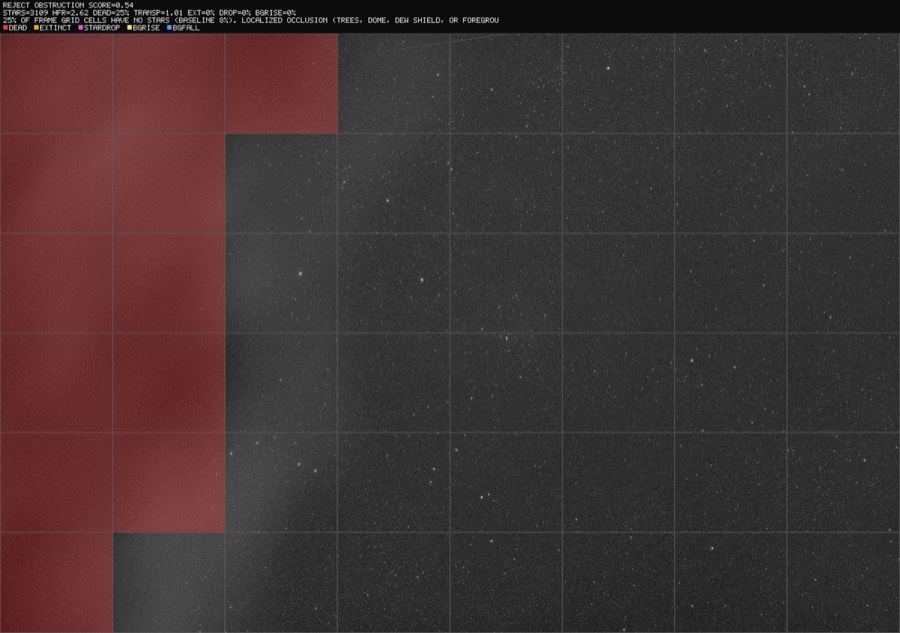
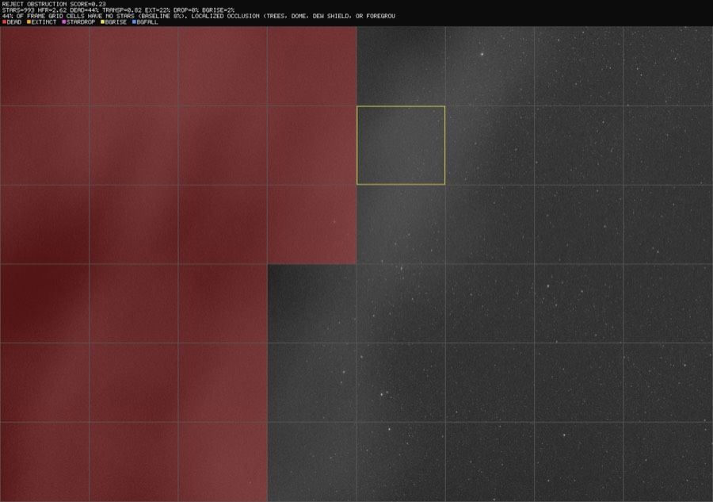
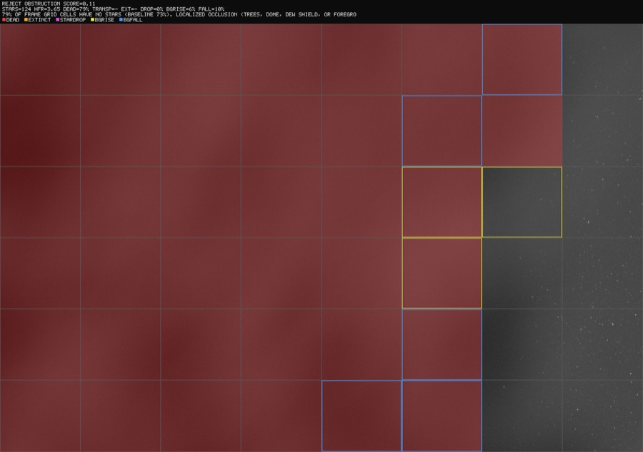
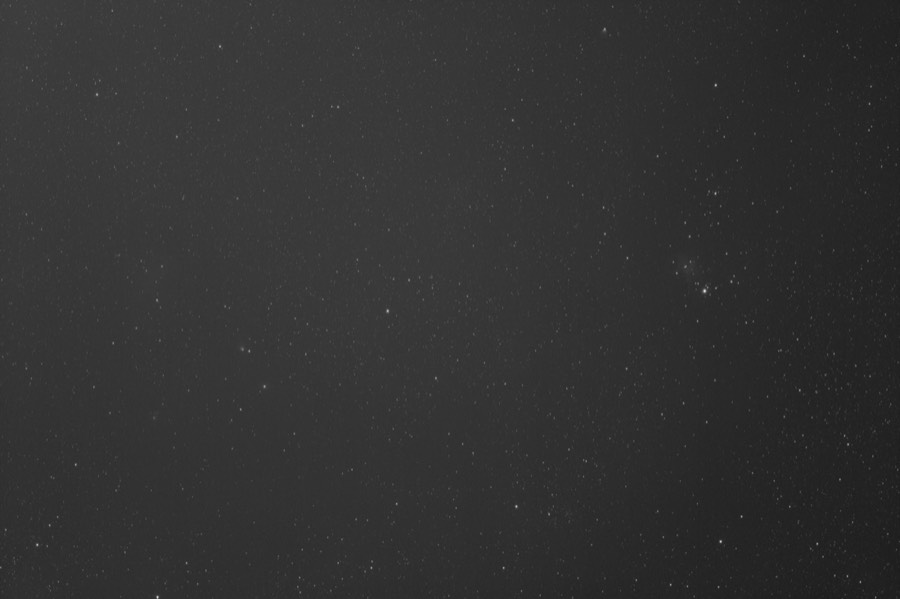
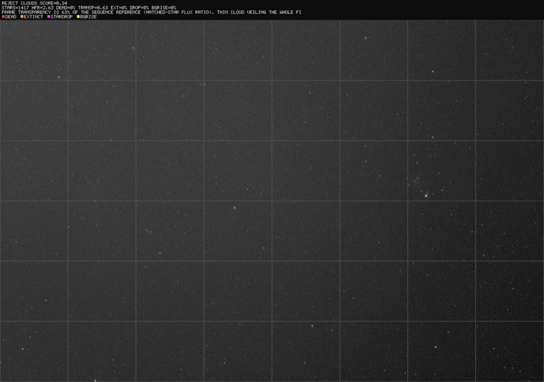
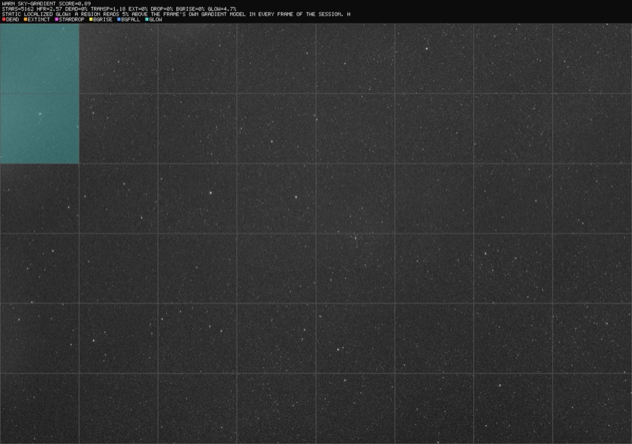

# Quality Screening: Image Conditions & Astrometry

PSF Guard can automatically screen light frames for problems that ruin
integrations but slip past conventional grading: trees or a dome edge
occluding part of the field, small clouds passing through, thin veils that
dim the whole frame, errant light, and static glow at the field edge. Every
verdict can be rendered as an annotated diagnostic image showing exactly
which part of the frame drove the decision.

When the scan has catalog target context, fresh pixel-derived plate
solutions also catch images captured away from the intended field, pointing
jumps, tracking drift, and deterministic solve failures. See
[Astrometry quality grading](ASTROMETRY_QUALITY.md) for target provenance,
failure semantics, score caps, and the guarded regrade workflow.

All pixel detections are classical statistics — no machine learning or
training data. An explicit server **Analyze Quality** run may download and retain
orbital elements needed for satellite checks. Merely opening Sequence Analysis
and CLI regrading remain cache-only. Thresholds were calibrated against real
sessions (measured clean-frame envelopes across multiple nights and filters),
and each detector carries regression tests pinning its behavior.

## Why global metrics are not enough

Star count and HFR — what conventional graders use — barely move when a
frame is partially ruined. Measured on a real session where a tree line
progressively occluded the field:

- Frames with a visibly occluded corner kept **star counts within normal
  variation** (the rest of the field is fine).
- **HFR stayed flat (~2.6) until the frame was more than 60% occluded** —
  the surviving stars are still in focus.
- A thin cloud veil dimmed every star by 37% while star count, HFR, and
  background all looked normal — the frame was Accepted by the capture
  software's own grader.
- N.I.N.A.'s rolling star-count baseline *adapts to* slow occlusions: on the
  measured session it Accepted 31 of 33 occluded frames, including one that
  was 90% blocked.

The screening stack answers with signals that are local (per grid cell),
photometric (flux ratios, not counts), and temporal (each cell compared to
its own history) — with baselines that refuse to normalize slow-growing
problems away.

## The detection stack

| Signal | Catches | How |
|---|---|---|
| **Dead cells** | Occlusion (trees, dome, dew shield) | Fraction of 8×6 grid cells whose star density collapsed vs the frame's own median cell |
| **Transparency** | Thin uniform veils | Median flux ratio of stars matched against a per-sequence reference catalog; 0.7 = whole frame ~0.4 mag dimmer |
| **Localized extinction** | Small clouds | Per-cell flux ratios ÷ global transparency; a passing cloud is a coherent dip in one patch of stars |
| **Star-share drops** | Small opaque clouds | Each cell's *share* of the frame's stars vs that cell's own temporal median (Poisson-aware) |
| **Background rise** | Errant light (headlights, flashlights) | Per-cell background vs the cell's own history, after subtracting the frame's gradient (robust plane fit) |
| **Background fall** | Dark occluders, cloud shadow | Same, downward: something blocking skyglow reads *darker*, not milky |
| **Static glow** | Corner haze, lit occluder edges | Cells brighter than the frame's own gradient model — catches problems present from a session's *first* frame, while a fresh solve masks cells covered by large cataloged emission nebulae |
| **Fresh plate solution** | Off-target frames, pointing jumps/drift, deterministic no-solves | Seiza solves the current pixels; solved centers are compared to the authoritative target, stable framing clusters, and within-segment drift |
| **Satellite prediction + pixel alignment** | Potentially bright satellite trails | A solved WCS plus FITS exposure/site metadata projects cached orbital elements through the shutter-open interval, then a bounded matched-filter search tests the nearby pixels; prediction and aligned-path evidence remain separate |

The signals feed two comparisons:

- **Session comparison** ranks frames from one capture run. It catches a
  cloud, focus change, or tracking loss within a night.
- **Target/filter stack comparison** ranks all frames that could enter one
  stack across capture runs. It can expose a whole weak night that looked
  stable by itself. It compares only frames with matching exposure, gain,
  offset, binning, readout, and sensor-region metadata.

Both scores run from 0 to 1. They are relative ranks, not verdicts. Catalog
star count, HFR, eccentricity, SNR, and background use a robust good reference
with a no-penalty band for normal variation. When a fresh solve places a large
cataloged emission region in the field, raw background receives no score
weight: lower can mean lost target signal, not a better frame. Matched-star
transparency still detects that loss. Missing signals receive no weight.
Fresh spatial, photometric, and plate-solve results add pixel evidence when a
quality scan has run.

A low relative score alone does not name a fault or recommend rejection. The
UI labels catalog-only results as **Catalog-relative score** and says which
comparison produced them. A frame gets a cause such as clouds, obstruction,
focus drift, tracking error, or off-target only when that detector has enough
evidence. Reviewed rejection recommendations use those causes, not the score
alone.

One absolute exception: a frame whose star measurement found **zero stars**
is capped at a condemned score with a **No Stars Detected** cause, even when
it has no sequence peers — zero stars in a light frame is direct pixel
evidence of clouds, trailing, or an obstructed aperture, not a normalization
artifact. A frame with no star measurement at all is never capped; grading
does not punish an image because an optional scan has not run.

How hard event evidence hits the score is adjustable. The **Scoring**
control in the Sequence view scales the score hit from satellite trails,
pointing failures, and temporal anomalies between 0% (ignore that evidence),
100% (the calibrated default), and 200% (double the hit). Setting the
satellite penalty to 0% turns satellite-trail checking off: trails neither
lower the score nor drive reject recommendations, though a pixel-confirmed
trail still shows as a warning — useful when trails are removed during
stacking anyway. The CLI equivalent is `screen-fits --ignore-satellites`.

The same control sets optional **reject limits**, fixed cut-offs like
N.I.N.A. subframe selection: **Max HFR** rejects any frame whose measured
HFR is over it, and **Min stars** rejects any frame with fewer detected
stars. Both are off by default. Limits judge each frame on its own, whatever
the rest of the sequence looks like: a frame past a limit is capped at a
condemned score and gets an `[Auto]` reject recommendation. A frame missing
the measurement is exempt. The CLI equivalents are `screen-fits --max-hfr`
and `--min-stars`.

The preference is remembered and applies to every scoring surface —
Sequence view, grid badges, and the detail panel — so a frame scores the
same everywhere. The zero-star cap does not scale: a frame measured to
have no stars is ruined whatever the preference. API callers pass
`penalty_satellite`, `penalty_pointing`, `penalty_temporal`,
`hfr_reject_above`, or `star_count_reject_below` on the analysis endpoints.

Capture sessions split at a Target Scheduler session change, a capture-profile
change, or a 60-minute gap. CLI screening still reports **OK**, **WARN**, and
**REJECT** verdicts for its file-screening workflow.

## Quick start

```bash
# Screen a night of lights (no database needed)
psf-guard screen-fits "/path/to/2026-06-30/LIGHT"

# Render an annotated diagnostic PNG for every WARN/REJECT frame
psf-guard screen-fits "/path/to/LIGHT" --annotate /tmp/diagnostics

# Add target-aware astrometry and propose/write supported [Auto] rejections
# (dry-run first; frames matched by filename AND capture timestamp)
psf-guard screen-fits "/path/to/LIGHT" --regrade-db my-db-slug --dry-run
psf-guard screen-fits "/path/to/LIGHT" --regrade-db my-db-slug

# Then archive the rejected files out of your stacking tree
psf-guard move-rejects --db my-db-slug
```

From the **web UI**: choose one target. **Analyze Quality** appears in the
Images grid or Sequence view when that target/filter has new frames or cached
results from an older quality model. It stays hidden when every frame is up to
date. Use **Rescan All Quality** in Settings when you need to force a full
rescan. The target scan runs spatial/photometric screening and fresh plate
solves in the background, then
refreshes the sequence scores. The fixed header status shows frame and solve
progress while you move between views; Overview folds the work into its
cross-database status. Results persist across restarts. The
sequence analysis shows coverage badges, classifications, solved-center
scatter, a session view, and an all-session stack comparison for each filter.
When analysis names a cause, the same reason and supporting evidence appear on
the Sequence card, the matching Grid card, and the image detail panel.
For a localized finding, image detail also offers **Show affected regions**.
The optional overlay marks the measured 8×6 scan cells behind the finding and
shows a legend for low star coverage, dimming, star loss, background shifts,
or glow. Whole-frame findings, such as a thin uniform veil, do not offer a
region overlay because the scan has no local boundary to draw.
Grid reuses one target, project, or database-wide scoring request. **All
Projects** scores each target/filter group on its own; it never compares frames
from unrelated targets. This request reads stored metadata and cached evidence
but does not start the full FITS quality scan. Grid states how many visible
images remain unscored because they lack a comparable sequence or enough
evidence.
The stack comparison scores only capture profiles with at least three matching
frames across two sessions. It reports profiles without enough matches instead
of assigning them a perfect score. Stack previews use the same cross-session
score when choosing a reference frame; profiles without enough matches keep
their session score.
Use the **Select** menu for score threshold, cloud, target, solve, or rejection
recommendation presets. Rejecting a recommendation always opens a per-image
review before anything is written.

The user-triggered scan resolves and durably caches suitable orbital elements
for each exposure, then caches exposure-specific crossings. Potentially bright
predictions warn; only a high-risk prediction with a matching pixel trail
creates a reviewed rejection recommendation. Merely opening Sequence Analysis
does not download anything, and CLI regrading remains cache-only.
See [Satellite track prediction](SATELLITES.md).

## Reading the diagnostics

`--annotate` renders each flagged frame with the analysis grid overlaid.
Cells are marked by the signal that fired; the caption strip carries the
verdict, score, per-frame metrics, and the classifier's explanation.

| Marking | Meaning |
|---|---|
| red fill | dead cell — star density collapsed (occlusion) |
| orange fill | localized extinction — stars dimmed (small cloud), labeled with the cell's flux ratio |
| magenta fill | transient drop in the cell's share of stars |
| yellow border | transient background rise (errant light) |
| blue border | transient background fall (dark occluder / cloud shadow) |
| cyan fill | static glow above the frame's own gradient model |

### Occlusion arriving (tree line)

25% of the field's cells have lost their stars; the red region traces the
visible out-of-focus occluder exactly. Note the caption: transparency is
1.01 — the *surviving* field is photometrically perfect, which is why global
metrics miss frames like this.



### Heavy occlusion with a stray-lit edge

Half the field is dead and a yellow border marks a cell whose background
rose above its own temporal baseline — the occluder's stray-lit edge
bleeding into a live cell.



### The advancing frontier — darkening and brightening at once

Late in the same session: blue borders mark cells reading *darker* than
their own history (the dark occluder blocking skyglow as it advances),
yellow marks its lit fringe. The frontier sits between the dead region and
the surviving starfield.



### Thin cloud veil — pure photometry

Same field, 13 minutes apart. Clean frame: 2,973 stars, transparency 1.05.
Veiled frame: 1,417 stars, transparency 0.63 (~0.5 magnitude of uniform
extinction). No cell is tinted because nothing is *locally* wrong — only the
matched-star flux ratios see it. This frame was Accepted by conventional
grading.

| Clean (frame 0025) | Veiled (frame 0034, REJECT) |
|:--:|:--:|
|  |  |

### Static corner glow

A haze present from the session's *first* frame — every temporal detector is
structurally blind to it (the affected cells' own baselines include the
glow), and it stacks into gradient artifacts. The static glow signal
compares each cell against the frame's own gradient model instead: the cyan
cells sit exactly on the haze at 4.7% above the plane. Found because a human
reviewer spotted it in a frame the pipeline had passed; now it's a detector.

Real nebulae can produce the same stable shape. If a fresh pixel-derived solve
projects a large emission nebula across a bright cell, PSF Guard treats that
cell as explained catalog context. It keeps any bright cells outside those
regions. This rule uses solved geometry only; a target name or FITS header does
not suppress the detector. The California Nebula Ha test set drove this guard:
healthy frames held a stable 16-18% residual over NGC 1499, while matched-star
flux still found the dim frames.



## Tuning

Defaults were calibrated against measured clean-frame envelopes (42+ frames,
4 nights, multiple filters). The main knobs:

| Knob | Default | Notes |
|---|---|---|
| `--min-score` | 0.35 | Composite score below which a frame is rejected |
| `--dead-cell-rise` | 0.08 | Occlusion onset sensitivity; clean-frame jitter is ≤0.04, so 0.08 is a 2× margin |
| `--session-gap` | 60 min | Splits sequences into sessions |
| `--max-hfr` | off | Reject any frame whose HFR (pixels) is over this, like N.I.N.A. subframe selection |
| `--min-stars` | off | Reject any frame with fewer detected stars than this |
| `--ignore-satellites` | off | Ignore satellite-trail evidence in scoring and rejection; trails still show as warnings |
| glow threshold | 2.5% of sky **and** >30 ADU | The ADU floor rejects weak structure. Fresh solved catalog geometry handles bright, large emission regions that exceed the floor. True haze measured 48–103 ADU. Rig-specific — tune `glow_min_adu` for your camera/exposures |
| transparency threshold | 0.80 | Global veil rejection level |

Safety properties worth knowing:

- **Regrade matching is double-keyed**: filename *and* capture timestamp
  (±10 min) must agree, so screening the wrong directory can never regrade
  the wrong row. Already-Rejected rows are never touched.
- **Fresh pixels are authoritative**: embedded FITS WCS and coordinate-only
  catalog association are never grading evidence. A quality scan plate-solves
  the current pixels, and cache reuse is fingerprinted against the FITS and
  solver resources. Only that fresh solve can exempt a background cell covered
  by a large cataloged emission region; unexplained cells still warn.
- **No-solve abstention**: a deterministic isolated solve failure lowers the
  score but is not automatically rejected without independent degradation.
  Missing catalogs, decode failures, and other operational errors abstain.
- **Bounded baselines**: a run of anomalous frames longer than
  `baseline_freeze_max_frames` (default 15) is accepted as a new steady
  state, so a permanent condition change (moonrise, light dome) cannot
  condemn the rest of a night. Occluded frames stay penalized through the
  absolute spatial term regardless.
- **Sparse-field abstention**: star-grid metrics abstain on legitimately
  star-poor frames (narrowband, short subs on slow optics) instead of
  reporting phantom dead cells.
- **Single-frame blips don't reject**: rise-based occlusion needs an
  adjacent frame to corroborate; photometric small-cloud calls rest on
  multi-star flux evidence and may be single-frame (clouds move).

## Limitations

- The server scan uses N.I.N.A. Fast for scheduler-compatible star count and
  HFR. Its full-resolution measurement aperture also supplies flux for
  photometry. `screen-fits` supports flux photometry with either detector.
- The photometric reference requires stars present in ≥50% of a session's
  frames, so it is blind to regions occluded for *most* of a sequence — by
  design; that case belongs to the dead-cell metric.
- Raw one-shot-color FITS files need a recognized `BAYERPAT` header. PSF Guard
  debayers them to luminance for quality measurements; the diagnostics remain
  luminance views.
- The glow ADU floor is rig- and exposure-profile-specific. A future
  extension is cross-session rig-signature baselining (comparing each cell's
  residual pattern against the archive's own signature).
