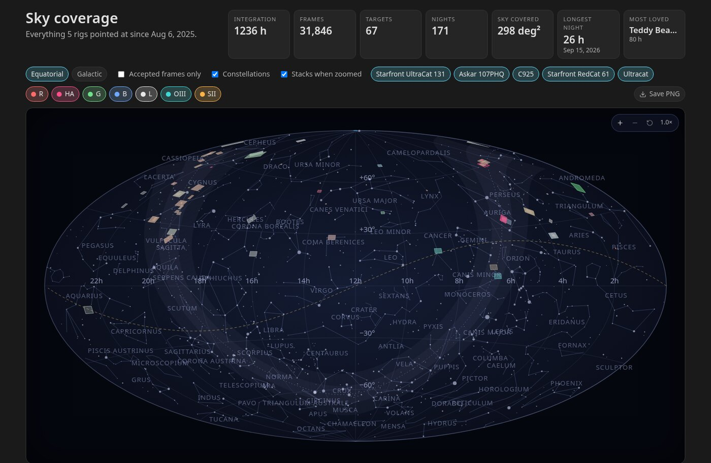
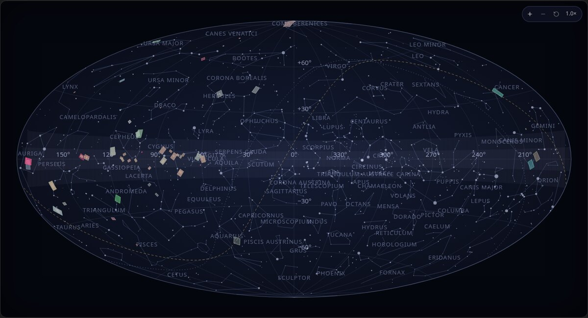
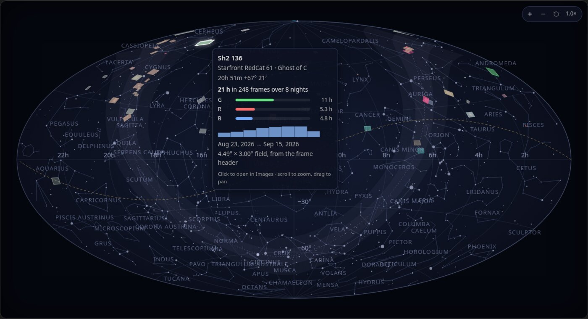
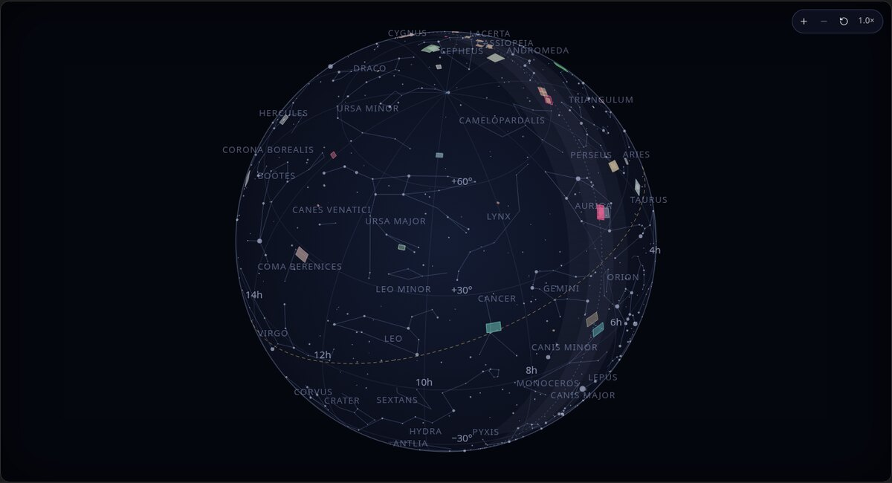
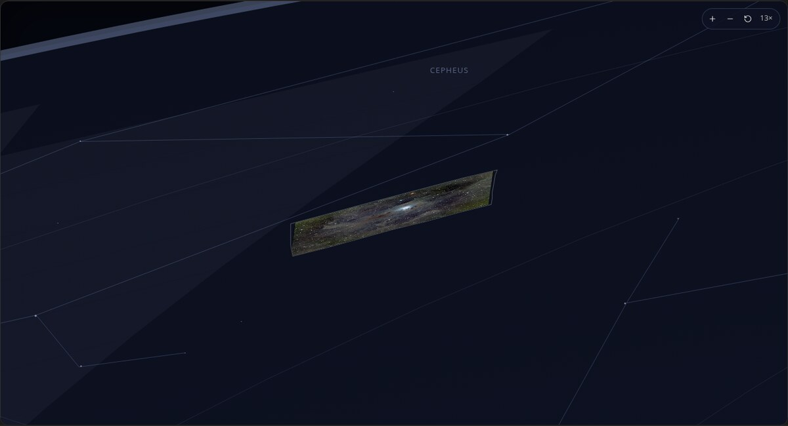
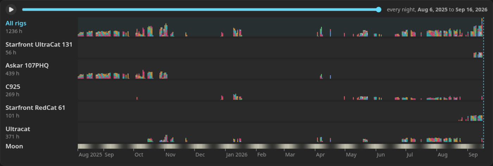
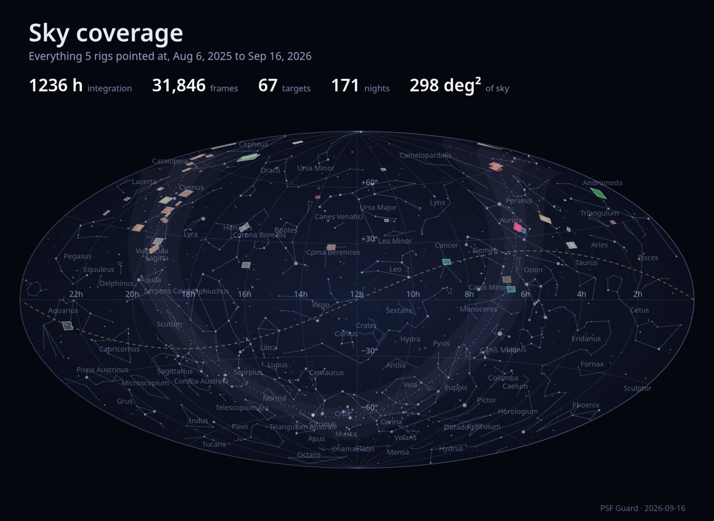

# Sky coverage

The **Sky** view draws everything your catalogs have pointed at on one map of
the whole sky, and lets you replay the nights that built it. It reads every
registered database at once, like the Overview.

## The map

An Aitoff projection of the celestial sphere, east to the left as on a star
chart. Switch between **Equatorial** (right ascension and declination, with
the galactic plane dashed) and **Galactic** (galactic longitude and latitude,
with the celestial equator dashed). The ecliptic is the dotted gold line. A
soft band marks the Milky Way.

Each target is drawn as its field on the sky, coloured by the mix of filters
that went into it and brighter the more hours it has. Hover a field for its
card: rig, project, coordinates, hours per filter, a sparkline of hours per
night, frames, nights, first and last night, where the field size came from,
and which stack preview is shown. Click it to open the target in **Images**.

Behind the fields sit the constellation figures and names and every star to
magnitude 4.5, which the **Constellations** switch hides.

**Flat** draws the whole sky at once; a drag at whole-sky zoom spins the
central meridian. **Globe** draws the sky as a sphere seen from outside,
and a drag turns it in any direction, so the pole or the far side comes
round. Scroll to zoom in either; zoomed in on the flat map a drag pans
instead. The buttons in the corner step the zoom and return to the whole
sky as it first stood, and a double click does the same.

Zoomed in past three times, each field that has a stack preview shows the
picture itself inside its outline (**Stacks when zoomed**): the latest
colour stack of the target when one exists, else the mono stack with the
most integration. A preview is placed by its reference frame's plate solution
when the astrometry cache holds one, carried through the stack's own
orientation, so it lands where the pixels really are; without a solve it is
laid into the field by the planned rotation, north up and east left, which
can be a flip out.

The field size comes from the best source at hand:

- **from a plate solve** when PSF Guard has solved one of the target's
  frames: the solved footprint is drawn as it was measured;
- **from the frame header** otherwise: the sensor size and focal length in
  one frame's FITS header per capture profile, turned by the rotation the
  scheduler planned for the target;
- a dot when neither is available.

## Filters and counts

Chips turn rigs and filters on and off, and **Accepted frames only** counts
graded-in frames alone. Every number on the page follows the same cut: the
stat band, the fields, their cards, and the timeline.

The stat band gives integration hours, frames, targets, nights, the sky area
covered (the sum of the shown fields, so overlapping fields count twice), the
longest night, and the target with the most hours.

## The timeline

Under the map, one lane per rig shows the integration of every night as a bar
stacked by filter, with month ticks below and a Moon row whose brightness is
the Moon's illumination that night. With more than one rig, an **All rigs**
lane on top sums them. Drag the scrubber, or press play, to see
the map as it stood at the end of any night: fields appear as their first
frames arrive and brighten as hours accumulate. The band above reads "as of"
that night while you look back.

A night is the civil date it began on. Captures are grouped twelve hours back
from UTC, which keeps an evening and the small hours that follow it together
for any site within about eight hours of Greenwich.

## Saving a picture

**Save PNG** renders the map at twice its on-screen size, as shown and as
zoomed, with the title and the numbers above it, for a wallpaper or a post.
The button is a browser feature and is not offered in the desktop app.

## Where the numbers come from

`GET /api/db/{db}/sky/coverage` returns, for one database, every target with
its coordinates in degrees, per-filter frame and second totals, the nights it
was shot, and its footprint; every (night, target, filter) row; the filters
seen; and the totals. Seconds come from each frame's recorded exposure. A
target with a finished stack also carries `preview`: the preview URL, the
pixel grid it covers, whether it is colour or one filter, and a TAN solution
on that grid when the reference frame was solved.

## Third-party data

The constellation figures, constellation names, and bright stars drawn
behind the fields come from the d3-celestial data set, Copyright (c) 2015,
Olaf Frohn, under the BSD 3-Clause License. The notice ships with the
frontend source in `static/src/data/d3-celestial-LICENSE.txt`.
