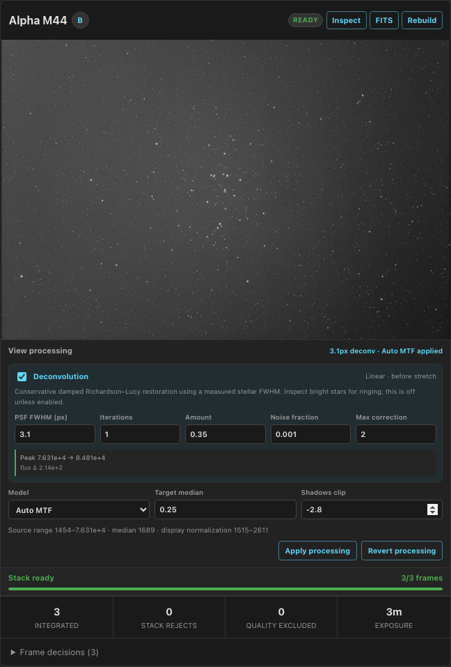
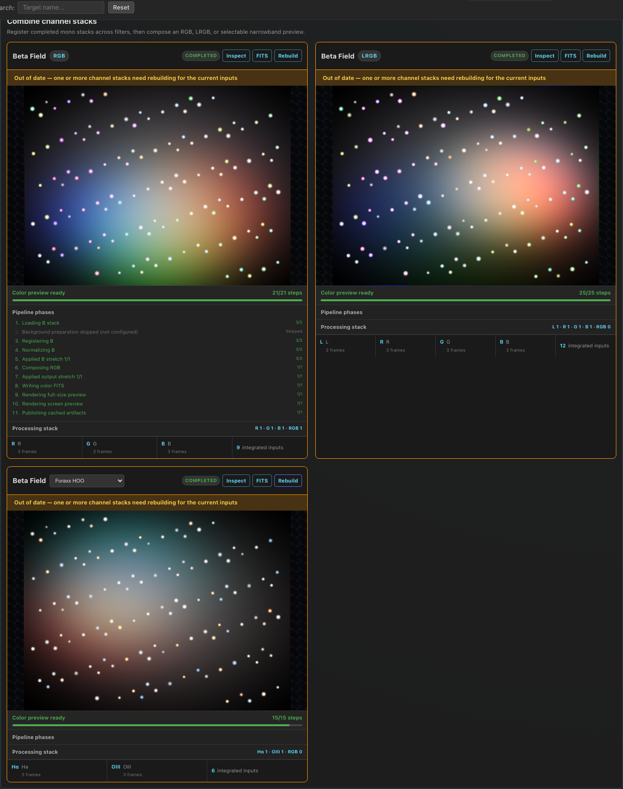
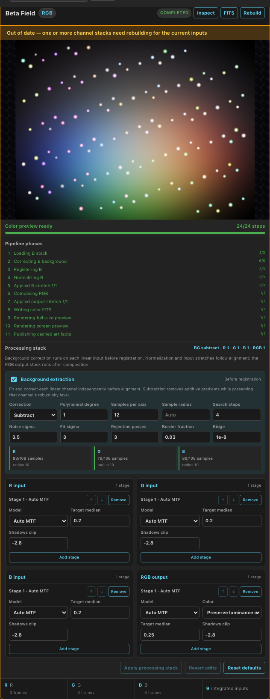

# Project stack previews

PSF Guard can build an on-demand integration directly from the image grid.
This is a fast visual answer to “what does this project/channel look like so
far?”, with the grading and registration evidence kept beside the result. It
is deliberately labeled **Uncalibrated stack preview**: it is not a replacement
for a calibrated science or final-processing workflow.


## Build a preview

Open one project in the image grid and choose **Build stack previews** to build
every current target/channel group, or **Build channel** on one card to test
only that group. Once a result exists, the corresponding actions become
**Rebuild current set** and **Rebuild channel**. An individual rebuild replaces
only that channel's remembered result; the other channel cards remain intact.

- A multi-selection of two or more images is the input when one exists.
- Otherwise the current visible set is used, including the status, channel,
  date, target, and search filters shown above the grid.
- The server always separates inputs by exact Target Scheduler target and
  filter/channel. It never combines different targets or filters.
- **Accepted only** removes Pending frames. By default both Accepted and usable
  Pending frames are eligible.

The build runs in the background and the panel polls its status. Different
target/channel groups are processed sequentially. Only one stacking job runs
in the PSF Guard process at a time, even when the server hosts multiple
databases, so full-frame accumulator buffers cannot multiply unexpectedly.
Cards are capped at two columns on wide displays so the inspection preview does
not become excessively wide.

PSF Guard remembers the last successful preview for every target/channel in the
project cache and restores those cards after navigation, page reload, or server
restart. Each card retains the exact input image IDs and scheduler grades used
to build it. The card is marked **Out of date**—without hiding the usable older
preview—when the current filter/selection changes the image set, an image is
accepted/rejected/pended, or the **Accepted only** policy changes. A failed
rebuild never replaces the last successful result.

## Frame selection and admission

PSF Guard owns project policy; Seiza owns image registration and integration.
Before handing frames to Seiza, PSF Guard excludes:

1. images marked Rejected in the scheduler database;
2. Pending images when **Accepted only** is enabled; and
3. images for which the current sequence analysis has a `regrade_reason`,
   including confirmed cloud/obstruction, off-target, tracking-loss, and
   corroborated no-solve decisions.

The highest-scoring remaining frame becomes the immutable reference. The other
eligible frames are offered to Seiza in acquisition order. Seiza decodes the
linear FITS samples, debayers when required, performs global normalization,
registers each source to the reference, applies its overlap/RMS/scale/rotation
admission gates, and accumulates accepted samples with online delta-sigma
rejection.

Expand **Frame decisions** to audit what happened. Each result retains the
PSF Guard quality score and disposition. Accepted frames also report matched
stars, registration RMS, registration drift, overlap, and integrated-sample
fraction; excluded or rejected frames retain their reason.

Choose **Inspect full size** to open the native-resolution integration in PSF
Guard's image inspector. It uses the same controls as individual images: scroll
to zoom, drag to pan, **F** or **0** to fit, and **1** for one image pixel per
screen pixel. The full-size stretched PNG is loaded only when the inspector is
opened, so the project grid continues to use the smaller screen preview.


Choose **Download linear FITS** on the card or in the inspector to retrieve the
full-resolution floating-point integration from the cache. The FITS is
unstretched and retains the reference frame's supported WCS headers plus
Seiza's accepted/rejected frame counters, making it suitable for inspection or
as an input to a separate processing workflow.


## Reversible display stretching

Expand **Display stretch** on any mono stack card to change only its
rendered PNG. **Apply stretch** asks Seiza to resolve the selected model against
the cached FITS and renders both the grid and full-resolution inspection PNGs.
The source stack and downloadable FITS are never rewritten. **Revert stretch**
immediately returns the card and inspector to the default rendering.

The controls expose Seiza's identity, explicit linear, asinh,
percentile-asinh, MTF, Generalized Hyperbolic Stretch (GHS), and Auto-MTF
models. Auto-MTF with PSF Guard's established target median and shadow clipping
is the default for linear mono-stack artifacts.
Explicit black, white, shadow, and highlight points use normalized zero–one
display units. PSF Guard maps a robust 0.1%–99.9% range from linear FITS into
that domain before invoking Seiza. After an application, the card shows the raw
source range, median, and normalization bounds so the transform remains
inspectable.

Applied variants are content-addressed by the source artifact revision, full
stretch configuration, robust-normalization policy, and Seiza stretch version.
Reapplying the same settings reuses the cached PNG pair. The active selection
is intentionally browser-local and reversible; a reload returns to the durable
default preview while the linear FITS remains the sole source of truth.



## Color previews from channel stacks

Once one target has completed mono stacks for **L/R/G/B** or **H-alpha/OIII**,
the grid adds a **Combine channel stacks** section. Color generation is a
separate on-demand job: rebuilding or changing a color palette never changes
the mono integrations or their admission evidence.

- **RGB** requires one unambiguous Red, Green, and Blue stack.
- **LRGB** requires one unambiguous Luminance, Red, Green, and Blue stack.
  Luminance supplies the output luminance while Seiza retains the RGB
  chromaticity.
- **Narrowband** requires H-alpha and OIII. HOO and Foraxx HOO are then
  available. Adding SII enables SHO, SOH, HSO, HOS, OSH, OHS, and Foraxx SHO.
- The palette picker is part of the cache key. Previously generated palettes
  remain available, and selecting another palette builds or restores its own
  artifact.

PSF Guard recognizes the ordinary short and long filter names (`L`, `Red`,
`Ha`, `H-alpha`, `OIII`, `SII`, `O3`, and `S2`) plus descriptive names such as
`Red`, `H-alpha`, and `OIII` as distinct tokens in vendor labels. It
deliberately does not guess when two stacks map to the same role or when a
multi-band filter name is ambiguous. Rename the Target Scheduler filters to
make those roles explicit before building color.

Each non-reference stack is registered to R for RGB, L for LRGB, or H-alpha
for narrowband, using the same bounded Seiza star/similarity registration used
by the Seiza color CLI. The **Processing stack** editor then robustly normalizes
each physical input independently and applies that role's ordered stretch
stages before composition. Expand L/R/G/B, H-alpha/OIII/SII, or RGB output to
add, edit, remove, and reorder Seiza identity, linear, asinh, percentile-asinh,
MTF, GHS, and Auto-MTF stages. **Apply processing stack** starts a new cached
color job; **Revert edits** returns to the last rendered pipeline and **Reset
defaults** restores one Auto-MTF stage per input with no post-composition stage.

Every intermediate remains `f32`, and each automatic stage resolves against
the preceding stage's output. These are sequential transfer passes, not pixel
values added together. Seiza receives the independently prepared channels as
display-referred inputs, so Foraxx uses those values directly instead of
applying a second shared stretch. RGB output stages may use linked, unlinked,
or luminance-preserving color strategies. The downloadable RGB FITS contains
the exact processed color result, records `COLORSPC`, `SEIZACLR`, and
`SEIZATRF='DISPLAY'`, and preserves supported WCS cards from the reference
stack. The manifest retains both the requested stage arrays and every resolved
Seiza plan. The processing definition and source revisions are part of the job
ID, so applying the same stack restores its prior artifact.

Color composition currently consumes the cached linear channel stacks
directly. Seiza's forthcoming background-extraction crate belongs immediately
after loading and before channel registration, with additive correction fitted
per channel stack; it is intentionally not approximated in PSF Guard while that
API is still under review. The progress ledger already records that phase as
skipped. When adopted, its configuration and fit diagnostics must participate
in the color artifact revision and cache provenance.



The expanded RGB card shows the complete phase ledger plus independent R, G,
B, and output stretch lanes. Each lane can add, remove, and reorder stages;
**Apply processing stack** creates a new content-addressed preview while
**Revert edits** restores the last rendered configuration.



Color cards retain the compact loading/status strip directly below the image.
Its determinate total covers source loading, background preparation, channel
registration, per-input normalization, every input stretch stage, composition,
every output stretch stage, FITS writing, full-size rendering, screen rendering,
and artifact publication. **Pipeline phases** preserves each phase's completed,
skipped, reused, or failed state and identifies the active role and stage in the
live label. **Inspect** opens the same native-size pan/zoom inspector as a mono
stack. **FITS** downloads the full RGB result for further inspection. A color
result is marked **Out of date**—but remains viewable—when any source channel
stack is rebuilt, a cached artifact goes missing, or the Seiza/color-processing
cache version changes.

## Output, caching, and invalidation

Each group produces a default display-stretched PNG no larger than 2400 pixels
on its longest side, a native-resolution stretched PNG for interactive
inspection, and an unstretched, source-resolution, 32-bit floating-point FITS.
Applied stretch variants live beside separate configuration and resolved-plan
manifests. A JSON provenance manifest describes the stack job. Seiza sees the original star profiles
during integration, and its incremental accumulator keeps memory bounded
independently of frame count. A conservative memory estimate is checked against
the server worker policy before integration starts. Full-size PNGs and FITS
downloads stream from disk rather than buffering the full artifact in server
memory.

Artifacts live below the database cache directory:

```text
<cache>/<database>/stack-previews/<job-id>/
  manifest.json
  group-0.png
  group-0-original.png
  group-0.fits
  group-1.png
  group-1-original.png
  group-1.fits
<cache>/<database>/stack-previews/latest-project-<project-id>.json
<cache>/<database>/stack-previews/color/<color-job-id>/
  manifest.json
  preview.png
  preview-original.png
  color.fits
<cache>/<database>/stack-previews/color/latest-project-<project-id>.json
```

The content-addressed job ID includes the database/project, exact ordered
inputs and grouping, grades, quality scores and regrade reasons, source path
fingerprints, an explicit PSF Guard cache-policy version, Seiza stacking
revision, stretch parameters, and preview format. Repeating an unchanged
request loads the persistent result. A rebuild bypasses that lookup and
atomically replaces the PNG, FITS, and manifest. The per-project latest index
is also written atomically and is updated only for successfully completed
groups. Each run receives a distinct artifact revision in its download/display
URLs so clients cannot mistake an immutable cached response for the rebuilt
output.

## Deliberate limits

- No bias, dark, or flat masters are applied in this first version.
- The retained FITS is still an uncalibrated preview integration, not a final
  science product.
- Color is a visual channel combination, not photometric or
  spectrophotometric calibration. There is no gradient removal, custom mixing
  matrix UI, star removal, mosaic, drizzle, or cross-target integration.
- Satellite predictions and image-detail overlays are not applied to a stack.
  They describe individual shutter intervals, while one preview represents
  several exposures.

## HTTP API

The grid uses these per-database endpoints:

```text
POST /api/db/{db}/projects/{project}/stack-previews
GET  /api/db/{db}/projects/{project}/stack-previews/latest
GET  /api/db/{db}/projects/{project}/stack-previews/{job}
GET  /api/db/{db}/stack-previews/{job}/{group}/preview[?size=screen|original]
POST /api/db/{db}/stack-previews/{job}/{group}/stretch
GET  /api/db/{db}/stack-previews/{job}/{group}/fits
GET  /api/db/{db}/projects/{project}/stack-previews/color
POST /api/db/{db}/projects/{project}/stack-previews/color
GET  /api/db/{db}/projects/{project}/stack-previews/color/{job}
GET  /api/db/{db}/stack-previews/color/{job}/preview[?size=screen|original]
GET  /api/db/{db}/stack-previews/color/{job}/fits
GET  /api/db/{db}/stack-previews/stretch/{stretch}/preview[?size=screen|original]
```

The POST body is `{ "image_ids": [...], "accepted_only": false, "force":
false }`. Status responses contain the group counters, captured image/grade
snapshot, and complete per-frame decision records used by the UI. The latest
endpoint returns the durable last-successful result for each target/channel.
The color catalog reports role/palette availability and durable results. Its
POST body is `{ "target_id": 42, "kind": "rgb", "force": false,
"processing": { "input_stretches": { "red": [{ "model": { "type":
"auto-mtf", "target_median": 0.2, "shadows_clip": -2.8 },
"color_strategy": "linked" }] }, "output_stretches": [] } }`,
`{ "target_id": 42, "kind": "lrgb", "force": false }`, or
`{ "target_id": 42, "kind": "narrowband", "palette": "foraxx-hoo",
"force": false }`. Omitting `processing` retains the earlier linear quick-look
behavior for API compatibility. Mono stretch POST bodies use Seiza's tagged model shape, for
example `{ "model": { "type": "percentile-asinh", "black_percentile":
0.01, "white_percentile": 0.995, "strength": 8.0 }, "color_strategy":
"luminance-preserving" }`.
