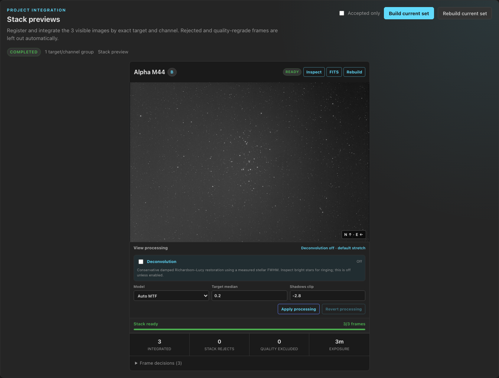
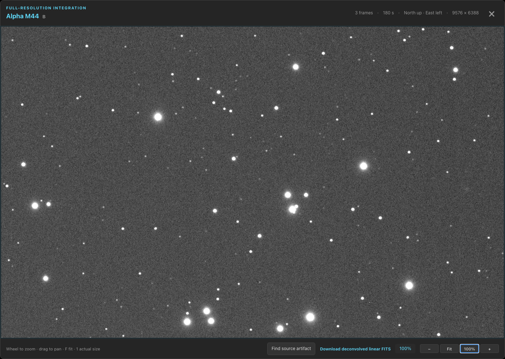
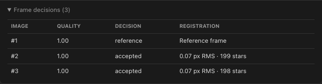
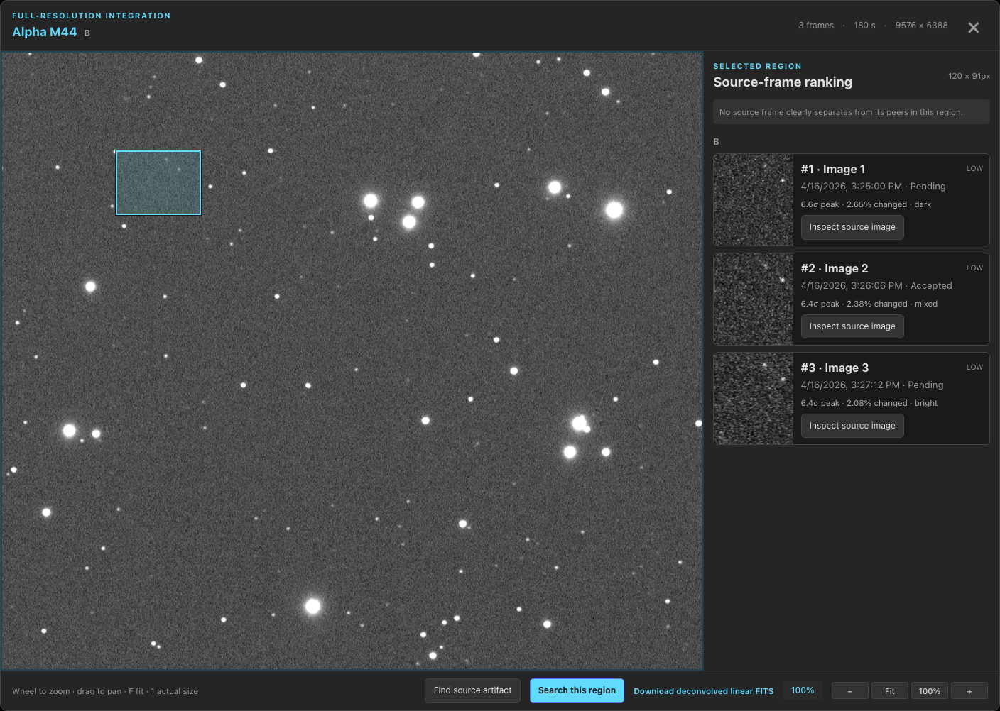
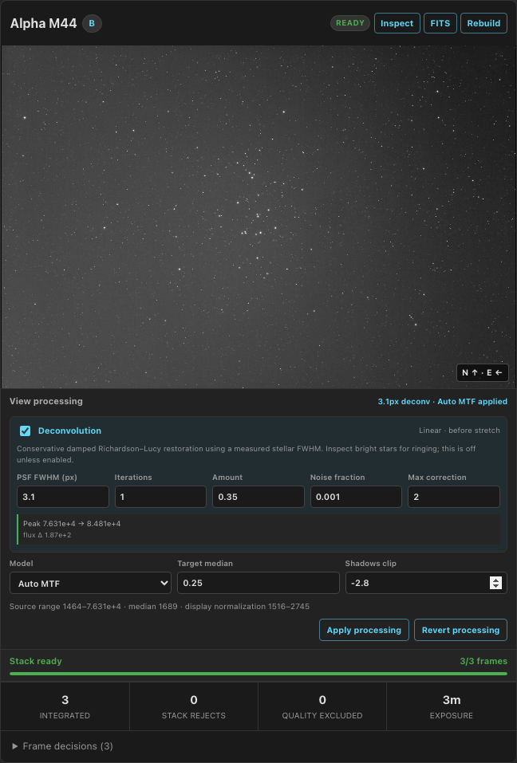
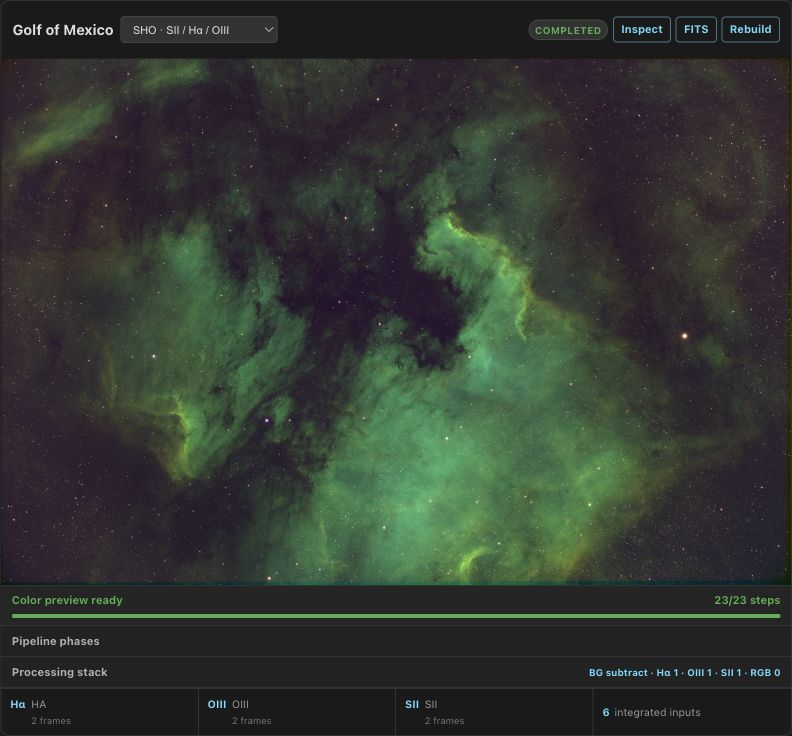
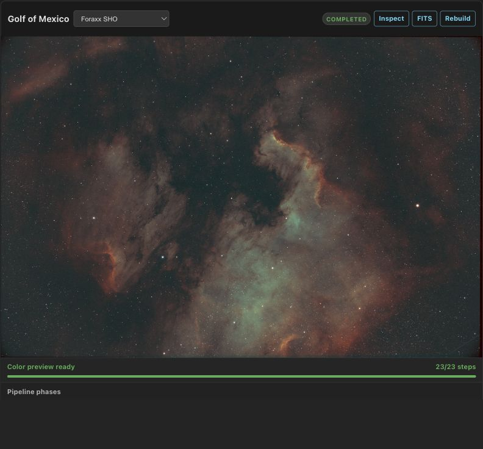
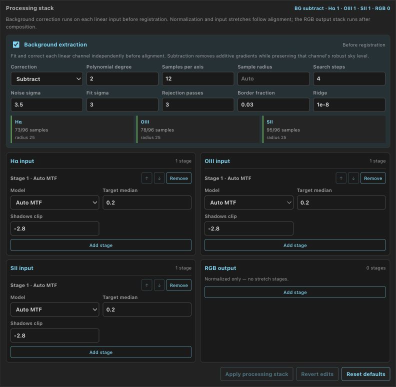

# Project stack previews

PSF Guard can build an on-demand integration directly from the image grid.
This is a fast visual answer to “what does this project/channel look like so
far?”, with the grading and registration evidence kept beside the result. It
can apply cataloged calibration data, but it remains a quick-look result rather
than a final-processing workflow.



## Build a preview

Open one project in the image grid and choose **Build stack previews** to build
every current target/channel group, or **Build channel** on one card to test
only that group. Once a result exists, the corresponding actions become
**Rebuild current set** and **Rebuild channel**. An individual rebuild replaces
only that channel's remembered result; the other channel cards remain intact.

- A multi-selection of two or more images is the input when one exists.
- Otherwise the current visible set is used, including the status, channel,
  date, target, and search filters shown above the grid.
- The server always separates inputs by exact catalog target and
  filter/channel. It never combines different targets or filters.
- **Accepted only** removes Pending frames. By default both Accepted and usable
  Pending frames are eligible.

The build runs in the background and the panel polls its status. Different
target/channel groups are processed sequentially. Only one stacking job runs
in the PSF Guard process at a time, even when the server hosts multiple
databases, so full-frame accumulator buffers cannot multiply unexpectedly.
Cards are capped at two columns on wide displays so the inspection preview does
not become excessively wide.

### Queue builds by hand

Build buttons stay available while a build runs. Clicking **Build channel** on
another card — or a color build, or **Build stack previews** for the whole set
— queues that job behind the running one on the same single-job worker, so
memory use does not grow with the queue. Each card shows its own state:
`queued` cards wait, the `running` card shows live progress, and the status
line counts the builds in the queue. The header **Stacking** indicator lists
the same queue in every view. **Stop** becomes **Stop all** when more than one
build is pending and stops every queued and running job; channels that already
finished keep their previews.

### Additive rebuilds resume

A finished or stopped channel build checkpoints its integration state — the
running accumulator, the online rejection statistics, and the registration
reference — beside a ledger of every frame it integrated or turned away. A
later build of the same target and channel whose frame set only grew reopens
that checkpoint and integrates just the new frames, so adding a night to a
season-long target costs one night's stacking, not the whole season's. The
card marks restored work as `resumed` in its frame counter.

The resumed result is exactly the stack a from-scratch build would produce;
Seiza's checkpoint round trip is bit-for-bit and validates the format version,
dimensions, configuration, and payload checksum before continuing. The
checkpoint is only reused when it is provably an ancestor of the request:
every recorded frame must still be requested with an identical source
fingerprint, and the calibration set, Accepted-only policy, and stacking
pipeline version must match. Removing a frame, regrading one in place,
changing calibration, or upgrading Seiza rebuilds from scratch — and when a
checkpoint existed but could not be extended, the card says why (`Full
restack: calibration changed`), so a slow rebuild is never a mystery. A
stopped build checkpoints the frames it finished, so building again continues
where the stop landed instead of starting over. Checkpoints live in the
project cache and cost one full-frame state file per target/channel.

### Cache housekeeping

Stack artifacts are content-addressed by job, so every rebuild writes a new
directory and old ones used to accumulate forever. After a build settles, a
janitor sweeps the stack cache and deletes what nothing references any more:
mono and color job directories absent from every durable latest index and
from the in-memory job list, and cached color inputs no kept job points at.
Both indices replace entries per identity — mono per target/channel, color
per target/kind/palette — so a job's output is durable until its input set
changes and a newer build of the same identity supersedes it. A full day of
grace on top means nothing a long build session or an open inspector still
touches is swept out from under it.

Resume checkpoints follow the same rule: each is replaced in place when its
group's input set changes and is otherwise kept, whatever its age. The only
checkpoints deleted outright are ones that can never resume again — written
by another stacking pipeline version, unreadable, or an orphaned half of an
interrupted save.

A build belongs to the server, not to the page that started it. The header
shows a **Stacking** indicator next to the cache and quality-analysis progress
for as long as any mono or color build is queued or running, in every view and
in every database. Reopening the project grid re-attaches the stack panels to
the running job, so leaving the page and coming back restores the live per-card
progress instead of an idle panel. The indicator names the target and channel
being stacked, its frame counts, and how many further builds are waiting.

## Stop a build

**Stop** appears beside the build buttons while a build is queued or running.
The stop takes effect between frames, between channels, and between
calibration masters, so it lands within one frame's work rather than instantly.
Building a single master runs inside Seiza and finishes before the stop is
seen; that is a first build of a night's calibration set, not the usual case.
Nothing partial is published: a channel that stops before its FITS and preview
are written leaves no artifact, and the card says the channel was stopped.
Channels that already finished keep their previews and are remembered as usual.
Build again when you are ready; a stopped job is never reused as a cached
result.

## Stack orientation

A stack keeps the rotation of its reference frame. Registration matches star
triangles at any angle, so frames taken on either side of a meridian flip land
on the same grid without a reprojection, and the result looks like the frames
you graded. The downloaded FITS carries the reference frame's own WCS when it
has one.

### Which side of a meridian flip

A German equatorial mount turns the field 180 degrees when it flips. Both
halves of such a night stack cleanly, but the reference frame alone decides
which way up the result comes out, and the reference is whichever frame scored
best — it can sit on either side of the flip, and it can move to the other
side when a regrade or a quality rescan changes the scores.

So PSF Guard follows the exposure instead. If most of the integrated seconds
came from frames half a turn from the reference, it turns the finished stack
half a turn to match them. That is an exact reversal of the pixel order, so it
costs no resampling and loses no accuracy. A night that never flipped is never
turned, an even split keeps the reference frame's rotation, and the choice does
not move when scores do.

PSF Guard records the source-to-output mapping on every stack, so
source-artifact search maps a selected stack region back to the right source
pixels, and background protection maps catalog bounds forward onto the stack.
That mapping is the identity for an untouched build and the half turn for a
turned one, so both consumers follow the published pixels without special
cases.

### The shared north-up grid

A caller can ask for the canonical celestial frame instead — north up, east
left — by sending `north_up: true` when it starts a build. Several stacks then
share one grid, which is what a sky mosaic needs. The UI never sets it; each
card and inspector shows the `N ↑ · E ←` marker only for a stack built this
way.

An oriented build reprojects the integration after registration and expands the
output grid to keep the source frame's four corners, so a rotated camera
produces blank, masked wedges around the valid sky footprint instead of losing
data to a crop. PSF Guard first uses a current pixel-derived solve, then a valid
embedded FITS WCS. If neither exists, it plate-solves the reference frame before
it publishes the result. The build fails with a catalog or solve error when it
cannot prove the orientation; it never marks an unknown view as sky-up. The
FITS then contains a replacement TAN WCS for the reprojected pixels and records
`SKYORIEN='N-UP E-LEFT'`. A color preview registers its channel stacks onto the
reference channel's grid, so RGB, LRGB, and narrowband outputs inherit whichever
frame their channels were built in.

## Cached results

PSF Guard remembers the last successful preview for every target/channel in the
project cache and restores those cards after navigation, page reload, or server
restart. Each card retains the exact input image IDs and scheduler grades used
to build it. PSF Guard hides previews built by an older orientation rule; build
each channel once to replace them. The card is marked **Out of date**—without
hiding the usable older preview—when the current filter/selection changes the
image set, an image is
accepted/rejected/pended, or the **Accepted only** policy changes. A failed
rebuild never replaces the last successful result.

## Calibration before registration

Before Seiza registers the reference, PSF Guard matches the light against the
calibration library in the same database. It builds and caches sigma-clipped
masters from two or more matching inputs, then supplies the bias, dark, and
flat masters to Seiza. Raw CFA data is calibrated before debayering.

The card reports the calibration phase, input counts, whether a complete or
partial set was applied, and missing-file or coverage warnings. The stack job
key includes the matched calibration files and their current file
fingerprints. Adding, replacing, or removing a matching frame therefore marks
the prior preview out of date instead of silently reusing it.

PSF Guard does not cross a known camera, dimensions, channel count, binning,
gain, offset, readout mode, or Bayer mismatch. Darks also match exposure and
temperature; flats match filter, telescope, and focal length when those values
exist. It prefers the nearest captures in time and caps each master at 64
inputs. Missing required metadata causes that candidate to abstain rather than
guess.

If no safe set exists, the card says that calibration is absent or incomplete.
PSF Guard never labels an uncalibrated preview as calibrated. See
[Calibration libraries](CALIBRATION_LIBRARY.md) for the full rules.

## Frame selection and admission

PSF Guard owns project policy; Seiza owns image registration and integration.
Before handing frames to Seiza, PSF Guard excludes:

1. images marked Rejected in the catalog;
2. Pending images when **Accepted only** is enabled; and
3. images for which the current sequence analysis has a `regrade_reason`,
   including confirmed cloud/obstruction, off-target, tracking-loss, and
   corroborated no-solve decisions.

The highest-scoring remaining frame becomes the immutable reference. The other
eligible frames are offered to Seiza in acquisition order. Seiza decodes the
linear FITS samples, debayers when required, performs global normalization,
registers each source to the reference, applies its overlap/RMS/scale/rotation
admission gates, and accumulates accepted samples with online delta-sigma
rejection.

Expand **Frame decisions** to audit what happened. Each result retains the
PSF Guard quality score and disposition. Accepted frames also report matched
stars, registration RMS, registration drift, overlap, and integrated-sample
fraction; excluded or rejected frames retain their reason.

Choose **Inspect full size** to open the native-resolution integration in PSF
Guard's image inspector. It uses the same controls as individual images: scroll
to zoom, drag to pan, **F** or **0** to fit, and **1** for one image pixel per
screen pixel. The full-size stretched PNG is loaded only when the inspector is
opened, so the project grid continues to use the smaller screen preview.



Choose **Download linear FITS** on the card or in the inspector to retrieve the
full-resolution floating-point integration from the cache. The FITS is
unstretched and contains the stack's WCS plus Seiza's accepted/rejected frame
counters, making it suitable for inspection or as an input to a separate
processing workflow.



## Find a stack artifact in its source frames

A stack can make a satellite trail, reflection, hot region, or other local
defect easier to see. Open **Inspect full size**, choose **Find source
artifact**, and drag a box around the suspect area. **Search this region**
starts a background job that maps the same sky area back into every integrated
source frame.

PSF Guard calibrates and prepares each source as it did for the stack, applies
the retained source-to-stack registration and normalization, and compares the
aligned crops against their per-pixel median. Results rank unusually bright or
dark crops within each filter. For a result that separates from its peers, PSF
Guard also checks the changed pixels' shape. It can label a broad dark patch as
a dust-shadow candidate, a hollow round patch as a ring or donut candidate, a
thin feature as trail-like, or a small feature as a compact spot. Each result
shows its crop, capture time, deviation strength, changed-pixel fraction, shape
label, and a link to the full source image. Color-preview searches also apply
the retained channel-to-color registration, so the selected area maps through
both registration steps.
Every integrated frame contributes to the comparison. For a large stack, the
result panel keeps the 50 strongest crops per filter instead of creating and
loading an unbounded list of preview images.

The search is evidence for review, not a grade. **Strong**, **possible**, and
**low** describe how far one crop differs from the other crops in that small
area. Shape labels describe geometry, not a proven cause: a dust-shadow
candidate may instead be a cloud edge or obstruction, and a ring may instead
be a reflection. Low-evidence results stay unclassified. The search never
accepts or rejects an image. It cannot isolate a defect that appears in the
same registered place in every source because that defect becomes part of the
peer baseline. At least three integrated frames are needed for a filter. A
color search skips a channel that has fewer than three inputs and says why. The
region must measure 8–512 pixels on each side.



This real three-frame M44 check finds no source that clearly separates from
its peers. PSF Guard keeps the ranked crops visible and labels each result
**low** instead of inventing a culprit.

Stacks made before this feature lack the retained frame mappings and source
fingerprints. Rebuild the mono stacks and color preview once before searching
them. PSF Guard also asks for a rebuild if a source file, calibration choice,
channel stack, or color registration changed after the displayed preview was
built.

## Reversible view processing

Expand **View processing** on any mono stack card to configure its optional
linear restoration and display rendering. **Apply processing** reads the cached
FITS and renders both the grid and full-resolution inspection PNGs. The source
stack is never rewritten. **Revert processing** immediately returns the card,
inspector, and FITS download to the original integration.

**Deconvolution is off by default.** When enabled, PSF Guard uses
`seiza-deconvolution` before display normalization and stretching. Supply the
measured unsaturated-star FWHM in pixels, then tune the conservative damped
Richardson–Lucy iteration count, restored-image blend, noise damping, and
per-iteration correction limit. The defaults—3.1 px, four iterations, 35%
blend, 0.001 noise fraction, and 2× correction limit—are only populated after
the checkbox is enabled. Inspect bright stars at full resolution for ringing;
this is a circular, spatially invariant Gaussian PSF model, not blind or
spatially varying deconvolution.

An enabled restoration creates its own content-addressed linear FITS with WCS
and observation metadata preserved plus `SEIZADC`, `DCFWHM`, `DCITER`,
`DCAMT`, `DCNOISE`, and `DCMAXCOR` provenance cards. While that variant is
active, the full-size inspector downloads the deconvolved FITS. Turning the
processing off returns to the original cached stack FITS.
Changing only the display stretch reuses the same restored FITS. Its cache key
depends on the source revision, restoration settings, and Seiza algorithm
version, not the display model.

The controls expose Seiza's identity, explicit linear, asinh,
percentile-asinh, MTF, Generalized Hyperbolic Stretch (GHS), and Auto-MTF
models. Auto-MTF with PSF Guard's established target median and shadow clipping
is the default for linear mono-stack artifacts.
Explicit black, white, shadow, and highlight points use normalized zero–one
display units. PSF Guard maps a robust 0.1%–99.9% range from linear FITS into
that domain before invoking Seiza. After an application, the card shows the raw
source range, median, and normalization bounds so the transform remains
inspectable.

Applied PNG variants are content-addressed by the source artifact revision,
restoration artifact, stretch configuration, robust-normalization policy, and
Seiza processing versions. Reapplying the same settings reuses the cached PNG
pair. Stretch edits also reuse a matching processed linear FITS. The active
selection is intentionally browser-local and reversible; a reload returns to
the durable default preview while the linear FITS remains the sole source of
truth.



## Color previews from channel stacks

Once one target has completed mono stacks for **L/R/G/B** or **H-alpha/OIII**,
the grid adds a **Combine channel stacks** section. Color generation is a
separate on-demand job: rebuilding or changing a color palette never changes
the mono integrations or their admission evidence.

- **RGB** requires one unambiguous Red, Green, and Blue stack.
- **LRGB** requires one unambiguous Luminance, Red, Green, and Blue stack.
  Luminance supplies the output luminance while Seiza retains the RGB
  chromaticity.
- **Narrowband** requires H-alpha and OIII. HOO and Foraxx HOO are then
  available. Adding SII enables SHO, SOH, HSO, HOS, OSH, OHS, and Foraxx SHO.
- The palette picker is part of the cache key. Previously generated palettes
  remain available, and selecting another palette builds or restores its own
  artifact.

PSF Guard recognizes the ordinary short and long filter names (`L`, `Red`,
`Ha`, `H-alpha`, `OIII`, `SII`, `O3`, and `S2`) plus descriptive names such as
`Red`, `H-alpha`, and `OIII` as distinct tokens in vendor labels. It
deliberately does not guess when two stacks map to the same role or when a
multi-band filter name is ambiguous. Rename the Target Scheduler filters to
make those roles explicit before building color.

Before registration, PSF Guard uses `seiza-background` to fit and correct each
linear channel independently. Background extraction is enabled for new UI
builds and defaults to additive subtraction, which removes the fitted gradient
while preserving that channel's robust sky reference level. Multiplicative
division is available for vignetting-like fields, and extraction can be
disabled when the source stacks are already corrected. A strength control can
apply part of the fitted correction when a full pass is too strong.

The default automatic model compares constant, linear, and quadratic surfaces
on held-out samples, then picks the simplest model that earns a clear
improvement. It does not consider a radial-basis surface by default. That model
can follow smaller-scale variation, but costs more to apply and can mistake
real extended emission for sky. Enable it only as an advanced option, or select
a fixed polynomial or radial-basis model for manual control.

When a channel stack has a fresh pixel-derived plate solve, PSF Guard protects
large cataloged emission regions from background sampling. It uses closed
catalog or curated contours when the object catalog supplies them, then falls
back to the object's projected ellipse. Embedded FITS WCS alone does not enable
this protection. Each channel uses its own stack reference frame, and PSF Guard
maps its catalog bounds through the stack's saved source-to-output transform
before it fits the background. The manifest records the reference image,
catalog version, object names, region count, and a geometry fingerprint. These
values form part of the cache key and stale check, so a new solve or catalog
projection cannot reuse or present a fit made with stale bounds. After
correction, each non-reference stack is registered to R for RGB, L for LRGB, or
H-alpha for narrowband, using the same bounded Seiza star/similarity
registration used by the Seiza color CLI.

The **Processing stack** editor exposes correction mode and strength, automatic
or fixed surface selection, sample-grid density and radius, sample-search
steps, sample and fit rejection thresholds, rejection passes, border exclusion,
and model-specific controls. After registration it applies optional per-role
deconvolution while each physical input is still linear, then robustly
normalizes the result and applies that role's ordered stretch stages before
composition. Deconvolution is independently opt-in for L/R/G/B or
H-alpha/OIII/SII and is off for every role by default. Expand those input lanes
or RGB output to add, edit, remove, and reorder Seiza
identity, linear, asinh, percentile-asinh, MTF, GHS, and Auto-MTF stages.
**Apply processing stack** starts a new cached color job; **Revert edits**
returns to the last rendered pipeline and **Reset defaults** restores additive
background extraction, deconvolution off, one Auto-MTF stage per input, and no
post-composition stage.

Every intermediate remains `f32`, and each automatic stage resolves against
the preceding stage's output. These are sequential transfer passes, not pixel
values added together. Seiza receives the independently prepared channels as
display-referred inputs, so Foraxx uses those values directly instead of
applying a second shared stretch. RGB output stages may use linked, unlinked,
or luminance-preserving color strategies. The downloadable RGB FITS contains
the exact processed color result, records `COLORSPC`, `SEIZACLR`, and
`SEIZATRF='DISPLAY'`, and preserves supported WCS cards from the reference
stack. The manifest retains the requested background configuration,
per-channel deconvolution parameters and peak/flux diagnostics, and stage
arrays, plus each resolved background model and Seiza stretch plan. The UI
reports the chosen surface, accepted/candidate sample counts, resolved sample
radius, protected-region count, and protected object names for every input
role. The complete processing definition, resolved dependency versions, source
revisions, and solver-derived protection are part of the job ID, so
applying the same pipeline restores its prior artifact. Artifacts from before
background extraction are rebuilt with the new additive default; a current
artifact whose extraction was explicitly disabled keeps that choice.

PSF Guard caches each set of prepared linear inputs after background
correction, registration, optional deconvolution, and normalization. Input or
output stretch edits reuse those FITS files, so they do not repeat source
loading, background fits, registration, or deconvolution. Registered channels
may contain `NaN` at uncovered borders; Seiza keeps that mask through
deconvolution instead of failing the color build or treating gaps as data.

### Edge crop

Registering one channel onto another leaves blank edges where that frame did
not reach. The **Edges** picker on each color card chooses what the composition
keeps:

| Choice | Keeps |
| --- | --- |
| Keep blank edges (default) | the whole reference grid, as earlier releases produced |
| Trim to covered box | the box the covered pixels span |
| Trim to full coverage | the largest rectangle every channel covers in full |

Dithered channels overlap in a rectangle, so the covered box is enough for
them. A meridian flip or a rotator leaves uncovered corners inside that box,
and only full coverage removes them. Pick full coverage when a later step
cannot handle `NaN`.

The crop is chosen before normalization, so every channel is scaled from the
same patch of sky and a bright edge that the crop discards cannot set a white
point. The downloadable FITS moves `CRPIX` onto the cropped grid and records
that origin in `SEIZACRX`/`SEIZACRY`, so the preview keeps the reference plate
solution. The choice is part of the job ID: each crop keeps its own cached
artifact, and applying a processing stack retains the crop the card is showing.

A completed card reports the kept size and the share of the grid retained. When
one channel's coverage sits far enough from the others to look like a pointing
error rather than dither, the card names it: that channel bounded the crop, and
reshooting or dropping it recovers the field. The server logs the same warning.

| Standard SHO | Foraxx SHO |
|:--:|:--:|
|  |  |

Both previews above come from the same six accepted Gulf of Mexico (NGC 7000)
acquisitions: two each in H-alpha, OIII, and SII. Switching palettes reuses the
three registered mono artifacts; it does not repeat their integrations.

The expanded color card shows the complete phase ledger plus independent input
and output stretch lanes. Each lane can add, remove, and reorder stages;
**Apply processing stack** creates a new content-addressed preview while
**Revert edits** restores the last rendered configuration.



This real Foraxx SHO run retained 73 of 96 H-alpha samples, 78 of 96 OIII
samples, and 95 of 96 SII samples. The rejected locations contain excess noise
or nebular structure that should not influence the fitted sky surface.

Color cards retain the compact loading/status strip directly below the image.
Its determinate total covers source loading, one background fit and one
correction per channel, channel registration, every enabled linear-input
deconvolution, per-input normalization, every input stretch stage, composition,
every output stretch stage, FITS writing, full-size rendering, screen rendering,
and artifact publication. When extraction or deconvolution is disabled, its
phase is retained as explicitly skipped. **Pipeline phases** preserves each
phase's completed, skipped,
reused, or failed state and identifies the active role and stage in the live
label. A failed fit stops the build with its input role named; disable
extraction or adjust the sampling controls to retry. **Inspect** opens the same
native-size pan/zoom inspector as a mono stack. **FITS** downloads the full RGB
result for further inspection. A color result is marked **Out of date**—but
remains viewable—when any source channel stack is rebuilt, a cached artifact
goes missing, or the Seiza/background/color-processing cache version changes.

## Output, caching, and invalidation

Each group produces a default display-stretched PNG no larger than 2400 pixels
on its longest side, a native-resolution stretched PNG for interactive
inspection, and an unstretched, source-resolution, 32-bit floating-point FITS.
Applied stretch variants live beside separate configuration and resolved-plan
manifests. A JSON provenance manifest describes the stack job. Seiza sees the original star profiles
during integration, and its incremental accumulator keeps memory bounded
independently of frame count. A conservative memory estimate is checked against
the server worker policy before integration starts. Full-size PNGs and FITS
downloads stream from disk rather than buffering the full artifact in server
memory.

Artifacts live below the database cache directory:

```text
<cache>/<database>/stack-previews/<job-id>/
  manifest.json
  group-0.png
  group-0-original.png
  group-0.fits
  group-1.png
  group-1-original.png
  group-1.fits
<cache>/<database>/stack-previews/stretch/<processing-id>/
  manifest.json
  preview.png
  preview-original.png
<cache>/<database>/stack-previews/deconvolution/<restoration-id>/
  manifest.json
  deconvolved.fits
<cache>/<database>/stack-previews/latest-project-<project-id>.json
<cache>/<database>/stack-previews/color-inputs/<input-id>/
  manifest.json
  red.fits
  green.fits
  blue.fits
<cache>/<database>/stack-previews/color/<color-job-id>/
  manifest.json
  preview.png
  preview-original.png
  color.fits
<cache>/<database>/stack-previews/color/latest-project-<project-id>.json
<cache>/<database>/stack-previews/artifact-searches/<search-id>/
  manifest.json
  image-<image-id>.png
```

The content-addressed job ID includes the database/project, exact ordered
inputs and grouping, grades, quality scores and regrade reasons, source path
fingerprints, matched calibration fingerprints, an explicit PSF Guard
cache-policy version, Seiza stacking revision, processing parameters, and
preview format. Restoration and prepared
color-input caches use narrower keys so display-only edits can reuse earlier
linear work. Repeating an unchanged request loads the persistent result. A
rebuild bypasses that lookup and atomically replaces the PNG, FITS, and
manifest. The per-project latest index is also written atomically and is
updated only for successfully completed groups. Each run receives a distinct
artifact revision in its download/display URLs so clients cannot mistake an
immutable cached response for the rebuilt output.

## Deliberate limits

- Calibration selection is automatic and conservative. There is not yet a UI
  for forcing a different master set.
- The retained FITS is a quick-look integration, whether calibrated or not. It
  is not a final science product.
- Color is a visual channel combination, not photometric or
  spectrophotometric calibration. There is no custom mixing matrix UI, star
  removal, mosaic, drizzle, or cross-target integration.
- Deconvolution requires a user-supplied FWHM and one circular Gaussian PSF for
  the whole channel. It does not estimate a PSF, vary it across the field, or
  replace a final scientific restoration workflow.
- Satellite predictions and image-detail overlays are not applied to a stack.
  They describe individual shutter intervals, while one preview represents
  several exposures.
- Source-artifact search detects local differences between registered inputs.
  It does not label the cause, replace full-frame quality analysis, or change a
  catalog grade.

## HTTP API

The grid uses these per-database endpoints:

```text
POST /api/db/{db}/projects/{project}/stack-previews
GET  /api/db/{db}/projects/{project}/stack-previews/latest
GET  /api/db/{db}/projects/{project}/stack-previews/{job}
GET  /api/db/{db}/stack-previews/{job}/{group}/preview[?size=screen|original]
POST /api/db/{db}/stack-previews/{job}/{group}/stretch
GET  /api/db/{db}/stack-previews/{job}/{group}/fits
GET  /api/db/{db}/projects/{project}/stack-previews/color
POST /api/db/{db}/projects/{project}/stack-previews/color
GET  /api/db/{db}/projects/{project}/stack-previews/color/{job}
GET  /api/db/{db}/stack-previews/color/{job}/preview[?size=screen|original]
GET  /api/db/{db}/stack-previews/color/{job}/fits
POST /api/db/{db}/stack-previews/{job}/{group}/artifact-searches
POST /api/db/{db}/stack-previews/color/{job}/artifact-searches
GET  /api/db/{db}/stack-previews/artifact-searches/{search}
GET  /api/db/{db}/stack-previews/artifact-searches/{search}/crops/{image}
GET  /api/db/{db}/stack-previews/stretch/{stretch}/preview[?size=screen|original]
GET  /api/db/{db}/stack-previews/stretch/{stretch}/fits
```

The POST body is `{ "image_ids": [...], "accepted_only": false, "force":
false }`. Status responses contain the group counters, captured image/grade
snapshot, and complete per-frame decision records used by the UI. The latest
endpoint returns the durable last-successful result for each target/channel.
The color catalog reports role/palette availability and durable results. Its
POST body is `{ "target_id": 42, "kind": "rgb", "force": false,
"processing": { "background_extraction": { "correction_mode": "subtract",
"strength": 1.0, "config": { "model": { "kind": "automatic",
"max_degree": 2, "ridge": 1e-8, "rbf_smoothing": 0.01,
"max_control_points": 192, "allow_radial_basis": false,
"minimum_improvement": 0.08 },
"samples_per_axis": 12, "sample_radius": null, "search_steps": 4,
"sample_rejection_sigma": 3.5, "fit_rejection_sigma": 3.0,
"fit_rejection_iterations": 3, "border_fraction": 0.03 } },
"input_deconvolutions": { "red": { "psf_fwhm_pixels": 3.1,
"iterations": 4, "amount": 0.35, "noise_fraction": 0.001,
"max_correction": 2.0 } },
"input_stretches": { "red": [{ "model": { "type": "auto-mtf",
"target_median": 0.2, "shadows_clip": -2.8 }, "color_strategy": "linked" }] },
"output_stretches": [] } }`,
`{ "target_id": 42, "kind": "lrgb", "force": false }`, or
`{ "target_id": 42, "kind": "narrowband", "palette": "foraxx-hoo",
"force": false }`. Omitting `processing` retains the earlier linear quick-look
behavior for API compatibility. The optional `"crop"` field takes `"none"`
(the default), `"bounds"`, or `"inscribed"` and trims the result to the area
every channel covers; a completed job reports `crop_report` with the kept
region, the retained fraction, and each channel's coverage. Clients cannot submit `protected_regions`;
the server derives them from fresh plate-solve evidence. Mono stretch POST
bodies use Seiza's tagged model shape, for
example `{ "model": { "type": "percentile-asinh", "black_percentile":
0.01, "white_percentile": 0.995, "strength": 8.0 }, "color_strategy":
"luminance-preserving", "deconvolution": null }`. Replace `null` with the
same deconvolution object shown above to opt in.

Both artifact-search POSTs take the displayed artifact revision and a region
in stack-image pixels:

```json
{
  "artifact_revision": "<revision>",
  "region": { "x": 1200, "y": 800, "width": 96, "height": 64 }
}
```

The response names an asynchronous search. Poll its GET endpoint until the
state is `completed` or `failed`; completed results include immutable crop
URLs and per-frame outlier evidence.
