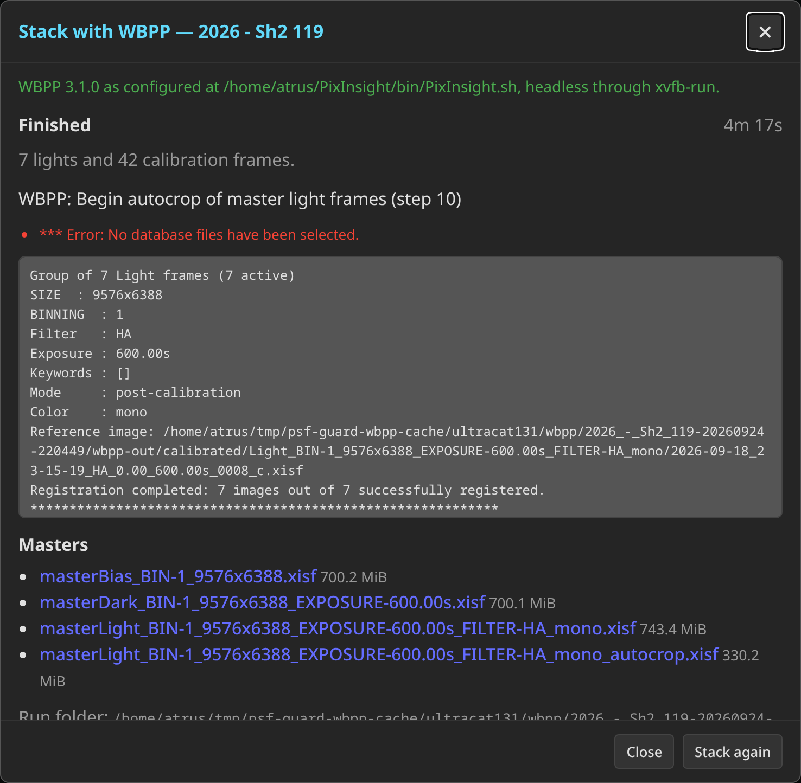

# Stacking with PixInsight's WBPP

PixInsight's WeightedBatchPreprocessing (WBPP) is the stacker most people
end up in. PSF Guard hands it a project two ways: as an **export** whose
runner scripts you start yourself, on any machine, or as a **run** PSF
Guard starts on its own server from the Overview. Both send WBPP the same
thing: the graded lights where they already are, each night's flats
matched to its lights, and every setting spelled out, so a headless run
does what you meant.

Checked against PixInsight 1.9.5 with WBPP 3.1.0.

## WBPP settings

WBPP's automation mode takes most of the dialog's controls as `name=value`
parameters. Two of the settings people reach for are not among them,
because WBPP keeps them per light group: drizzle, and Fast Integration.
PSF Guard's runner script sets those on every light group itself, just
before WBPP builds its pipeline. The settings PSF Guard offers:

| Setting | Choices | What it does |
|---|---|---|
| Quality | Maximum, Good, Fast | WBPP's own Presets: local normalization on with PSF Auto and every star (maximum), on with Moffat 4 and 500 stars (good), or off (fast). Default maximum. |
| Fast Integration | Off, WBPP decides, On | The in-memory stack with less weighting. WBPP switches any group of 150 frames or more to it on its own, which nobody sees happen headless, so PSF Guard's default is off. |
| Drizzle | Off, 2x, 3x | Drizzle integration of the lights, at WBPP's default drop shrink and kernel. Off by default. |
| Autocrop | WBPP's default (on), On, Off | Crop the masters to the area every frame covers. |
| Light rejection | WBPP's default (automatic), or an algorithm | The pixel rejection for the light integration. |

Pick them in the export dialog when the layout is WBPP, and in the run
dialog. **Settings → Setups → Export** holds the defaults both start from.
A headless run starts from WBPP's own defaults, not from what its dialog
last saved, so the settings above are the whole story.

Anything else WBPP takes can ride along: the run dialog has a box for more
`name=value` parameters, and the launcher scripts forward whatever is
appended to `PARAMS`. WBPP prints its full list with Alt+A in its dialog,
or with `automationMode=true,paramList` on the command line.

## Export a WBPP tree and run it yourself

The Export action on a project card or target row, with the **WBPP**
layout, writes the frames (or, with **Reference in place**, only the
scripts that name them) and three files beside them:

- `run-wbpp.js`, the PixInsight script. It carries the frames, the
  settings and the per-group drizzle and Fast Integration choices, and
  runs WBPP inside PixInsight.
- `run-wbpp.sh` and `run-wbpp.cmd`, which start PixInsight on that script
  with the folder's own `wbpp-out` as the output. Set `PI_ROOT` or `PI_BIN`
  if PixInsight is not in the standard place.

By default the script loads the frames and stops at WBPP's dialog, so you
can check the groups before an hour of integration starts. Append `,run`
to `PARAMS` in the launcher, or pass `run` yourself, to go straight
through. See [Calibration libraries](CALIBRATION_LIBRARY.md#export) for
the layout and how flats are matched by night.

To run headless on Linux, put `xvfb-run -a` in front of the launcher.
PixInsight needs a display, and that gives it a virtual one.

## Stack from inside PSF Guard

**Stack in WBPP**, on a project card of the Overview, runs WBPP on the
server. It needs the database-management grant, because it starts a
program on the server, and a PixInsight install the server can reach.

1. Tell PSF Guard where PixInsight is, once, under **Settings → Setups →
   PixInsight**. Leave the path empty to look in the standard places
   (`/opt/PixInsight`, `~/PixInsight`, the macOS application folder, or
   Program Files). The panel says what it found, which WBPP version, and
   whether the server has a display: a Linux server without one needs
   `xvfb-run` (the `xvfb` package), and the panel says so. PixInsight's
   licence must already be activated for the account the server runs as;
   activation itself needs the real GUI once.
2. Open **Stack in WBPP** on a project. Choose whether ungraded lights
   count (rejects never do), the settings above, and any extra parameters.
3. **Start stacking.** PSF Guard plans the frames as an export would,
   writes `run-wbpp.js` into a run folder, and starts PixInsight on it
   headless.

A run writes gigabytes: calibrated and registered copies of every light,
then the masters. So the run folder is yours to place. The **WBPP runs
folder** under **Settings → Setups → PixInsight** puts every database's
runs below it (`<folder>/<database>/<project>-<time>/`) and shows the
space free there. Without one, a database's runs go under its export
directory when it has one, and only otherwise under the cache. The run
dialog can also name a folder for one run. The dialog shows the space
free at the folder when the run began.

The dialog then follows WBPP's own log: which step it is on, how long the
run has taken, the last lines, and any line WBPP marked as an error. WBPP
writes its log between steps, so a long integration shows nothing new for
a while; the elapsed time keeps counting and PixInsight is still at work.
**Stop PixInsight** ends the run. One run at a time per database; opening
the dialog while one is under way shows that run.

When PixInsight exits, the dialog lists the masters WBPP wrote, each a
download, with links to the script, WBPP's log and PixInsight's console
output. Everything stays in the run folder, so it is also there on the
server's disk for PixInsight to open directly. A run that wrote no master
is reported as failed, with the last error WBPP logged.

The Overview shows every database's run under way or just finished, in
whichever browser or tab you open it from: a status line above the
projects, and the project's own **Stack in WBPP** action reads *Stacking
in WBPP…*, *WBPP masters ready* or *WBPP failed* until the next run.
Either reopens the dialog. The run's state lives in the server process,
so a server restart forgets a finished run's progress and results; its
folder and files stay on disk.

### Keep the masters with your finished work

Most people keep finished work per rig, beside the frames: a `_Process`
folder next to `_Source`, with one folder per processing project and the
WBPP masters in a `master/` folder inside it. PSF Guard can put a run's
masters there. Give the database a **process directory** under **Settings
→ Databases** (the rig's `_Process` folder), and the run dialog offers
**Save the masters**: name the project's folder, and the masters are
copied to `<process directory>/<folder>/master/`. Tick **Save the masters
when done** before a run to have it happen as the run ends, or press
**Save masters** afterwards.

The folder name is remembered per project, so the next run of the same
project offers it again. Nothing already in the folder is overwritten: a
file already there with the same size is taken as the same file and
skipped, one with a different size is left alone and named in the
outcome. Only the `master/` files are copied; the calibrated and
registered frames stay in the run folder.

## What can go wrong

- **PixInsight not found.** The settings panel lists where it looked. Name
  the executable: `PixInsight.sh` under `bin/` on Linux, the binary inside
  the app bundle on macOS, `PixInsight.exe` on Windows.
- **No display.** On a Linux server, install `xvfb`. PSF Guard uses
  `xvfb-run -a` on its own once it is on the path.
- **Frames not found.** The run names each frame by its full path on the
  server. A catalog row whose file is not below the database's image
  folders is left out and counted in the dialog.
- **WBPP wrote no master.** Read WBPP's log from the dialog; the usual
  causes are a group WBPP could not register, or calibration frames that
  do not match. PixInsight prints nothing to its console output in this
  mode, so the log is the record.
- **`*** Error: No database files have been selected.`** is WBPP's plate
  solver saying the server's PixInsight has no local star catalog. It
  solves another way and the run goes on; the dialog shows every line WBPP
  marks as an error, so this one appears even on a run that finished well.
- **A comma in a path.** WBPP's command line separates parameters with
  commas, so a run folder or frame path with one cannot be expressed; PSF
  Guard refuses rather than mangles it.
