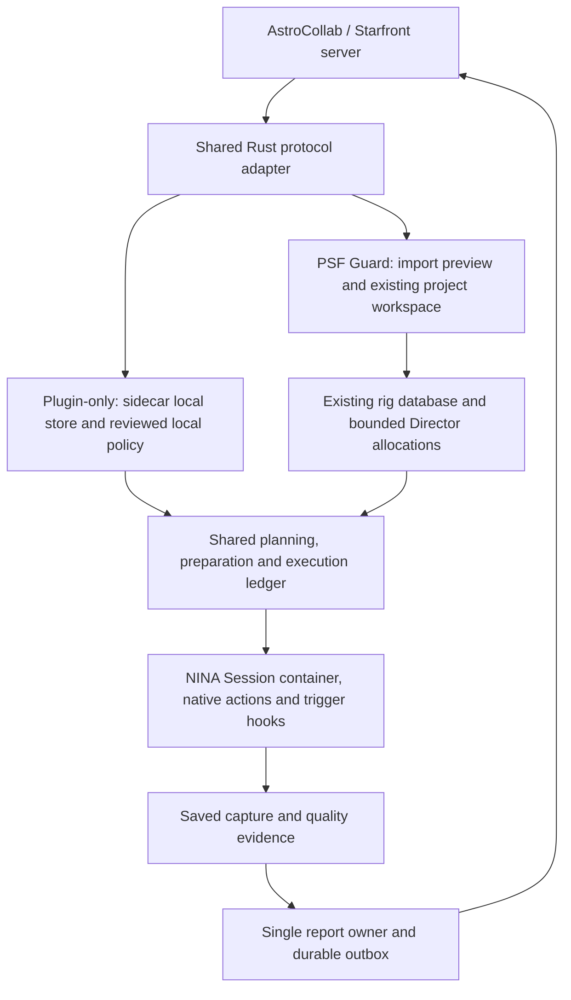

# AstroCollab and Starfront interoperability

Status: shared reader, authentication, reviewed import, managed-host hello/join,
nightly work retrieval, catalog-evidence review, durable contribution delivery
and fresh activity forwarding implemented. Reviewed assignments can use existing
Activation to write ordinary Target Scheduler rows, with GUID-based capture
association and actual-observing-night credit. The NINA adapter has separate
standalone pairing and browser sign-in. Neither remote registration nor import
grants acquisition. Plugin-only admission and reporting-owner handoff remain
planned.
Last reviewed: 2026-10-07.

## Sources and scope

Reviewed AstroCollab **0.2.0-draft.1**, wire protocol **1**, at
[`35a6f06`](https://github.com/theatrus/astrocollab-api/tree/35a6f068c6015367b4dbb69c1c4de5b7a0747d90),
and Starfront at
[`4cfa896`](https://github.com/bray-sfro/starfront/tree/4cfa8961c9fb98098645896a19c59b5f5ec3b976).
The public [protocol](https://github.com/theatrus/astrocollab-api/blob/35a6f068c6015367b4dbb69c1c4de5b7a0747d90/spec/protocol.md),
[OpenAPI](https://github.com/theatrus/astrocollab-api/blob/35a6f068c6015367b4dbb69c1c4de5b7a0747d90/openapi/astrocollab.yaml),
and [conformance scenarios](https://github.com/theatrus/astrocollab-api/blob/35a6f068c6015367b4dbb69c1c4de5b7a0747d90/spec/conformance.md)
own the wire contract. Do not maintain a second API specification here.

This draft adopts Starfront's hello, tonight and report routes. It is not the
earlier draft's capacity, revision-sync and calibrated-upload API. Core credit
comes from per-night reports; the optional `files` extension has **no defined
upload routes**. Monthly commitments, file delivery and coordinator project
administration are not part of this client contract.

Starfront's useful reference points are `astrocontrol/collabclient.py` for
polling/reporting, `astrocontrol/main.py` for adopting work into a local plan,
`astrocontrol/collab.py` for requirements, tiling and allocation, and
`server/app.py` / `server/store.py` for routes and report persistence. Its
capture software and collaboration server are in the same repository.
AstroCollab publishes an MIT license. This Starfront checkout has no license
file and GitHub reports no license: use it to inspect interoperability, not to
copy its implementation into the core without permission.

## Two modes, one executor

The diagram describes the complete target architecture. Managed PSF Guard
transfer and standalone NINA authentication are implemented; plugin-only work
import, local admission and reporting-owner handoff are not implemented yet.

**Plugin-only:** the NINA plugin pairs directly with a collaboration server.
The bundled Rust sidecar stores adopted projects, nightly demand, local policy,
execution evidence and queued reports. No PSF Guard server, rig catalog or Target
Scheduler installation is required. The operator supplies a complete local
equipment/exposure setup and chooses which projects may run automatically.
The existing NINA executor and its hooks stay unchanged in purpose.

**Import into PSF Guard:** PSF Guard browses and imports a remote project into
the existing Library/project workspace, with downstream work in the selected
rig databases. Director receives the normal local allocations. PSF Guard adds
catalog review, grading, calibration evidence, coverage and report submission.
Import must preview changes before Apply; later automatic refresh must stay
within the explicitly reviewed policy.

These are workload-source and reporting choices, not separate schedulers.
One collaboration agent represents one commissioned rig/equipment setup. In
PSF Guard mode it binds to the existing project database's rig identity; it
does not create a second catalog hierarchy. Sites remain location, horizon,
time and weather inputs. A shared remote project can map to one combined
project with different downstream framing and recipes on each rig.

Choose **one report owner** per server/agent/share: sidecar or PSF Guard.
Switching mode requires explicit identity, provenance and outbox handoff, not
two independent reporters using the same telescope token. Later importing
plugin-only captures preserves their original capture IDs and associations.

## Authentication and credential ownership

Status: PSF Guard setup, config-file credentials, standalone NINA authentication
and recovery states implemented. Reporting-owner credential handoff remains
planned. Keep three authorities separate:

- Local PSF Guard login and Director pairing control access to this installation.
- A temporary collaboration person token enrolls or lists remote rigs. Keep it
  only for setup, then discard it locally. Do not automatically call remote
  logout: the server may share that person session with another client.
- A collaboration agent token belongs to one commissioned rig and authorizes
  hello, participation, work retrieval and reports. It grants no local database
  or hardware permission.

In PSF Guard mode, the backend owns the agent credential and reporting queue.
NINA uses its existing Director pairing and never receives that credential.
In plugin-only mode, the managed NINA host owns collaboration HTTP and stores
the credential in a separate Windows Credential Manager entry. The Rust core
and sidecar receive bounded non-secret payloads, never tokens or pairing codes.
Do not reuse Director's token format or either plugin's existing credential.

### PSF Guard config file

Use the existing config space for desktop and headless/Docker PSF Guard, not a
new encrypted vault, external secret service or deployment unlock key. Store
agent credentials as plaintext JSON in `collaboration-credentials.json` beside
the normal `config.json`. For a custom registry, use
`<registry-stem>.collaboration-credentials.json` in that registry's directory,
following the existing `auth.json` naming pattern. An isolated test registry
must never read or write the user's normal credential file.

On Unix, create the file and all temporary replacements with mode `0600` from
the start, owned by the service user. Use `0700` for an application config
directory created for this purpose. On Windows, restrict the file to the
running user's access with the appropriate ACL. Check the file type, ownership,
permissions and parent-directory write access; refuse symlinks and storage
whose protection cannot be enforced. Do not silently proceed with a world- or
group-readable credential file, or repair an unsafe path by following it.
Use a restricted temporary file in the same directory, sync it and replace
atomically. Serialize concurrent updates so connecting one rig cannot lose
another rig's credential. Verify durable storage before reporting connected.

Docker persists this file in its existing writable config volume with matching
service UID and permissions. No extra secret mount is required. File and backup
readers can use the stored tokens: filesystem permissions are access control,
not encryption. Exclude this file from config exports, diagnostic bundles and
version control; protect any deliberate backup like a password file. The draft
protocol describes a system credential store; this config file is PSF Guard's
explicit headless storage choice, not a change to the wire protocol.

Bind each credential to the canonical server origin/base path, local rig and
remote agent. Keep non-secret identity and queue metadata in the meta store;
never include the token in settings responses, browser storage, logs, generated
runtime configs, process arguments, environment or IPC. Changing a server or
rig requires a reviewed binding, not reusing another binding's token.

### Connect and recover

Offer browser sign-in and single-use pairing only as advertised by the server.
Keep polling and the person token in the host; the UI receives status and the
validated browser URL, never person or agent tokens. The browser URL can contain
a sign-in code, so treat it as temporary sensitive data too. Bind pending setup
to its local caller, rig and server, with expiry and a single claim. Local setup
writes must pass the existing ReadWrite and database-management checks. Pairing
or joining never starts acquisition. Check storage availability before enrollment
where possible; a lost enrollment or pairing reply must not cause a blind retry.

Treat readable credentials, missing credentials, denied file/vault access,
pending setup, rejected credentials and an unknown enrollment outcome as
different states. Re-read the credential before requests. Manual deletion must
enable reconnect, not leave a stale configured flag disabling the Pair button.
A storage failure must not erase identity or automatically register another rig.

The current draft has no standard way to replace a lost token for the same
agent. Listing agents does not recover their tokens, and enrollment or pairing
can create a new agent. Until a capability-discovered same-agent recovery
contract exists, retain the old binding and queued reports for explicit
recovery. Registering a new agent creates a separate binding; never relabel old
reports or send them under that new identity. Switching report owner likewise
needs an explicit handoff, not copying a token to a second active reporter.

Validate the browser sign-in URL against the reviewed server origin. Never
forward bearer credentials across an origin change or HTTP redirect. Production
uses HTTPS; isolated loopback tests have explicit test-only transport consent.
A `401` stops remote communication and asks for repair, without erasing already
issued bounded work or overriding hardware safety. Other permanent errors
require review; transient failures use bounded backoff outside the exposure
path. Do not invent refresh tokens or renewal routes absent from the protocol.

PSF Guard exposes these setup routes under `/api/director/v1`:

| Route | Behavior |
| --- | --- |
| `GET /rigs/{rig}/collaboration` | Non-secret bindings and current credential availability, including pending browser setup. |
| `POST /rigs/{rig}/collaboration` | Register local setup intent with a caller-minted UUID, server URL, name and explicit loopback test consent; no remote enrollment yet. |
| `POST /collaboration/{id}/discover` | Read health/features, with `/auth` fallback for sign-in only. |
| `POST /collaboration/{id}/pair` | Consume one user-supplied code once, persist remote identity and credential, never start acquisition. |
| `POST /collaboration/{id}/signin` | Begin browser approval; return only its validated URL and expiry. |
| `POST /collaboration/{id}/poll` | Check approval in the original local session, at most every two seconds, then enroll once and store the agent token. |
| `POST /collaboration/{id}/cancel` | Cancel this session's pending browser setup locally. |
| `POST /collaboration/{id}/validate` | Explicitly check the saved token with a bounded project-list read. No work is adopted. |
| `POST /collaboration/{id}/disconnect` | Disable the binding and remove its credential, preserving identity, work and reports. No unsupported remote revocation is invented. |

Setup is serialized separately from planning and acquisition. Token-producing
operations finish local persistence even if their browser request disconnects.
The meta store records uncertain enrollment before sending it and records a
returned agent ID before saving the token. A failed token write therefore keeps
the known agent for recovery. Pending browser codes live only in memory and
expire; after restart, start browser sign-in again. An existing registered or
uncertain binding cannot enroll again automatically. Local callers see a remote
credential rejection as a connection conflict, not a local-login `401`.
An explicit enrollment rejection permits a corrected code or new browser sign-in;
a lost or malformed token-producing reply remains uncertain, with no blind retry.

### Managed Work API

`POST /api/director/v1/collaboration/{id}/work` uses a tagged `operation` body.
It requires the same interactive editor and database-management gate as setup;
it does not accept remote bearer tokens or caller-provided scientific evidence.

| Operation | Input and result |
| --- | --- |
| `configure` | Save non-secret `settings`: binning, colour, hours per night, filter exposure/bandpass map and opt-in activity sharing. Optics come from the commissioned rig profile. |
| `browse` | Send hello, then return the authenticated project list and compatibility. |
| `join` | Join one remote project with explicit `night` context, then retrieve authenticated nightly work. |
| `tonight` | Retrieve work for `night: {night, moon, moon_up}`; date and both fractions are required. |
| `preview`, `apply` | Refetch the selected `task` for that night. Apply requires the current `review_digest`; changed work conflicts. Imports stay inactive. |
| `report_inputs` | List this binding's imported visits and databases bound to its rig. |
| `report_candidates` | List accepted saved-image GUIDs for an `import_id`, `catalog` and optional actual `observing_night` (defaults to the original night). Activated work is scoped by target GUID and assignment lifetime. No grades or files are changed. |
| `preview_report`, `queue_report` | Review `selection: {import_id, catalog, panel, image_guids, source_digest?, observing_night?}` using catalog and fresh pixel evidence. Queue requires its unchanged `review_digest`. |
| `checkin` | Send fresh opted-in presence and replay pending immutable reports. Persist receipts only after validating the complete positional reply. |

Accepted live rig telemetry also schedules background check-in at most once a
minute when activity sharing is enabled. Network failure never blocks the local
telemetry acknowledgement. Historical batches do not become fresh presence.
An explicit check-in works when activity sharing is off. A rejected remote
contribution is a delivered receipt, not a local grade change or endless retry.

## Contract mapping

| External input | Director / PSF Guard mapping | Required change or boundary |
| --- | --- | --- |
| Health and optional features | Connector discovery and compatibility state | Negotiate wire protocol 1. If features are omitted, discover sign-in through `/auth`; never guess that pairing/files exists. |
| Sign-in, enrollment or pairing | Separate collaboration credential and agent binding | Person tokens enroll/list telescopes; agent tokens fetch/report work. Neither is a Director pairing or local database permission. |
| Hello profile | NINA equipment snapshot plus reviewed rig setup | Add sensor/optics, fixed-angle or rotator capability, filter bandpass, calibrated exposure defaults and measured arcsecond quality. Send unknown as unknown. |
| Open projects and join | Browse, compatibility review, explicit participation | Join returns an accepted share; a manually offered share still needs acceptance. Joining does not start a sequence. |
| Project region, kind and depth goals | Existing project/objective intent, with remote provenance | `single` centers one object; `mosaic` covers a region. Remote depth is hours at a sky position, not a local frame quota or proof of cross-rig equivalence. |
| Task cells, ordered share, visit and version | Immutable demand translated to targets, recipes and frame goals | Keep server panel indices and geometry. Translate assigned visit frames, not season-long task hours. The assigned night is provenance, not an acquisition deadline. |
| Requirements | Contribution criteria and shared Director capability checks | TS uses reviewed local scheduling and recipes; remote criteria still govern credit. Director admission can narrow, never weaken, local safety/equipment constraints. Preserve project ranking and overrides. |
| Presence | Optional projection of Director live status | Opt-in position/name sharing; no commands and no replay of stale presence after reconnect. |
| Night report and verdict | Durable contribution outbox and remote assessment history | Report actual attributable data; remote accepted/rejected/unverified is separate from local per-frame grades. |
| Depth map | Advisory combined coverage in the existing project workspace | Never subtract another telescope's remote integration from local authorized attempts or overwrite local capture progress. |
| Optional files | Future artifact transport adapter | No implementation until upload and artifact identity contracts exist; PSF Guard remote intake is a separate service. |

## Shared Rust boundary

### Implemented reader

[`psf-guard-director-interop`](../../crates/director-interop/src/lib.rs) supplies
the same AstroCollab decoder to PSF Guard (`director_interop`) and the Director
runtime library (`interop`). Its `astrocollab` module reads health, hello
profiles, project lists and nightly shares. It performs no HTTP, credential,
database or equipment operations. The runtime IPC protocol remains unchanged;
the C# plugin cannot call this reader over IPC yet.

The reader retains source base URL and agent, project/task IDs, named night,
task version, server panel indices, milliarcsecond geometry and its digest.
Nightly demand uses visit frames and the task's exposure, not the season's depth
goal. Project goals and collected depth remain hours, separate from local frame
credit. Profile rotation distinguishes missing/unknown, fixed angle and explicit
null (adjustable); OSC and dual-band names do not become mono filters.

Only accepted shares for the requested named night with complete requirements,
nonempty panels and valid visits produce proposed demand. Other states retain
review reasons and no demand. A proposed demand is **not** a local approval:
capability matching, local policy, horizon/Moon windows, budgets and fresh
dispatch checks still belong to the admission and execution paths.

Input is bounded to 256 KiB, 32 levels and 4,096 JSON values, with at most 64
projects, 32 tasks, 256 cells per task and 256 resulting demands per response.
Oversized input is refused, never truncated. Unknown fields are tolerated;
duplicate JSON keys, conflicting legacy aliases, ambiguous folded filters,
foreign agent IDs and invalid coordinates are refused. Unreadable optional
measurements remain unknown; unreadable requirement limits hold the work for
review. Errors do not echo the source body or URL. Source URLs reject embedded
credentials, query strings and fragments, and require HTTPS except explicitly
consented loopback HTTP.

Regression fixtures include AstroCollab's captured Starfront examples and a
nightly reply generated by its independent reference server. They verify the
same six OIII visits of eleven 300-second frames, plus held states, units,
identity, geometry changes, alias ambiguity and resource bounds. This is reader
validation, not connector or acquisition conformance. Chunking, a depth-map
decoder and transport are not implemented yet.

### Implemented import and reporting primitives

`interop::collaboration::prepare_import` prepares one accepted nightly share.
It creates stable IDs from the server URL and remote identities, keeps exact
server panel indices and geometry, and strips unknown fields from its stored
public-wire snapshot. Project identity rolls up agents on the same server;
assignment identity also includes agent, task and the original named night.
Names do not establish identity.

The meta store provides preview/Apply with a review digest. Preview writes
nothing. Apply creates an ordinary project and initial filter objectives, with
no rig contributions, activation or new catalog hierarchy. The initial framing
draft shows the imported parent region; activation still uses exact remote cells.
Exact remote geometry stays in the import, not a regenerated rectangular grid.
Existing local drafts, priorities and grades are not overwritten on refresh.
Changed local draft revisions invalidate a pending review. A lost Apply reply
requires a fresh preview; unchanged reimport is a no-op.

Schema 23 retains immutable source revisions, so grading after a compatible
source update can still use the original assignment. One server/agent binds
to one rig. Older remote versions and changed content at the same version are
refused. Attaching or detaching an imported project is blocked until provenance
handoff is supported. Activation requires a current reviewed assignment for
each participating rig and one enabled recipe per assigned filter at its assigned
exposure. Import alone never grants acquisition.

### Target Scheduler execution

Publication is the existing project workspace's Activation, not another import
screen or plugin mode. `GET /projects/{id}/activation/collaboration` lists imported
assignments. Preview and Apply accept `collaboration: [{import_id, source_digest}]`.
The activation digest binds that choice and refuses changed source content.
Exact remote panel centers, rotations and frame demands become ordinary TS rows.
Local observing preferences and native TS safety/scheduling stay in control.
Remote quality/Moon requirements remain credit criteria, not fabricated evidence
or a second scheduler.

There is no offline nightly guard, hard attempt cap or date-based expiry in this
TS path. The protocol calls tonight's list advice and defines no deadline mode;
TS itself does not enforce stored project dates. Work remains eligible across
nights until completed, disabled locally or superseded by reviewed new activation.
Network loss and a missing nightly response do not revoke existing work.

The rig-side `psf_guard_collaboration_plan` table records non-secret provenance:
exposure-plan/target GUIDs, import ID, source digest, remote panel/filter/exposure,
activation start, optional supersession cutover and cumulative desired frames.
It stays on PSF Guard's catalog copy; ordinary TS rows travel through existing
Sync, and returning image target GUIDs identify their source. Same-source Apply
does not replenish the goal. Reviewed replacement closes the old association,
adds requested frames above accepted/acquired progress, and reuses unchanged sky
targets. Old source revisions remain available for delayed grading and reporting.
Cutovers use TS capture timestamp precision (seconds). Automatic remote refresh,
explicit remote revocation and plugin-only admission remain separate follow-ups.

`finalize_contribution` builds a report from host-verified, saved, accepted and
finalized frames. It binds capture/image GUID pairs to an import revision,
panel and filter, requires matching image/solve fingerprints, uses the actual
exposure sum and pixel-derived footprint. `finalize_contribution_for_night`
retains original task/source identity but reports the actual observing night;
the legacy helper defaults to the assignment night. Reports on different nights
have separate queue/replay keys. A frame cannot move between nights for credit.
Unknown measurements remain null. Calibration is asserted only when all frames
have verified calibration evidence. The managed host verifies saved-file and
fresh solve fingerprints from its catalog; supplying Rust structures alone
is not proof that an image exists. There is no public evidence-ingress API.

Director preserves `PGCAPID` independently of the catalog image GUID. Managed
report review requires one contiguous, acknowledged saved receipt for that
capture on the bound rig, matching the activated exposure-plan goal, saved
identity, exposure duration and a capture timestamp not before reservation.
Native trigger time is not inferred from capture/save duration: autofocus or a
meridian flip may run between reservation and exposure. File intake and batch check-in can arrive in
either order; neither receipt alone nor a copied header grants contribution
credit. Target Scheduler frames without this header keep stable image-GUID
identity. The lookup reads a bounded receipt batch rather than querying per
frame. Duplicate capture identity across ledgers is held, not guessed.

Saved `PGGRMS` supplies guider RMS in arcseconds. The NINA adapter converts
recorded guider-pixel RMS with its recorded guider scale and omits unmeasured
values. Saved `PGHFR` supplies explicitly pixel-valued HFR for conversion with
the fresh image solve. Explicit saved `PGBAND` or a single-band nm filter label
can establish bandpass. Moon context uses the saved exposure midpoint and site
with shared-core ephemerides and topocentric parallax. Missing site coordinates
leave separation unknown. Current rig settings and remote limits never stand
in for capture evidence; required calibration without processing evidence is
still held.

The report builder accepts only one source revision, exposure recipe and
colour/bandpass cohort with a verified common footprint. The managed host
computes conservative shared coverage from the fresh pixel solutions before
aggregation. Mixed revisions still need a lossless provenance merge before
combining captures. Disjoint coverage and mixed revisions are never averaged
or replaced with planned pointing. These limits prevent unattended reporting.
Exposure matching allows only measured shutter jitter around the assigned
recipe: 0.1%, with a 10 ms floor and one-second cap. Integration sums the saved
durations; the reported sub length is their mean, not the assigned duration.

The meta store queues immutable report payloads and their capture/image pairs.
Exact requeue is idempotent; an extension must increase integration and retain
every previously credited pair. A capture or image cannot move to another
panel, filter or share. Same-total quality corrections, lowered totals and
retiling after a report exists require review rather than a pretend overwrite.
The queue returns one oldest unacknowledged snapshot per report key. It survives
restart and database backup/restore. A complete, validated positional reply
acknowledges only the submitted IDs, atomically; concurrent new frames remain
pending. Retrying an acknowledgement preserves its first receipt and verdict.
Remote rejection/unverified evidence never rewrites local grades or progress.

Live presence has a separate fresh-only projection: at most a 60-second lease,
actual RA in hours, optional names/position for privacy, and no offline replay.
Fresh opted-in Director activity is forwarded by the managed host. Offline
activity is not replayed as current presence; scientific reports are replayed.

Still missing: plugin-only work IPC/admission, reporting-owner handoff and
lossless mixed-revision aggregates. Managed-host hello/join, import, catalog
evidence, common footprint, report transport and durable replay are implemented.

### Host and admission work

Keep the pure planning core free of HTTP, credentials, catalog SQL and NINA
types. The small shared Rust adapter owns tolerant public-wire decoding and
normalization, usable by the server and bundled sidecar. Keep transport and
persistence in their hosts. C# presents settings and executes supported NINA
operations; it must not implement a second AstroCollab-to-plan mapper.
In NINA, authenticated HTTP stays in the managed transport/credential-store
host; only bounded non-secret payloads enter Rust IPC. PSF Guard supplies its
own transport and secret-store integration. Sharing mapping code does not
require sending tokens to the sidecar.

The proposed shared inputs are **work provenance**, **observation demand**,
**reviewed local policy**, and **contribution evidence**. They translate into
the existing `project::Project`, `program::Program`, geometry, Moon, priority,
preparation and ledger contracts where those contracts express the intent.
Do not deserialize a remote Task directly as an internal Program or Allocation.
External JSON permits unknown fields; internal IPC stays strict and versioned.
Bound public payload sizes, nesting and collection lengths before normalization.
Large mosaics must enter deterministic bounded chunks under one reviewed nightly
budget, not expand the core's 256-goal/256-KiB limits or create fresh authority
for every chunk.

Current gaps are explicit:

- `project::Contribution` requires rig-specific accepted-frame counts. It does
  not express a collaborative depth map or prove that integration from unlike
  rigs is interchangeable. Retain remote depth separately and derive only a
  bounded per-rig nightly visit; do not claim the global goal is locally complete.
- Plugin acquisition currently requires PSF Guard pairing and a coordinator
  allocation/start acknowledgement. Plugin-only needs a distinct local issuer,
  not a fabricated coordinator response or a bypass of admission checks.
- Local issuance must bind the profile, equipment fingerprint, adopted source
  revision, permitted sky region, recipes and reviewed local execution bounds.
  Do not infer an acquisition deadline from the remote assignment's night. The
  ledger, exclusive local owner and fresh dispatch checks apply to both issuers.
  PSF Guard's server-issued path retains its existing one-shot launch contract.
- Shared report aggregation needs per-frame provenance, evidence completeness
  and immutable outbox snapshots; the capture ledger alone is not a calibration
  or grading catalog. Hosts supply that evidence without moving image algorithms
  into the planner. PSF Guard continues to use published Seiza processing.

Adoption can be manual or automatic within a reviewed allowlist and budget.
The remote server supplies demand; local Director selects when and what to
image using the same priorities, altitude/horizon, darkness, Moon, meridian,
overhead and recovery rules used for local projects. Remote panel order is a
preference within the adopted work, not permission to violate local constraints.
NINA native actions, seven hook slots, built-in meridian trigger flow, safety
interrupts and configurable park/hold behavior remain the execution path.
Admit a visit only when its minimum frames can fit the remaining budget/window,
including preparation estimates. A safety interrupt always wins; report an
incomplete visit truthfully rather than run past a shutdown to meet the quota.

## Identity, quantities and evidence

Persist `(server origin/base path, agent, project, task, named night, task
version, geometry digest, server panel index, filter, local recipe)` alongside
every adopted goal and saved capture. Map external 12-hex IDs explicitly to
local IDs; do not find projects by name or nearest coordinates. Task version
is not a PSF Guard revision, and server receipt identity is not a capture GUID.

Always send the rig's actual named observing night, not its assignment date.
Preserve it through delayed replay,
even after midnight or a site/time-zone change. AstroCollab timestamps and
exposures use seconds, Director uses milliseconds, and core coordinates use
integer milliarcseconds. Convert with finite/range/overflow checks. Regions and
footprints use RA **degrees**; presence and TS use RA **hours**. Sky width is not
RA-coordinate width, especially near the poles or RA wrap.

Convert HFR pixels to arcseconds with the matching image's binned pixel scale;
guide RMS is already arcseconds only when the source declares it so. Do not
reuse a new rig configuration's scale for old frames. Record bandpass in nm,
Moon fraction in 0..1, and separate unknown measurements from measured zero.

Protocol filter folding differs from the core's broader alias list: the core
currently recognizes `rgb`/`osc` as luminance aliases. The adapter must preserve
wire identity and explicit sensor colour semantics, not advertise OSC as mono
L or synthesize R/G/B, H/O contributions from a colour or dual-band exposure.
Unknown filters require an explicit native filter mapping. Different exposure
lengths/purposes remain separate local recipes; do not report a misleading
average exposure for incompatible cohorts under one panel/filter record.
For the first adapter, select one approved exposure cohort per share/panel/filter;
defer heterogeneous cohorts until a lossless report convention is established.

Report verified final saves and eligible measured frames, not attempted or
planned frames. A cloud rejection, canceled exposure or uncertain save cannot
earn credit. A planned center or FITS header is not a solved footprint. Keep
fresh pixel-derived footprint/scale evidence and calibration provenance with
the report. If required evidence is unavailable, defer the report or preserve
the explicit unknown; do not fill in the planned value.

Raw NINA frames are not calibrated merely because compatible masters exist.
Plugin-only mode can serve projects accepting uncalibrated data; projects
requiring calibration need verified feedback from an external processor or
later PSF Guard import/processing. That feedback must bind the original frames,
recipe and masters. No calibration engine is added to the NINA adapter.
Do not submit raw totals early and expect adding `calibrated: true` later at the
same integration to update them; the duplicate behavior below prevents that.

## Offline behavior and known protocol gaps

Cache an adopted assignment's immutable list. TS can finish its frame goal on
later nights; offline operation does not create new work or replenish that goal.
Director allocations retain their own local limits and normal shutdown hooks,
but must not infer expiry from AstroCollab's assigned night. Refresh at safe boundaries
and stage changed work, never mutate an in-flight target or recipe. Unknown,
declined, complete, superseded, invalid or empty work does not mean "image all
panels". Only already admitted work can continue during an outage.

Keep these distinctions visible in the implementation and tests:

1. **A nightly list is held.** The same named night keeps its deal despite new
   Moon, availability or remote progress. Do not promise continual server
   reprioritization; local conditions can still pause or select another goal.
2. **Retiling can reuse identity.** Starfront changes cells and increments the
   same task's version when a fixed camera turns. Its report key has no geometry
   version. If a panel index changes sky position after frames exist for that
   night/filter, retain both local geometries and stop automatic submission of
   the conflicting aggregate. Require a verified server convention or protocol
   extension before combining them. Never silently rewrite old footprints.
3. **Reports are monotonic by integration, not revisions.** Starfront only
   replaces an existing payload/verdict when `seconds` increases, preserving a
   coordinator override. Equal-total quality corrections, lowered totals after
   regrading and withdrawals cannot be reconciled by retrying. Initially publish
   finalized evidence, then surface later corrections for review rather than
   claim remote convergence. An amendment/withdrawal contract is future work.
4. **A batch reply acknowledges records in order.** Require a complete, validated
   positional reply before acknowledging the immutable submitted snapshot. Keep
   short/malformed replies and HTTP failures queued; a server may have committed
   a prefix before failing. Replaying the same snapshots must not double-count.
   Captures added while a batch is in flight remain pending. Recorded does not
   mean scientifically accepted, and a duplicate does not prove corrected
   evidence replaced the earlier payload.
5. **Starfront and the draft differ.** The draft allows joining with some wanted
   filters; its conformance suite records Starfront's refusal as a known gap.
   Show the server's actual compatibility/refusal, do not promise partial-filter
   enrollment works everywhere or silently ignore remote requirements.

Do not mark a continuing multi-night share complete after one nightly visit.
Local visit exhaustion and remote project/share completion are distinct states.
Known fixed camera rotation, unknown rotation and a functioning rotator are
also distinct: protocol null means angle-adjustable, not "we do not know".

Credential ownership, config-file permissions, repair and transport rules are
defined in [Authentication and credential ownership](#authentication-and-credential-ownership).

## Delivery and validation

This is an additive backlog, not a replacement for unfinished local Director
commissioning or unattended-night validation. Shared import/report primitives
and managed PSF Guard browse/import/report workflows are implemented. Direct
NINA authentication is separate from PSF Guard pairing; plugin-only acquisition
still needs its local issuer, store and reviewed admission policy.

1. **Shared read-only adapter (reader implemented).** The pinned reader and
   checked-in examples cover health, profiles, projects, requirements and nightly
   demand/provenance. Rust adapter and runtime-consumer tests cover unknown
   fields, units, filter/colour identity, rotation, empty shares and bounds.
   Managed-host transport is implemented. Remaining: versioned non-secret IPC and tests against
   both live implementations through our hosts. No hardware launch.
2. **Browse and import (storage implemented).** Origin maps, source history,
   reviewed draft Apply and local-edit preservation have regression tests.
   PSF Guard credentials, pairing and browser sign-in are implemented in rig
   setup. Hello/join, UI preview/Apply, and standalone plugin credentials are
   implemented. Commissioned optics and explicit filters describe the remote
   rig; the server's compatibility decision is displayed. Reviewed downstream
   TS activation and GUID-based capture association are implemented. Remaining:
   plugin-only work intake and automatic managed refresh policy.
3. **Plugin-only admission.** Add complete local setup, workload-source choice,
   local issuer/store and versioned IPC. Reuse the Session and ledger; prove
   offline bounded execution, restart/replay refusal, safety/roof interruptions,
   night rollover, same-rig ownership conflicts and local priority preservation.
4. **Reports and handoff (outbox implemented).** Finalized evidence contracts,
   calibration gating, separate remote verdicts and immutable queue/replay have
   tests for partial replies, new frames in flight, retile collisions and
   correction refusal. Catalog evidence extraction, conservative common solved
   coverage, reviewed queueing, bounded transport/replay and live activity
   forwarding are implemented. Reporting uses stable image GUIDs, only accepted
   saved frames and unchanged-source pixel solutions. Header processing evidence
   can establish calibration; filenames and available masters cannot. The host
   never fills missing measurements from planned settings. The operator maps
   the cohort to its actual observing night and original task/panel. Director
   capture receipts and saved guiding/HFR, bandpass and Moon context are linked
   during managed-host review. Remaining:
   mixed-revision aggregates, precise polygon credit,
   and plugin-to-PSF Guard ownership handoff. Unattended report creation stays off
   for unresolved geometry or evidence-correction cases.
5. **Future files extension.** Implement only after public routes, artifact
   identity, retries and calibration/stack provenance are specified. Keep raw
   image intake and collaborative contribution transport separate.

Use AstroCollab's reference server, client proxy and conformance suite, plus an
isolated Starfront server with copied fixtures. Then run the actual plugin and
bundled sidecar on supported NINA 3.2 and 3.3 simulator copies, with an isolated
PSF Guard server for the import mode. Record versions, request assertions,
ledger evidence and UI captures. Passing a reference suite alone does not prove
host interoperability or safe unattended acquisition.

See [Director design](director.md#federation-and-collaboration) for the local
execution boundary and [data transfer](data-transfer.md) for existing catalog
sync contracts. PSF Guard Sync and Chatstronomy's TS integration remain separate
and unchanged.
