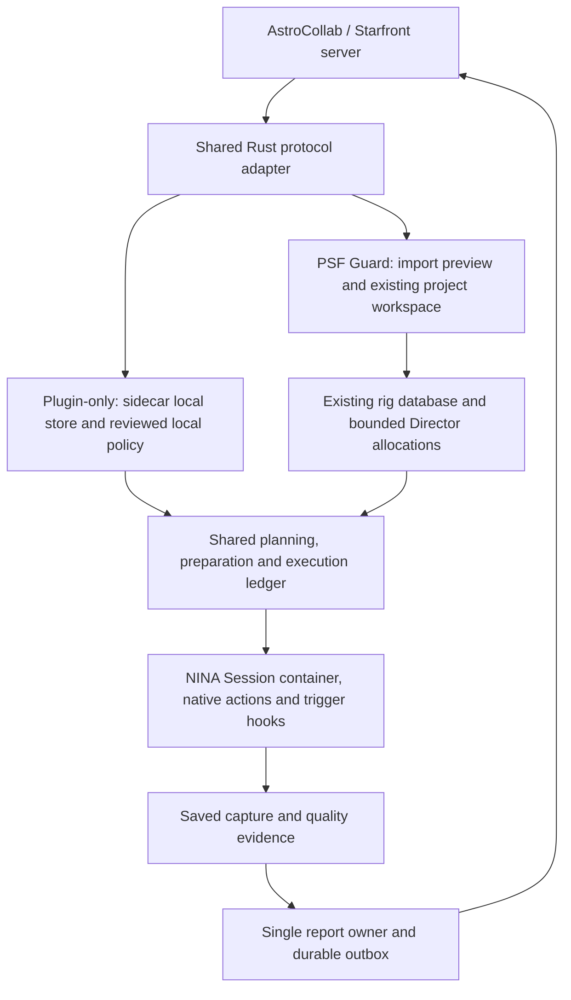

# AstroCollab and Starfront interoperability

Status: proposed integration, not implemented. This record maps the current
protocol to Director and PSF Guard; it enables no connector or acquisition.
Last reviewed: 2026-10-06.

## Sources and scope

Reviewed AstroCollab **0.2.0-draft.1**, wire protocol **1**, at
[`35a6f06`](https://github.com/theatrus/astrocollab-api/tree/35a6f068c6015367b4dbb69c1c4de5b7a0747d90),
and Starfront at
[`4cfa896`](https://github.com/bray-sfro/starfront/tree/4cfa8961c9fb98098645896a19c59b5f5ec3b976).
The public [protocol](https://github.com/theatrus/astrocollab-api/blob/35a6f068c6015367b4dbb69c1c4de5b7a0747d90/spec/protocol.md),
[OpenAPI](https://github.com/theatrus/astrocollab-api/blob/35a6f068c6015367b4dbb69c1c4de5b7a0747d90/openapi/astrocollab.yaml),
and [conformance scenarios](https://github.com/theatrus/astrocollab-api/blob/35a6f068c6015367b4dbb69c1c4de5b7a0747d90/spec/conformance.md)
own the wire contract. Do not maintain a second API specification here.

This draft adopts Starfront's hello, tonight and report routes. It is not the
earlier draft's capacity, revision-sync and calibrated-upload API. Core credit
comes from per-night reports; the optional `files` extension has **no defined
upload routes**. Monthly commitments, file delivery and coordinator project
administration are not part of this client contract.

Starfront's useful reference points are `astrocontrol/collabclient.py` for
polling/reporting, `astrocontrol/main.py` for adopting work into a local plan,
`astrocontrol/collab.py` for requirements, tiling and allocation, and
`server/app.py` / `server/store.py` for routes and report persistence. Its
capture software and collaboration server are in the same repository.
AstroCollab publishes an MIT license. This Starfront checkout has no license
file and GitHub reports no license: use it to inspect interoperability, not to
copy its implementation into the core without permission.

## Two modes, one executor

**Plugin-only:** the NINA plugin pairs directly with a collaboration server.
The bundled Rust sidecar stores adopted projects, nightly demand, local policy,
execution evidence and queued reports. No PSF Guard server, rig catalog or Target
Scheduler installation is required. The operator supplies a complete local
equipment/exposure setup and chooses which projects may run automatically.
The existing NINA executor and its hooks stay unchanged in purpose.

**Import into PSF Guard:** PSF Guard browses and imports a remote project into
the existing Library/project workspace, with downstream work in the selected
rig databases. Director receives the normal local allocations. PSF Guard adds
catalog review, grading, calibration evidence, coverage and report submission.
Import must preview changes before Apply; later automatic refresh must stay
within the explicitly reviewed policy.

These are workload-source and reporting choices, not separate schedulers.
One collaboration agent represents one commissioned rig/equipment setup. In
PSF Guard mode it binds to the existing project database's rig identity; it
does not create a second catalog hierarchy. Sites remain location, horizon,
time and weather inputs. A shared remote project can map to one combined
project with different downstream framing and recipes on each rig.

Choose **one report owner** per server/agent/share: sidecar or PSF Guard.
Switching mode requires explicit identity, provenance and outbox handoff, not
two independent reporters using the same telescope token. Later importing
plugin-only captures preserves their original capture IDs and associations.

## Contract mapping

| External input | Director / PSF Guard mapping | Required change or boundary |
| --- | --- | --- |
| Health and optional features | Connector discovery and compatibility state | Negotiate wire protocol 1. If features are omitted, discover sign-in through `/auth`; never guess that pairing/files exists. |
| Sign-in, enrollment or pairing | Separate collaboration credential and agent binding | Person tokens enroll/list telescopes; agent tokens fetch/report work. Neither is a Director pairing or local database permission. |
| Hello profile | NINA equipment snapshot plus reviewed rig setup | Add sensor/optics, fixed-angle or rotator capability, filter bandpass, calibrated exposure defaults and measured arcsecond quality. Send unknown as unknown. |
| Open projects and join | Browse, compatibility review, explicit participation | Join returns an accepted share; a manually offered share still needs acceptance. Joining does not start a sequence. |
| Project region, kind and depth goals | Existing project/objective intent, with remote provenance | `single` centers one object; `mosaic` covers a region. Remote depth is hours at a sky position, not a local frame quota or proof of cross-rig equivalence. |
| Task cells, ordered share, visit and version | Immutable nightly demand translated to targets, recipes and bounded work | Keep server panel indices and geometry. Translate visit frames using the approved rig exposure; do not turn season-long task hours into unlimited nightly attempts. |
| Requirements | Shared capability checks and stricter effective observing constraints | Remote constraints can narrow, never weaken, local horizon, Moon, safety, equipment, time or attempt limits. Preserve local project ranking and overrides. |
| Presence | Optional projection of Director live status | Opt-in position/name sharing; no commands and no replay of stale presence after reconnect. |
| Night report and verdict | Durable contribution outbox and remote assessment history | Report actual attributable data; remote accepted/rejected/unverified is separate from local per-frame grades. |
| Depth map | Advisory combined coverage in the existing project workspace | Never subtract another telescope's remote integration from local authorized attempts or overwrite local capture progress. |
| Optional files | Future artifact transport adapter | No implementation until upload and artifact identity contracts exist; PSF Guard remote intake is a separate service. |

## Shared Rust boundary

Keep the pure planning core free of HTTP, credentials, catalog SQL and NINA
types. Put the tolerant public-wire decoder and normalization in a small shared
Rust adapter, usable by the server and bundled sidecar. Keep transport and
persistence in their hosts. C# presents settings and executes supported NINA
operations; it must not implement a second AstroCollab-to-plan mapper.
In NINA, authenticated HTTP stays in the managed transport/credential-store
host; only bounded non-secret payloads enter Rust IPC. PSF Guard supplies its
own transport and secret-store integration. Sharing mapping code does not
require sending tokens to the sidecar.

The proposed shared inputs are **work provenance**, **observation demand**,
**reviewed local policy**, and **contribution evidence**. They translate into
the existing `project::Project`, `program::Program`, geometry, Moon, priority,
preparation and ledger contracts where those contracts express the intent.
Do not deserialize a remote Task directly as an internal Program or Allocation.
External JSON permits unknown fields; internal IPC stays strict and versioned.
Bound public payload sizes, nesting and collection lengths before normalization.
Large mosaics must enter deterministic bounded chunks under one reviewed nightly
budget, not expand the core's 256-goal/256-KiB limits or create fresh authority
for every chunk.

Current gaps are explicit:

- `project::Contribution` requires rig-specific accepted-frame counts. It does
  not express a collaborative depth map or prove that integration from unlike
  rigs is interchangeable. Retain remote depth separately and derive only a
  bounded per-rig nightly visit; do not claim the global goal is locally complete.
- Plugin acquisition currently requires PSF Guard pairing and a coordinator
  allocation/start acknowledgement. Plugin-only needs a distinct local issuer,
  not a fabricated coordinator response or a bypass of admission checks.
- Local issuance must bind the profile, equipment fingerprint, adopted source
  revision, permitted sky region, recipes, attempt cap and night deadline. The
  ledger, exclusive local owner and fresh dispatch checks apply to both issuers.
  PSF Guard's server-issued path retains its existing one-shot launch contract.
- Shared report aggregation needs per-frame provenance, evidence completeness
  and immutable outbox snapshots; the capture ledger alone is not a calibration
  or grading catalog. Hosts supply that evidence without moving image algorithms
  into the planner. PSF Guard continues to use published Seiza processing.

Adoption can be manual or automatic within a reviewed allowlist and budget.
The remote server supplies demand; local Director selects when and what to
image using the same priorities, altitude/horizon, darkness, Moon, meridian,
overhead and recovery rules used for local projects. Remote panel order is a
preference within the adopted work, not permission to violate local constraints.
NINA native actions, seven hook slots, built-in meridian trigger flow, safety
interrupts and configurable park/hold behavior remain the execution path.
Admit a visit only when its minimum frames can fit the remaining budget/window,
including preparation estimates. A safety interrupt always wins; report an
incomplete visit truthfully rather than run past a shutdown to meet the quota.

## Identity, quantities and evidence

Persist `(server origin/base path, agent, project, task, named night, task
version, geometry digest, server panel index, filter, local recipe)` alongside
every adopted goal and saved capture. Map external 12-hex IDs explicitly to
local IDs; do not find projects by name or nearest coordinates. Task version
is not a PSF Guard revision, and server receipt identity is not a capture GUID.

Always send the rig's named observing night. Preserve it through delayed replay,
even after midnight or a site/time-zone change. AstroCollab timestamps and
exposures use seconds, Director uses milliseconds, and core coordinates use
integer milliarcseconds. Convert with finite/range/overflow checks. Regions and
footprints use RA **degrees**; presence and TS use RA **hours**. Sky width is not
RA-coordinate width, especially near the poles or RA wrap.

Convert HFR pixels to arcseconds with the matching image's binned pixel scale;
guide RMS is already arcseconds only when the source declares it so. Do not
reuse a new rig configuration's scale for old frames. Record bandpass in nm,
Moon fraction in 0..1, and separate unknown measurements from measured zero.

Protocol filter folding differs from the core's broader alias list: the core
currently recognizes `rgb`/`osc` as luminance aliases. The adapter must preserve
wire identity and explicit sensor colour semantics, not advertise OSC as mono
L or synthesize R/G/B, H/O contributions from a colour or dual-band exposure.
Unknown filters require an explicit native filter mapping. Different exposure
lengths/purposes remain separate local recipes; do not report a misleading
average exposure for incompatible cohorts under one panel/filter record.
For the first adapter, select one approved exposure cohort per share/panel/filter;
defer heterogeneous cohorts until a lossless report convention is established.

Report verified final saves and eligible measured frames, not attempted or
planned frames. A cloud rejection, canceled exposure or uncertain save cannot
earn credit. A planned center or FITS header is not a solved footprint. Keep
fresh pixel-derived footprint/scale evidence and calibration provenance with
the report. If required evidence is unavailable, defer the report or preserve
the explicit unknown; do not fill in the planned value.

Raw NINA frames are not calibrated merely because compatible masters exist.
Plugin-only mode can serve projects accepting uncalibrated data; projects
requiring calibration need verified feedback from an external processor or
later PSF Guard import/processing. That feedback must bind the original frames,
recipe and masters. No calibration engine is added to the NINA adapter.
Do not submit raw totals early and expect adding `calibrated: true` later at the
same integration to update them; the duplicate behavior below prevents that.

## Offline behavior and known protocol gaps

Cache an adopted night's immutable list. Continue offline only inside locally
issued limits; network failure supplies no new budget. At expiry/night end,
leave the Session through its normal shutdown hooks. Refresh at safe boundaries
and stage changed work, never mutate an in-flight target or recipe. Unknown,
declined, complete, superseded, invalid or empty work does not mean "image all
panels". Only already admitted work can continue during an outage.

Keep these distinctions visible in the implementation and tests:

1. **A nightly list is held.** The same named night keeps its deal despite new
   Moon, availability or remote progress. Do not promise continual server
   reprioritization; local conditions can still pause or select another goal.
2. **Retiling can reuse identity.** Starfront changes cells and increments the
   same task's version when a fixed camera turns. Its report key has no geometry
   version. If a panel index changes sky position after frames exist for that
   night/filter, retain both local geometries and stop automatic submission of
   the conflicting aggregate. Require a verified server convention or protocol
   extension before combining them. Never silently rewrite old footprints.
3. **Reports are monotonic by integration, not revisions.** Starfront only
   replaces an existing payload/verdict when `seconds` increases, preserving a
   coordinator override. Equal-total quality corrections, lowered totals after
   regrading and withdrawals cannot be reconciled by retrying. Initially publish
   finalized evidence, then surface later corrections for review rather than
   claim remote convergence. An amendment/withdrawal contract is future work.
4. **A batch reply acknowledges records in order.** Require a complete, validated
   positional reply before acknowledging the immutable submitted snapshot. Keep
   short/malformed replies and HTTP failures queued; a server may have committed
   a prefix before failing. Replaying the same snapshots must not double-count.
   Captures added while a batch is in flight remain pending. Recorded does not
   mean scientifically accepted, and a duplicate does not prove corrected
   evidence replaced the earlier payload.
5. **Starfront and the draft differ.** The draft allows joining with some wanted
   filters; its conformance suite records Starfront's refusal as a known gap.
   Show the server's actual compatibility/refusal, do not promise partial-filter
   enrollment works everywhere or silently ignore remote requirements.

Do not mark a continuing multi-night share complete after one nightly visit.
Local visit exhaustion and remote project/share completion are distinct states.
Known fixed camera rotation, unknown rotation and a functioning rotator are
also distinct: protocol null means angle-adjustable, not "we do not know".

Use separate credential-store entries scoped to the collaboration server and
agent. Never reuse a PSF Guard API key. Keep tokens and pairing codes out of
IPC payloads, generated configs, process arguments, environment and logs.
Validate the browser sign-in URL and never forward credentials across an origin
change or redirect. Production uses HTTPS; isolated loopback tests have explicit
test-only transport consent. Pairing and token-producing enrollment cannot be
blindly retried after a lost reply. A `401` stops remote communication and asks
for repair; it does not itself override local hardware safety or erase already
issued, bounded local work. Other permanent errors require review, while transient
failures use bounded backoff outside the exposure path.

## Delivery and validation

This is an additive backlog, not a replacement for unfinished local Director
commissioning or unattended-night validation. No item below is implemented.

1. **Shared read-only adapter.** Pin the draft and checked-in examples; decode
   profile, projects, requirements and nightly work into demand/provenance.
   Test both hosts against identical vectors, including unknown fields, units,
   filter/colour identity, rotation, empty shares and bounds. No hardware launch.
2. **Browse and import.** Add server-specific credentials, hello, explicit join,
   and preview/Apply into the existing workspace and selected rig databases.
   Persist origin maps and source snapshots; test repeat import, changed setup,
   stale replies and duplicate names without losing local edits or grades.
3. **Plugin-only admission.** Add complete local setup, workload-source choice,
   local issuer/store and versioned IPC. Reuse the Session and ledger; prove
   offline bounded execution, restart/replay refusal, safety/roof interruptions,
   night rollover, same-rig ownership conflicts and local priority preservation.
4. **Reports and handoff.** Add a single-owner durable outbox, measured evidence,
   calibration gating and separate remote verdicts. Test lost/partial replies,
   concurrent new frames, retile collisions, regrades, clock/configuration
   changes and plugin-to-PSF Guard provenance handoff. Do not enable unattended
   reporting for unresolved geometry or evidence-correction cases.
5. **Future files extension.** Implement only after public routes, artifact
   identity, retries and calibration/stack provenance are specified. Keep raw
   image intake and collaborative contribution transport separate.

Use AstroCollab's reference server, client proxy and conformance suite, plus an
isolated Starfront server with copied fixtures. Then run the actual plugin and
bundled sidecar on supported NINA 3.2 and 3.3 simulator copies, with an isolated
PSF Guard server for the import mode. Record versions, request assertions,
ledger evidence and UI captures. Passing a reference suite is not proof that
our still-unimplemented connector conforms or that acquisition is safe.

See [Director design](director.md#federation-and-collaboration) for the local
execution boundary and [data transfer](data-transfer.md) for existing catalog
sync contracts. PSF Guard Sync and Chatstronomy's TS integration remain separate
and unchanged.
